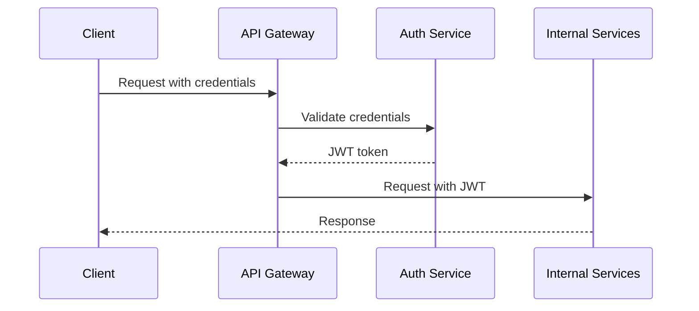

# Security Architecture

## Overview

This document outlines the security architecture for the Profile Service Microservices, detailing the security measures, protocols, and best practices implemented across the system.

## Security Principles

### 1. Defense in Depth

- Multiple layers of security controls
- Redundant security measures
- Fail-safe defaults
- Complete mediation

### 2. Zero Trust

- Never trust, always verify
- Least privilege access
- Micro-segmentation
- Continuous validation

### 3. Security by Design

- Security built into architecture
- Secure defaults
- Regular security reviews
- Threat modeling

## Security Components

### 1. Authentication

#### API Gateway Authentication



- JWT-based authentication
- OAuth 2.0 / OpenID Connect
- API key management
- Token validation and refresh

#### Service-to-Service Authentication

- Mutual TLS (mTLS)
- Service mesh authentication
- Certificate management
- Identity verification

### 2. Authorization

#### Role-Based Access Control (RBAC)

```yaml
roles:
  - name: admin
    permissions:
      - "profile:read"
      - "profile:write"
      - "profile:delete"
      - "profile:manage"
  - name: user
    permissions:
      - "profile:read"
      - "profile:write"
  - name: readonly
    permissions:
      - "profile:read"
```

- Fine-grained permissions
- Role hierarchy
- Dynamic permission updates
- Access control lists

#### Policy Enforcement

- Centralized policy management
- Policy evaluation
- Audit logging
- Policy versioning

### 3. Data Protection

#### Encryption

- Data at rest encryption
- Data in transit encryption
- Key management
- Certificate rotation

#### Data Classification

```yaml
data_classes:
  - name: public
    encryption: none
    retention: 1 year
  - name: internal
    encryption: required
    retention: 5 years
  - name: confidential
    encryption: required
    retention: 10 years
  - name: restricted
    encryption: required
    retention: permanent
```

### 4. Network Security

#### Service Mesh Security

```yaml
security_policies:
  - name: default-deny
    action: deny
    match:
      - source: "*"
        destination: "*"
  - name: allow-internal
    action: allow
    match:
      - source: "profile-*"
        destination: "profile-*"
```

- Traffic encryption
- Service isolation
- Network policies
- Traffic control

#### API Gateway Security

- Rate limiting
- Request validation
- DDoS protection
- WAF integration

### 5. Monitoring and Logging

#### Security Monitoring

```yaml
monitoring:
  metrics:
    - name: auth_failures
      type: counter
      labels:
        - service
        - reason
    - name: access_denied
      type: counter
      labels:
        - service
        - resource
        - user
```

- Security event logging
- Audit trails
- Real-time monitoring
- Alerting

#### Compliance Monitoring

- Access logs
- Change logs
- Audit logs
- Compliance reports

## Security Controls

### 1. Infrastructure Security

#### Kubernetes Security

- Pod security policies
- Network policies
- RBAC configuration
- Secret management

#### Container Security

- Image scanning
- Runtime security
- Resource limits
- Security contexts

### 2. Application Security

#### Code Security

- Static analysis
- Dependency scanning
- Code review
- Security testing

#### API Security

- Input validation
- Output encoding
- Error handling
- Rate limiting

### 3. Operational Security

#### Incident Response

- Security incident handling
- Breach notification
- Recovery procedures
- Post-incident review

#### Security Maintenance

- Regular updates
- Patch management
- Vulnerability scanning
- Security assessments

## Security Compliance

### 1. Standards and Regulations

- ISO 27001
- SOC 2
- GDPR
- CCPA

### 2. Compliance Controls

- Data protection
- Privacy controls
- Audit requirements
- Reporting

## Security Testing

### 1. Automated Testing

- Security scanning
- Vulnerability assessment
- Penetration testing
- Compliance testing

### 2. Manual Testing

- Security review
- Code audit
- Architecture review
- Threat modeling

## Security Documentation

### 1. Security Policies

- Access control policy
- Data protection policy
- Incident response policy
- Security maintenance policy

### 2. Security Procedures

- Security incident handling
- Access management
- Key rotation
- Security updates

## Next Steps

1. Implement security controls
2. Set up monitoring and alerting
3. Conduct security assessments
4. Create security runbooks
5. Train development team
