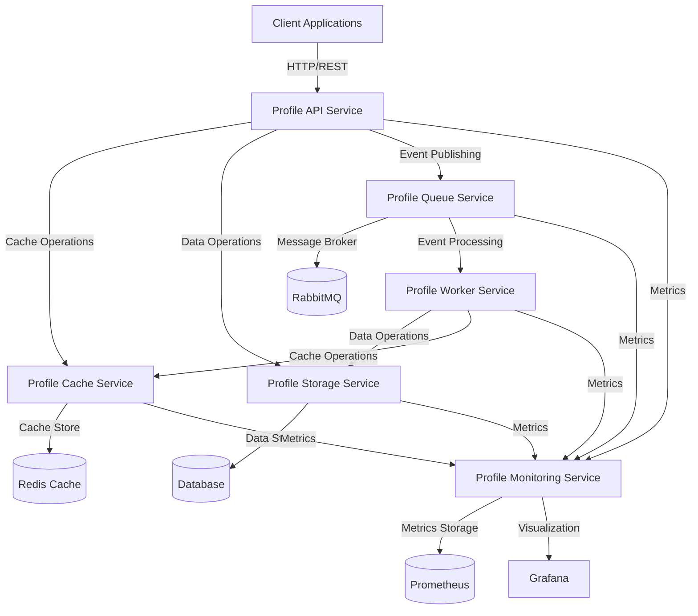

# System Context

## Overview

The Profile Service Microservices architecture is designed to provide a scalable, maintainable, and efficient system for managing user profiles. This document describes the system context, including the main components, their interactions, and the external systems they interact with.

## System Context Diagram

## Core Components

### 1. Profile API Service

- **Purpose**: Main entry point for client applications
- **Responsibilities**:
  - Request routing and validation
  - Authentication and authorization
  - API versioning
  - Rate limiting
- **Interactions**:
  - Communicates with Cache Service for data retrieval
  - Interacts with Storage Service for data persistence
  - Publishes events to Queue Service

### 2. Profile Cache Service

- **Purpose**: Provides fast data access through caching
- **Responsibilities**:
  - Cache management
  - Cache invalidation
  - Cache policies
  - Performance optimization
- **Interactions**:
  - Uses Redis for cache storage
  - Communicates with Storage Service for cache warming
  - Provides metrics to Monitoring Service

### 3. Profile Storage Service

- **Purpose**: Manages data persistence
- **Responsibilities**:
  - Data storage and retrieval
  - Data validation
  - Data migration
  - Data consistency
- **Interactions**:
  - Uses Database for persistent storage
  - Communicates with Cache Service for cache invalidation
  - Provides metrics to Monitoring Service

### 4. Profile Queue Service

- **Purpose**: Handles asynchronous communication
- **Responsibilities**:
  - Message routing
  - Event handling
  - Message persistence
  - Queue management
- **Interactions**:
  - Uses RabbitMQ for message broker
  - Communicates with Worker Service for event processing
  - Provides metrics to Monitoring Service

### 5. Profile Worker Service

- **Purpose**: Processes background tasks
- **Responsibilities**:
  - Background job processing
  - Task scheduling
  - Error handling
  - Job monitoring
- **Interactions**:
  - Processes events from Queue Service
  - Updates data through Storage Service
  - Manages cache through Cache Service
  - Provides metrics to Monitoring Service

### 6. Profile Monitoring Service

- **Purpose**: Provides system observability
- **Responsibilities**:
  - Metrics collection
  - Health checks
  - Alerting
  - Logging
- **Interactions**:
  - Collects metrics from all services
  - Stores metrics in Prometheus
  - Visualizes data in Grafana

## External Systems

### 1. Client Applications

- Web applications
- Mobile applications
- Third-party integrations
- Internal services

### 2. Infrastructure Services

- Redis: Cache storage
- Database: Persistent storage
- RabbitMQ: Message broker
- Prometheus: Metrics storage
- Grafana: Metrics visualization

## Communication Patterns

### 1. Synchronous Communication

- HTTP/REST for client-to-service communication
- gRPC for service-to-service communication
- Circuit breakers for fault tolerance
- Retry mechanisms for reliability

### 2. Asynchronous Communication

- Event-driven architecture
- Message queues for event processing
- Event sourcing for data consistency
- Dead letter queues for error handling

## Security Considerations

### 1. Authentication

- JWT for API authentication
- Service-to-service authentication
- API key management
- Token validation

### 2. Authorization

- Role-based access control
- Permission management
- API endpoint protection
- Resource access control

### 3. Data Protection

- Data encryption at rest
- Data encryption in transit
- Secret management
- Access logging

## Scalability Considerations

### 1. Horizontal Scaling

- Stateless services
- Load balancing
- Service replication
- Data partitioning

### 2. Performance

- Caching strategies
- Database optimization
- Message queue optimization
- Resource management

## Next Steps

1. Create detailed service architecture documents
2. Define API specifications
3. Design data models
4. Create deployment architecture
5. Document security architecture
