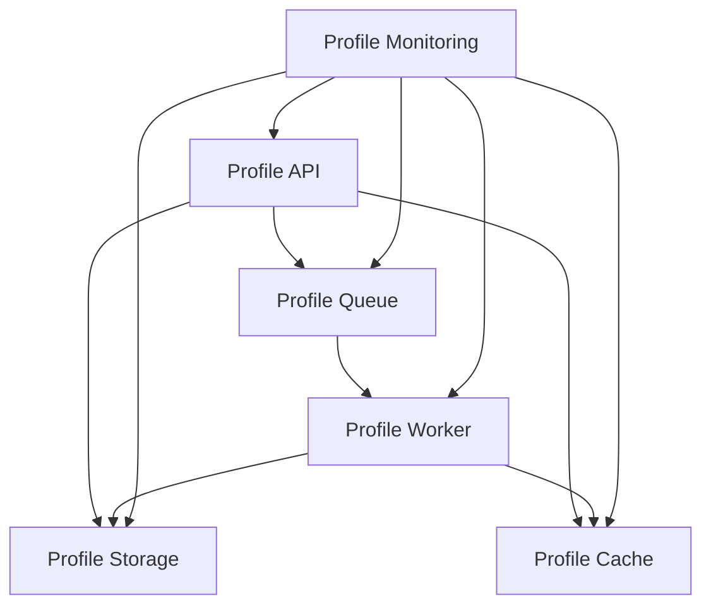
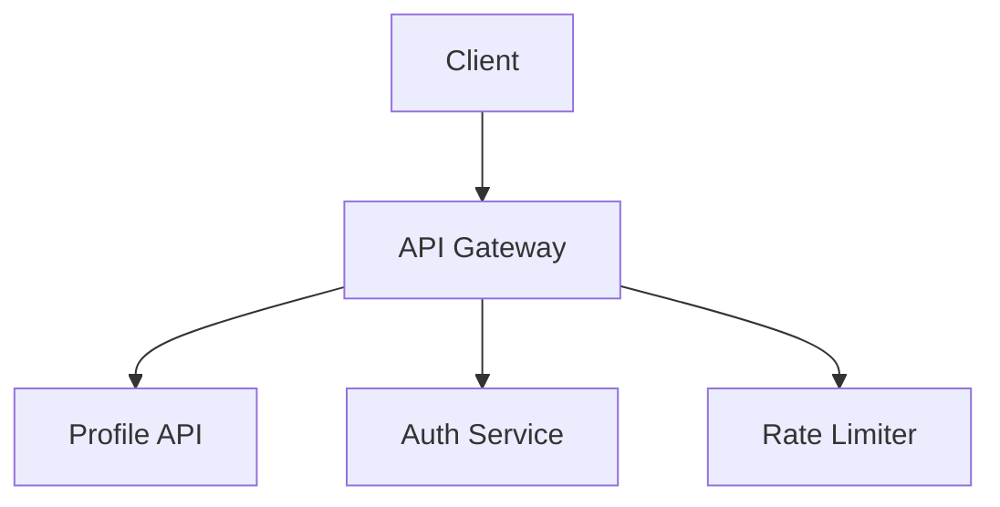
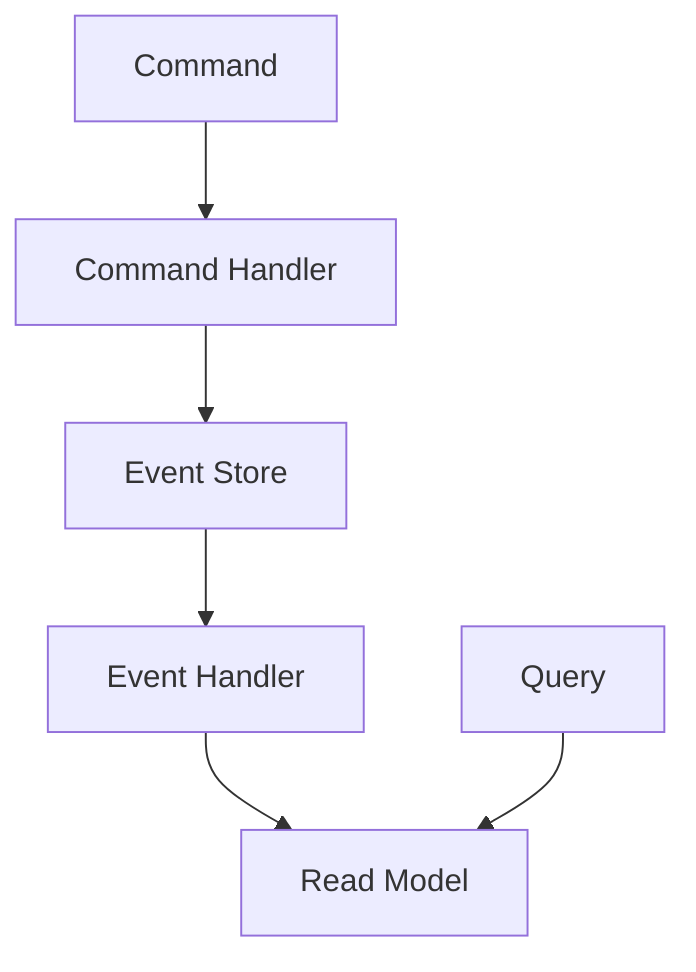
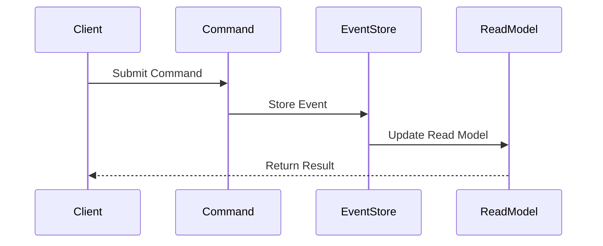
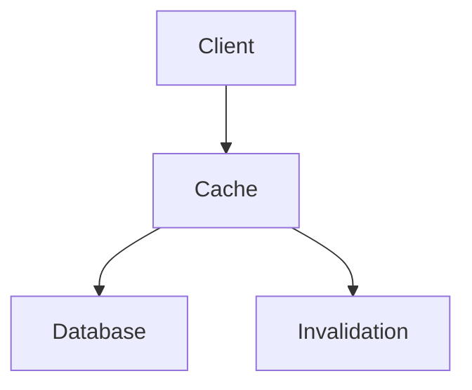
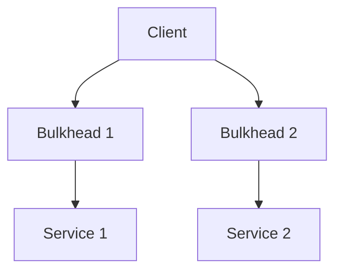
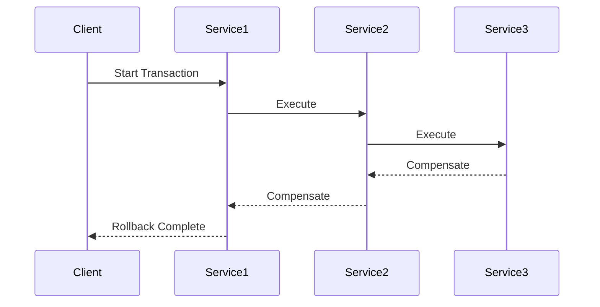
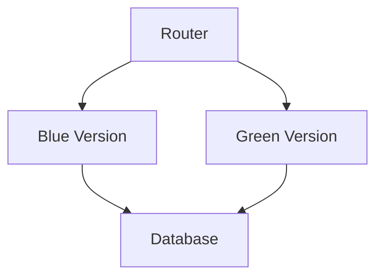
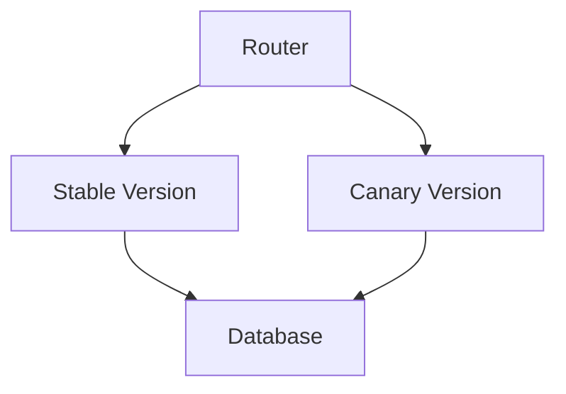

# Architectural Patterns

## Overview

This document outlines the key architectural patterns used in the Profile Service microservices architecture. These patterns provide a foundation for building scalable, maintainable, and resilient services.

## Core Patterns

### Microservices Pattern



**Characteristics**:

- Service Independence
- Domain-Driven Design
- Bounded Contexts
- Independent Deployment

**Implementation**:

```yaml
microservices:
  principles:
    - single_responsibility
    - loose_coupling
    - high_cohesion
  deployment:
    strategy: independent
    orchestration: kubernetes
```

### API Gateway Pattern



**Characteristics**:

- Request Routing
- Authentication
- Rate Limiting
- Request/Response Transformation

**Implementation**:

```yaml
api_gateway:
  features:
    - routing
    - authentication
    - rate_limiting
    - transformation
  scaling:
    strategy: horizontal
    replicas: 3
```

### CQRS Pattern



**Characteristics**:

- Command/Query Separation
- Event Sourcing
- Read/Write Model Separation
- Eventual Consistency

**Implementation**:

```yaml
cqrs:
  command_side:
    storage: event_store
    consistency: strong
  query_side:
    storage: read_model
    consistency: eventual
```

## Data Patterns

### Event Sourcing



**Characteristics**:

- Event-First Design
- Event Store
- Event Replay
- Temporal Queries

**Implementation**:

```yaml
event_sourcing:
  store:
    type: event_store
    persistence: append_only
  events:
    versioning: optimistic
    schema: json
```

### Caching Pattern



**Characteristics**:

- Multi-Level Cache
- Cache Invalidation
- Cache Consistency
- Cache Warming

**Implementation**:

```yaml
caching:
  levels:
    - type: local
      max_size: 1GB
    - type: distributed
      provider: redis
  invalidation:
    strategy: write_through
    ttl: 1h
```

## Resilience Patterns

### Bulkhead Pattern



**Characteristics**:

- Resource Isolation
- Failure Containment
- Independent Scaling
- Resource Limits

**Implementation**:

```yaml
bulkhead:
  isolation:
    type: thread_pool
    max_threads: 10
  limits:
    max_connections: 100
    timeout: 5s
```

### Saga Pattern



**Characteristics**:

- Distributed Transactions
- Compensation Logic
- Eventual Consistency
- Failure Recovery

**Implementation**:

```yaml
saga:
  coordination:
    type: choreography
    events:
      - transaction_started
      - transaction_completed
      - compensation_required
```

## Deployment Patterns

### Blue-Green Deployment



**Characteristics**:

- Zero Downtime
- Instant Rollback
- Traffic Switching
- Version Testing

**Implementation**:

```yaml
blue_green:
  strategy:
    type: traffic_switch
    validation:
      - health_check
      - smoke_test
  rollback:
    trigger: failure
    timeout: 5m
```

### Canary Deployment



**Characteristics**:

- Gradual Rollout
- Risk Mitigation
- Performance Monitoring
- User Segmentation

**Implementation**:

```yaml
canary:
  rollout:
    initial_percentage: 10
    increment: 10
    interval: 1h
  monitoring:
    metrics:
      - error_rate
      - latency
      - throughput
```

## Best Practices

1. **Service Design**

   - Follow Domain-Driven Design
   - Implement Bounded Contexts
   - Use Event-Driven Architecture
   - Maintain Service Independence

2. **Data Management**

   - Implement Event Sourcing
   - Use CQRS for Complex Domains
   - Maintain Data Consistency
   - Implement Proper Caching

3. **Resilience**

   - Implement Circuit Breakers
   - Use Bulkheads
   - Implement Retry Policies
   - Handle Failures Gracefully

4. **Deployment**
   - Use Blue-Green Deployment
   - Implement Canary Releases
   - Monitor Performance
   - Maintain Rollback Capability

## Next Steps

1. [ ] Implement service mesh
2. [ ] Add API versioning
3. [ ] Enhance monitoring
4. [ ] Implement feature flags
5. [ ] Add chaos engineering
