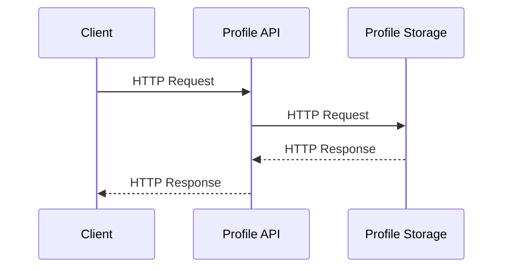
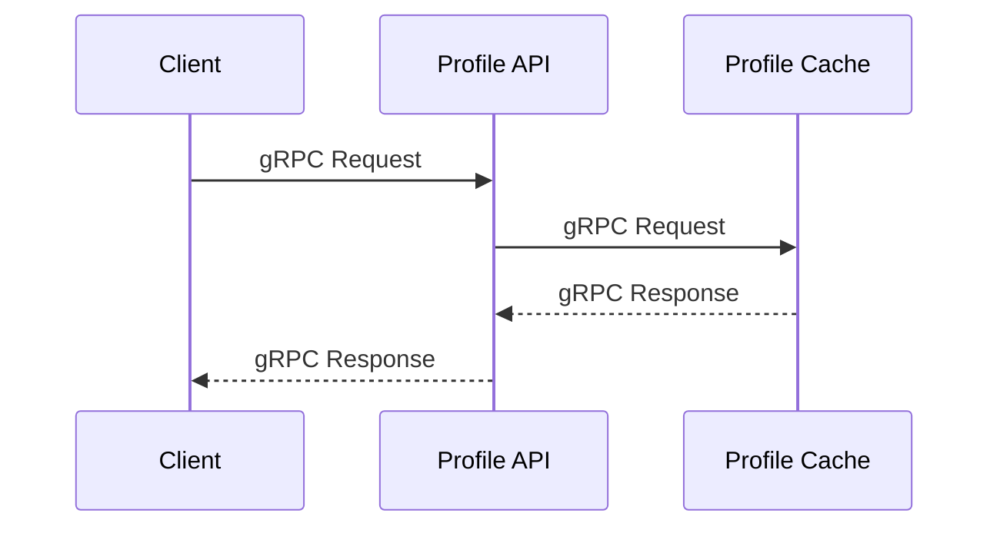
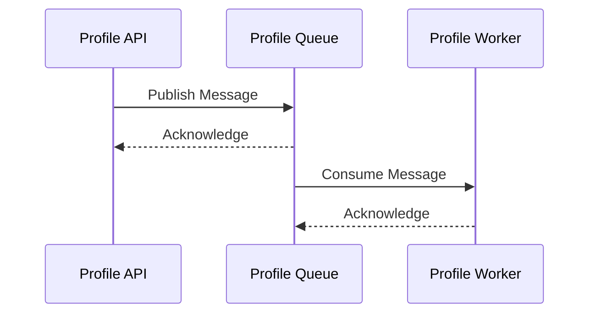
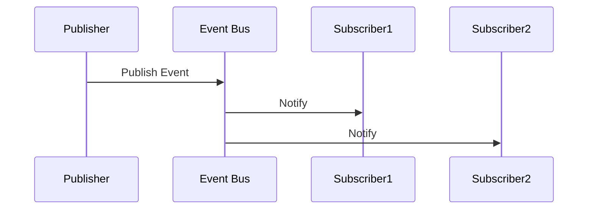
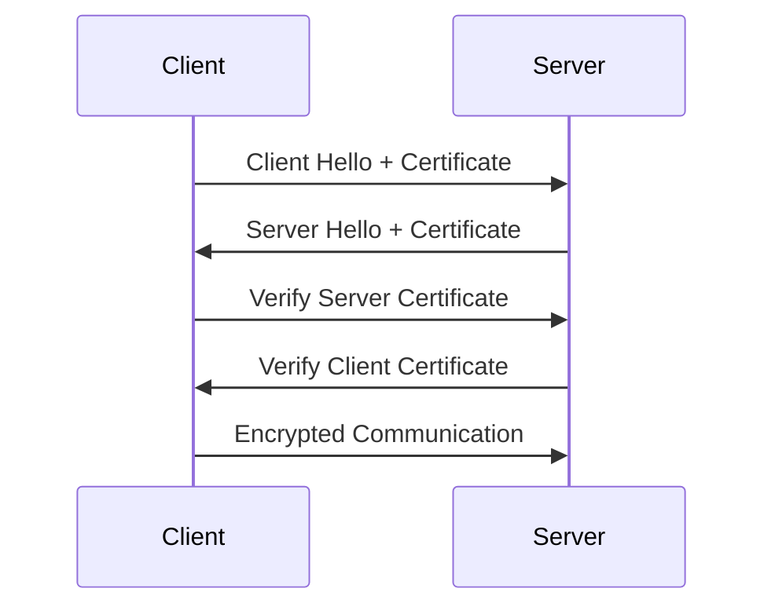
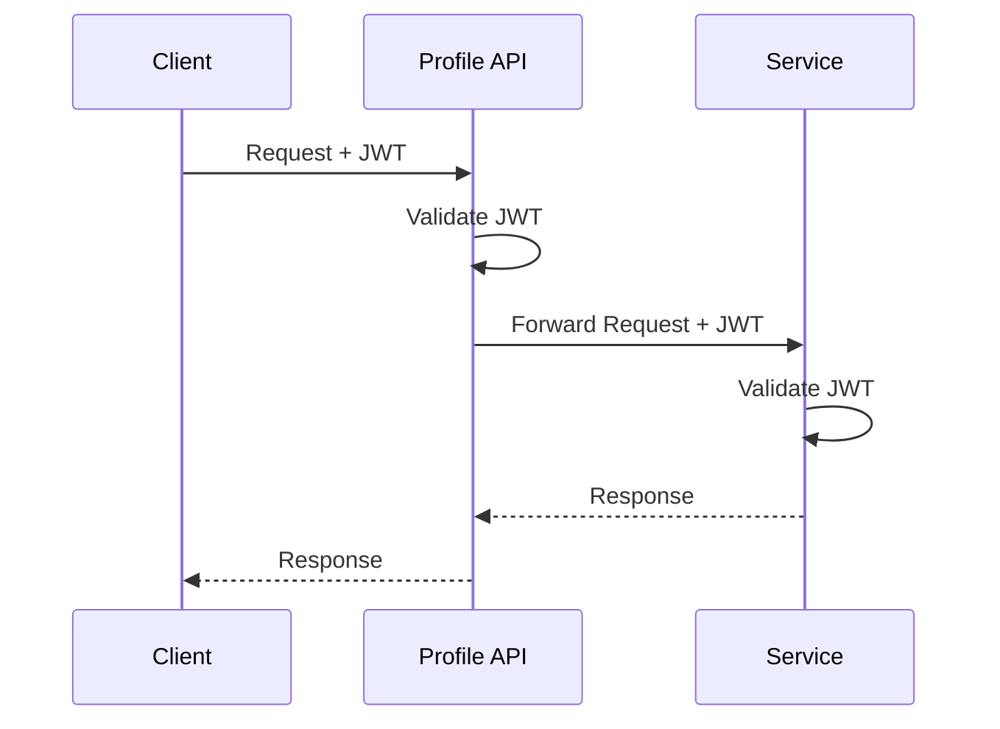
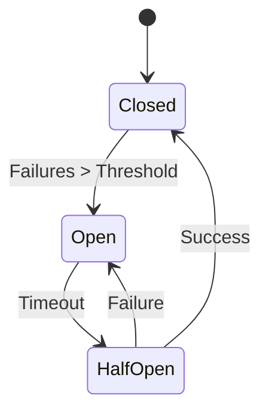
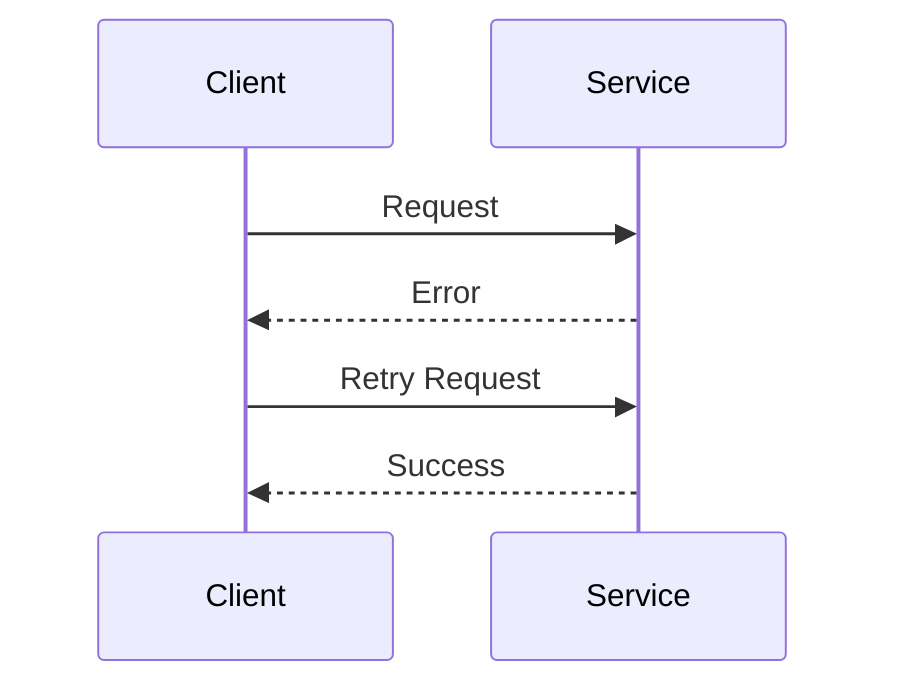
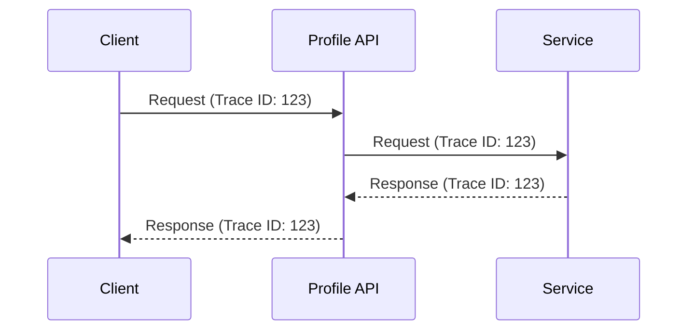
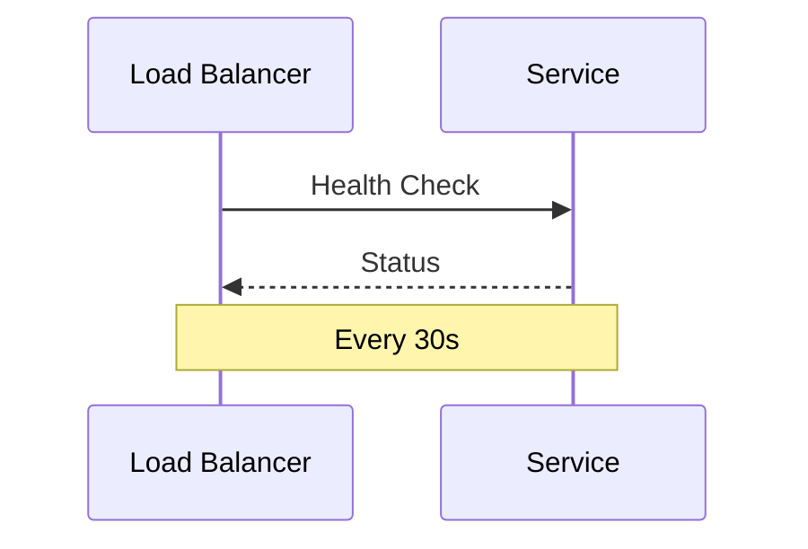

# Service Communication Patterns

## Overview

This document outlines the communication patterns used between services in the Profile Service microservices architecture. These patterns ensure reliable, secure, and efficient service-to-service communication.

## Communication Types

### Synchronous Communication

#### REST API Pattern



**Use Cases**:

- Profile CRUD operations
- Real-time data retrieval
- Immediate response required

**Implementation**:

```yaml
rest_api:
  protocol: HTTP/2
  authentication: mTLS
  timeout: 5s
  retry:
    max_attempts: 3
    backoff: exponential
```

#### gRPC Pattern



**Use Cases**:

- High-performance data streaming
- Bi-directional communication
- Strong typing required

**Implementation**:

```yaml
grpc:
  protocol: HTTP/2
  authentication: mTLS
  timeout: 3s
  compression: gzip
```

### Asynchronous Communication

#### Message Queue Pattern



**Use Cases**:

- Background processing
- Event-driven operations
- Decoupled services

**Implementation**:

```yaml
message_queue:
  broker: RabbitMQ
  protocol: AMQP
  authentication: mTLS
  persistence: true
  delivery:
    mode: at_least_once
    retry:
      max_attempts: 5
      backoff: exponential
```

#### Event Bus Pattern



**Use Cases**:

- Event broadcasting
- Service discovery
- State synchronization

**Implementation**:

```yaml
event_bus:
  broker: RabbitMQ
  protocol: AMQP
  authentication: mTLS
  exchange_type: topic
  routing:
    pattern: profile.*
```

## Security Patterns

### Mutual TLS (mTLS)



**Implementation**:

```yaml
mtls:
  certificate_rotation: 90d
  validation:
    - verify_certificate
    - check_revocation
    - validate_identity
```

### JWT Authentication



**Implementation**:

```yaml
jwt:
  algorithm: RS256
  expiration: 1h
  validation:
    - verify_signature
    - check_expiration
    - validate_claims
```

## Resilience Patterns

### Circuit Breaker



**Implementation**:

```yaml
circuit_breaker:
  failure_threshold: 5
  reset_timeout: 30s
  half_open_timeout: 5s
```

### Retry Pattern



**Implementation**:

```yaml
retry:
  max_attempts: 3
  backoff:
    type: exponential
    initial_interval: 1s
    max_interval: 10s
```

## Monitoring Patterns

### Distributed Tracing



**Implementation**:

```yaml
tracing:
  provider: Jaeger
  sampling_rate: 0.1
  propagation:
    - b3
    - w3c
```

### Health Checks



**Implementation**:

```yaml
health_check:
  endpoint: /health
  interval: 30s
  timeout: 5s
  success_threshold: 2
  failure_threshold: 3
```

## Best Practices

1. **Service Discovery**

   - Use Kubernetes service discovery
   - Implement health checks
   - Monitor service availability

2. **Load Balancing**

   - Use round-robin for REST APIs
   - Implement sticky sessions when needed
   - Monitor load distribution

3. **Error Handling**

   - Use standard error codes
   - Implement proper error propagation
   - Log errors with context

4. **Performance**
   - Use connection pooling
   - Implement caching
   - Monitor latency

## Next Steps

1. [ ] Implement service mesh
2. [ ] Add rate limiting
3. [ ] Enhance monitoring
4. [ ] Implement API versioning
5. [ ] Add request tracing
