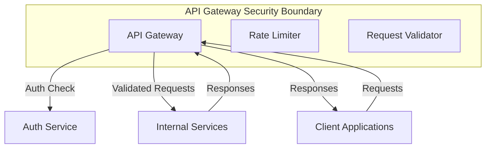

# API Gateway Security Documentation

## Service Overview

### Service Name

API Gateway

### Service Description

The API Gateway serves as the entry point for all client requests, handling routing, rate limiting, authentication, and request/response transformation. It provides a unified interface for clients to interact with the microservices architecture.

## Security Context

### Security Boundaries



### Security Dependencies

- Auth Service for authentication
- Rate Limiter for request throttling
- Request Validator for input validation
- Service Mesh for service discovery

## Authentication

### Client Authentication

- JWT validation
- API key authentication
- OAuth 2.0 / OpenID Connect
- Basic authentication (for internal services)

### Service-to-Service Authentication

- mTLS for all internal communication
- Service mesh integration
- Certificate-based service identity
- Automatic certificate rotation

## Authorization

### Access Control

```yaml
permissions:
  - resource: "api"
    actions:
      - "route"
      - "transform"
      - "validate"
    roles:
      - "system"
  - resource: "rate_limits"
    actions:
      - "read"
      - "write"
    roles:
      - "admin"
  - resource: "routes"
    actions:
      - "read"
      - "write"
    roles:
      - "admin"
```

### Role Requirements

- System role: For internal routing
- Admin role: For configuration
- Service role: For service-to-service communication

## Data Security

### Data Classification

```yaml
data_types:
  - name: "api_keys"
    classification: "sensitive"
    encryption: "required"
    retention: "90d"
  - name: "request_logs"
    classification: "internal"
    encryption: "required"
    retention: "30d"
  - name: "configuration"
    classification: "system"
    encryption: "required"
    retention: "365d"
```

### Data Protection

- AES-256 encryption for sensitive data
- Request/response sanitization
- Header stripping
- Data masking

## Network Security

### Network Policies

```yaml
network_policies:
  ingress:
    - from:
        - ipBlock:
            cidr: "0.0.0.0/0"
      ports:
        - protocol: TCP
          port: 443
  egress:
    - to:
        - podSelector:
            matchLabels:
              app: "auth-service"
      ports:
        - protocol: TCP
          port: 8080
    - to:
        - podSelector:
            matchLabels:
              app: "service-mesh"
      ports:
        - protocol: TCP
          port: 8080
```

### API Security

- Rate limiting per client/IP
- Request validation
- Response sanitization
- CORS policies
- WAF integration

## Monitoring and Logging

### Security Events

```yaml
security_events:
  - name: "request_validation"
    severity: "info"
    metrics:
      - name: "request_validation_total"
        type: "counter"
    alerts:
      - condition: "rate(request_validation_total[5m]) > 10000"
        action: "notify_security_team"
  - name: "rate_limit_hit"
    severity: "warning"
    metrics:
      - name: "rate_limit_hits_total"
        type: "counter"
    alerts:
      - condition: "rate(rate_limit_hits_total[5m]) > 1000"
        action: "notify_security_team"
```

### Audit Logging

- Log all requests
- Log all rate limit hits
- Log all validation failures
- 30-day retention period

## Security Controls

### Input Validation

- Validate all requests
- Sanitize headers
- Validate paths
- Validate methods
- Validate content types

### Output Encoding

- JSON encoding for API responses
- HTML encoding for web responses
- URL encoding for parameters
- Base64 encoding for binary data

## Security Testing

### Security Test Cases

```yaml
security_tests:
  - name: "path_traversal"
    type: "integration"
    scenario: "Attempt to access unauthorized paths"
    expected_result: "403 Forbidden"
  - name: "rate_limit_bypass"
    type: "integration"
    scenario: "Attempt to bypass rate limits"
    expected_result: "429 Too Many Requests"
  - name: "header_injection"
    type: "unit"
    scenario: "Attempt to inject malicious headers"
    expected_result: "400 Bad Request"
```

### Vulnerability Scanning

- Daily dependency scanning
- Weekly penetration testing
- Monthly security assessment
- Automated security testing in CI/CD

## Incident Response

### Security Incidents

- DDoS attacks
- API abuse
- Configuration compromise
- Service disruption

### Recovery Procedures

- Immediate rate limiting
- IP blocking
- Configuration rollback
- Post-incident analysis

## Compliance

### Compliance Requirements

- GDPR compliance
- CCPA compliance
- SOC 2 compliance
- ISO 27001 compliance

### Compliance Controls

- Request logging
- Access logging
- Audit trails
- Data protection

## Security Maintenance

### Updates and Patches

- Daily dependency updates
- Weekly security patches
- Monthly major updates
- Automated update testing

### Security Reviews

- Weekly security review
- Monthly penetration testing
- Quarterly security assessment
- Continuous security monitoring

## Security Documentation

### Runbooks

- Security incident response
- Service recovery procedures
- Security monitoring procedures
- Access management procedures

### Security Policies

- Rate limiting policies
- Routing policies
- Security incident policies
- Compliance policies

## Next Steps

1. Implement WAF integration
2. Enhance rate limiting
3. Deploy security monitoring
4. Create security runbooks
5. Conduct security training
