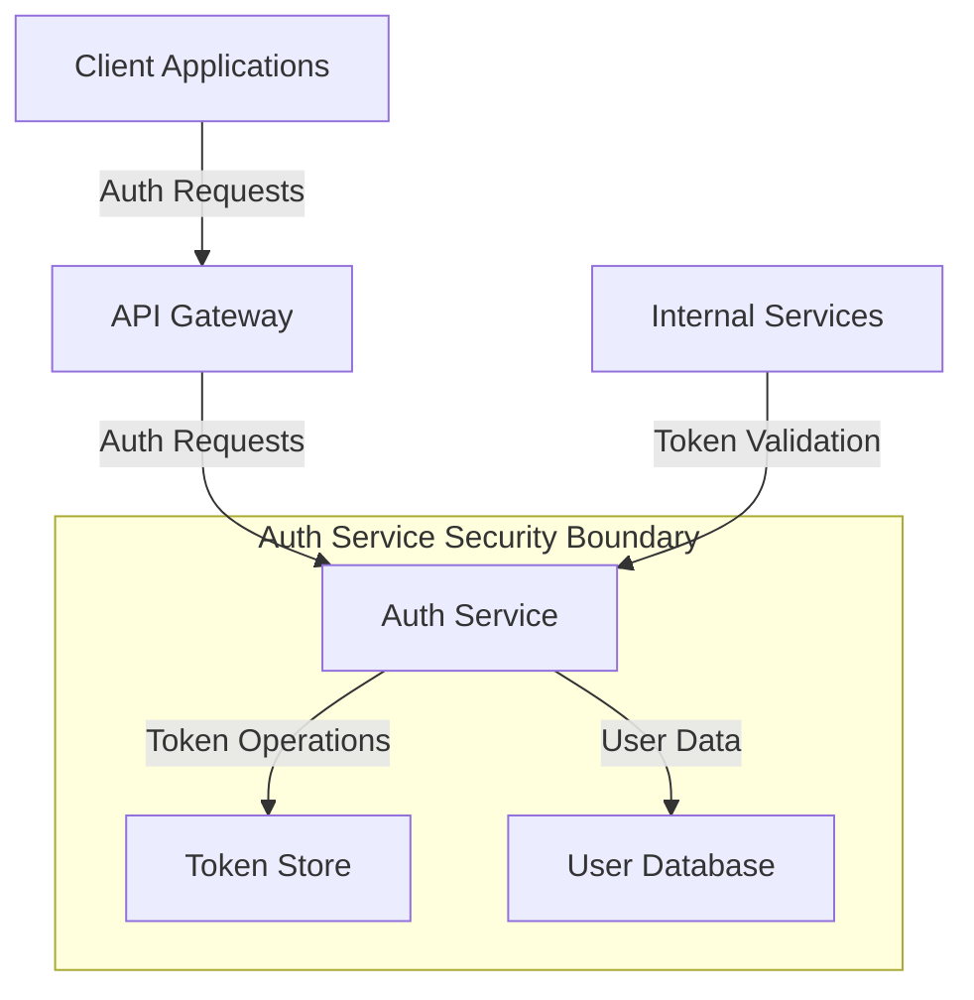

# Auth Service Security Documentation

## Service Overview

### Service Name

Auth Service

### Service Description

The Auth Service handles user authentication, authorization, and session management. It provides JWT token generation and validation, OAuth 2.0/OpenID Connect flows, and role-based access control.

## Security Context

### Security Boundaries



### Security Dependencies

- Redis for token storage
- PostgreSQL for user data
- API Gateway for request routing
- Certificate Authority for mTLS

## Authentication

### Client Authentication

- OAuth 2.0 / OpenID Connect
- JWT-based authentication
- Multi-factor authentication support
- Password hashing with bcrypt

### Service-to-Service Authentication

- mTLS for all service communication
- Service mesh integration
- Certificate-based service identity
- Automatic certificate rotation

## Authorization

### Access Control

```yaml
permissions:
  - resource: "auth"
    actions:
      - "authenticate"
      - "validate"
      - "refresh"
    roles:
      - "system"
  - resource: "users"
    actions:
      - "read"
      - "write"
      - "delete"
    roles:
      - "admin"
  - resource: "roles"
    actions:
      - "read"
      - "write"
      - "delete"
    roles:
      - "admin"
```

### Role Requirements

- System role: For service-to-service auth
- Admin role: For user management
- User role: For self-service operations

## Data Security

### Data Classification

```yaml
data_types:
  - name: "credentials"
    classification: "sensitive"
    encryption: "required"
    retention: "30d"
  - name: "tokens"
    classification: "sensitive"
    encryption: "required"
    retention: "1d"
  - name: "user_data"
    classification: "PII"
    encryption: "required"
    retention: "90d"
```

### Data Protection

- AES-256 encryption for sensitive data
- Token encryption at rest
- Password hashing with bcrypt
- Secure session management

## Network Security

### Network Policies

```yaml
network_policies:
  ingress:
    - from:
        - podSelector:
            matchLabels:
              app: "api-gateway"
      ports:
        - protocol: TCP
          port: 8080
  egress:
    - to:
        - podSelector:
            matchLabels:
              app: "redis"
      ports:
        - protocol: TCP
          port: 6379
    - to:
        - podSelector:
            matchLabels:
              app: "postgres"
      ports:
        - protocol: TCP
          port: 5432
```

### API Security

- Rate limiting: 100 requests/minute per IP
- Request validation
- Response sanitization
- CORS policies

## Monitoring and Logging

### Security Events

```yaml
security_events:
  - name: "authentication_attempt"
    severity: "info"
    metrics:
      - name: "auth_attempts_total"
        type: "counter"
    alerts:
      - condition: "rate(auth_attempts_total[5m]) > 1000"
        action: "notify_security_team"
  - name: "authentication_failure"
    severity: "warning"
    metrics:
      - name: "auth_failures_total"
        type: "counter"
    alerts:
      - condition: "rate(auth_failures_total[5m]) > 100"
        action: "notify_security_team"
```

### Audit Logging

- Log all authentication attempts
- Log all token operations
- Log all role changes
- 90-day retention period

## Security Controls

### Input Validation

- Validate all credentials
- Sanitize user input
- Validate token formats
- Validate role assignments

### Output Encoding

- JSON encoding for API responses
- JWT encoding for tokens
- URL encoding for parameters
- Base64 encoding for certificates

## Security Testing

### Security Test Cases

```yaml
security_tests:
  - name: "brute_force_protection"
    type: "integration"
    scenario: "Multiple failed login attempts"
    expected_result: "Account locked"
  - name: "token_validation"
    type: "unit"
    scenario: "Validate expired token"
    expected_result: "401 Unauthorized"
  - name: "role_escalation"
    type: "integration"
    scenario: "User attempts to escalate privileges"
    expected_result: "403 Forbidden"
```

### Vulnerability Scanning

- Daily dependency scanning
- Weekly penetration testing
- Monthly security assessment
- Automated security testing in CI/CD

## Incident Response

### Security Incidents

- Authentication bypass
- Token compromise
- Brute force attacks
- Service disruption

### Recovery Procedures

- Immediate service isolation
- Token revocation
- User notification
- Post-incident analysis

## Compliance

### Compliance Requirements

- GDPR compliance
- CCPA compliance
- SOC 2 compliance
- ISO 27001 compliance

### Compliance Controls

- Data encryption at rest
- Data encryption in transit
- Access logging
- Audit trails

## Security Maintenance

### Updates and Patches

- Daily dependency updates
- Weekly security patches
- Monthly major updates
- Automated update testing

### Security Reviews

- Weekly security review
- Monthly penetration testing
- Quarterly security assessment
- Continuous security monitoring

## Security Documentation

### Runbooks

- Security incident response
- Service recovery procedures
- Security monitoring procedures
- Access management procedures

### Security Policies

- Password policies
- Token policies
- Access control policies
- Security incident policies

## Next Steps

1. Implement MFA support
2. Enhance token security
3. Deploy security monitoring
4. Create security runbooks
5. Conduct security training
