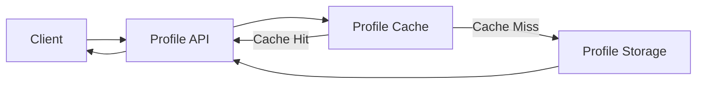
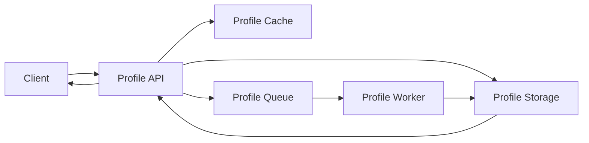

# Profile Microservices Data Flow

-> IMPORTANT: Never add fictional dates, version numbers, or metrics. Only include real, verified information. If information is not available, mark it as "To be determined" or remove the section.

## Overview

This document describes how data flows through the profile microservices system, including state management, data consistency, and data synchronization patterns.

## Data Flow Architecture

### 1. Data Storage Layers

#### Primary Storage (Profile Storage Service)

- PostgreSQL database
- Handles persistent data
- Manages data consistency
- Implements ACID properties

#### Cache Layer (Profile Cache Service)

- Redis-based caching
- Improves read performance
- Reduces database load
- Manages cache invalidation

#### Message Queue (Profile Queue Service)

- RabbitMQ-based queue
- Handles async operations
- Ensures message delivery
- Manages event propagation

### 2. Data Flow Patterns

#### Read Operations

#### Write Operations

## State Management

### 1. Service State

#### Profile API Service

- Request state
- Session state
- Authentication state
- Rate limiting state

#### Profile Storage Service

- Database state
- Transaction state
- Connection state
- Replication state

#### Profile Cache Service

- Cache state
- Invalidation state
- Connection state
- Memory state

#### Profile Queue Service

- Queue state
- Message state
- Connection state
- Consumer state

#### Profile Worker Service

- Task state
- Processing state
- Retry state
- Resource state

#### Profile Monitoring Service

- Metrics state
- Alert state
- Health state
- Configuration state

### 2. Data Consistency

#### Immediate Consistency

- Direct database writes
- Cache updates
- Synchronous operations
- Real-time updates

#### Eventual Consistency

- Async operations
- Background processing
- Cache propagation
- Queue processing

#### Consistency Patterns

- Write-through
- Write-behind
- Read-through
- Cache-aside

## Data Synchronization

### 1. Cache Synchronization

#### Cache Update Patterns

- Write-through
- Write-behind
- Cache invalidation
- Cache refresh

#### Cache Consistency

- TTL-based
- Event-based
- Time-based
- Version-based

### 2. Queue Synchronization

#### Message Patterns

- At-least-once delivery
- Exactly-once processing
- Message ordering
- Dead letter handling

#### Event Patterns

- Event sourcing
- Event streaming
- Event replay
- Event correlation

## Data Access Patterns

### 1. Read Patterns

#### Cache-First

- Check cache
- Cache miss handling
- Cache update
- Cache invalidation

#### Database-First

- Direct database access
- Cache population
- Cache update
- Cache management

### 2. Write Patterns

#### Write-Through

- Database write
- Cache update
- Event publishing
- State synchronization

#### Write-Behind

- Cache update
- Event publishing
- Async database write
- State management

## Error Handling and Recovery

### 1. Data Recovery

#### Cache Recovery

- Cache rebuild
- Data reloading
- State restoration
- Consistency check

#### Queue Recovery

- Message replay
- State recovery
- Error handling
- Retry mechanism

### 2. Consistency Recovery

#### Database Recovery

- Transaction rollback
- State restoration
- Consistency check
- Data validation

#### Service Recovery

- State recovery
- Cache rebuild
- Queue processing
- Health check

## Monitoring and Observability

### 1. Data Monitoring

#### Performance Metrics

- Response times
- Throughput
- Error rates
- Resource usage

#### State Metrics

- Cache hit rates
- Queue lengths
- Processing times
- Error counts

### 2. Health Monitoring

#### Service Health

- Service status
- Resource usage
- Error rates
- Performance metrics

#### Data Health

- Data consistency
- Cache health
- Queue health
- Storage health

## Notes

- Track all decisions
- Update documentation
- Maintain accuracy
- Document changes
- Record lessons learned
- Track improvements

## Tasks History

- Initial documentation creation
- Added data flow diagrams
- Documented state management
- Added monitoring patterns
