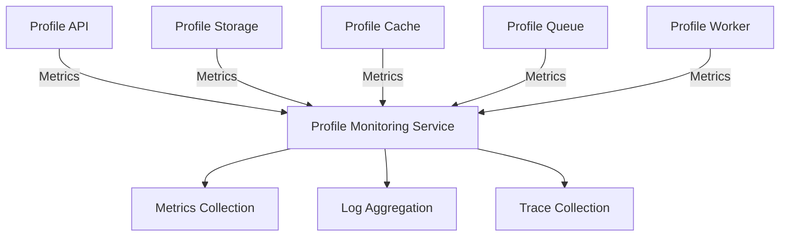
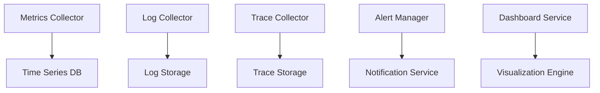
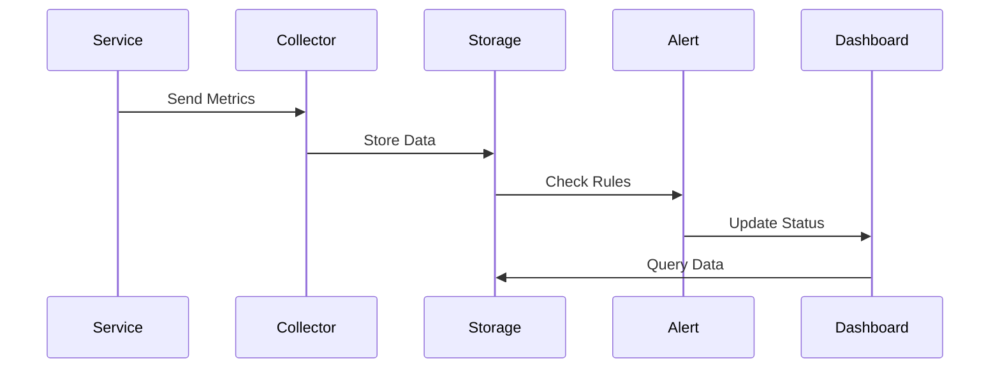

# Profile Monitoring Service Documentation

## Service Overview

### Description

The Profile Monitoring Service provides centralized monitoring, alerting, and observability for all profile-related services. It collects metrics, logs, and traces to ensure system health and performance.

### Service Context



### Service Boundaries

- **Input**:
  - Metrics from all profile services
  - Logs from all profile services
  - Traces from all profile services
- **Output**:
  - Monitoring dashboards
  - Alert notifications
  - Performance reports
- **Dependencies**:
  - Prometheus
  - Grafana
  - ELK Stack
  - Jaeger

## Architecture

### Component Diagram



### Data Flow



## API Documentation

### Endpoints

```yaml
endpoints:
  - path: /api/v1/monitoring/metrics
    method: POST
    description: Submit metrics
    requestBody:
      type: object
      required: true
      content:
        application/json:
          schema:
            $ref: "#/components/schemas/Metrics"
    responses:
      202:
        description: Metrics accepted
      400:
        description: Invalid metrics format
      500:
        description: Internal server error

  - path: /api/v1/monitoring/alerts
    method: GET
    description: Get active alerts
    responses:
      200:
        description: List of active alerts
      500:
        description: Internal server error
```

### Data Models

```yaml
models:
  Metrics:
    type: object
    properties:
      service:
        type: string
      metric_name:
        type: string
      value:
        type: number
      labels:
        type: object
      timestamp:
        type: string
        format: date-time

  Alert:
    type: object
    properties:
      id:
        type: string
      name:
        type: string
      severity:
        type: string
        enum: [critical, warning, info]
      status:
        type: string
        enum: [firing, resolved]
      description:
        type: string
      timestamp:
        type: string
        format: date-time
```

## Implementation Details

### Technology Stack

- **Language**: Go 1.21+
- **Framework**: Gin
- **Metrics**: Prometheus
- **Visualization**: Grafana
- **Logging**: ELK Stack
- **Tracing**: Jaeger

### Configuration

```yaml
service:
  name: profile-monitoring
  version: 1.0.0
  port: 8080
  environment: development
  metrics:
    retention: 15d
    scrape_interval: 15s
  logging:
    retention: 30d
    level: info
  tracing:
    sampling_rate: 0.1
    retention: 7d
```

### Dependencies

```yaml
dependencies:
  - name: github.com/gin-gonic/gin
    version: v1.9.1
    purpose: HTTP framework
  - name: github.com/prometheus/client_golang
    version: v1.17.0
    purpose: Metrics collection
  - name: go.uber.org/zap
    version: v1.26.0
    purpose: Logging
```

## Operational Aspects

### Health Checks

```yaml
health_checks:
  - name: readiness
    path: /health/ready
    interval: 30s
    timeout: 5s
    checks:
      - metrics_collector
      - log_collector
      - trace_collector
  - name: liveness
    path: /health/live
    interval: 30s
    timeout: 5s
```

### Metrics

```yaml
metrics:
  - name: monitoring_metrics_total
    type: counter
    labels:
      - service
      - metric_type
  - name: monitoring_alerts_total
    type: counter
    labels:
      - severity
      - status
  - name: monitoring_collection_duration_seconds
    type: histogram
    labels:
      - collector_type
```

### Logging

```yaml
logging:
  format: json
  fields:
    - service
    - trace_id
    - alert_id
    - collector_id
  levels:
    - error
    - warn
    - info
    - debug
```

## Deployment

### Kubernetes Configuration

```yaml
deployment:
  replicas: 3
  resources:
    requests:
      cpu: 200m
      memory: 256Mi
    limits:
      cpu: 1000m
      memory: 1Gi
  strategy:
    type: RollingUpdate
    rollingUpdate:
      maxSurge: 1
      maxUnavailable: 0
  volumes:
    - name: config
      configMap:
        name: profile-monitoring-config
```

### Environment Variables

```yaml
environment:
  - name: METRICS_RETENTION
    value: "15d"
  - name: LOG_LEVEL
    value: info
  - name: TRACING_SAMPLE_RATE
    value: "0.1"
```

## Development

### Local Development

```bash
# Start dependencies
docker-compose up -d prometheus grafana elasticsearch kibana jaeger

# Start service
go run cmd/main.go

# Run tests
go test ./...
```

### Testing

```yaml
testing:
  unit:
    command: go test ./...
    coverage: 80%
  integration:
    command: go test ./integration/...
    timeout: 5m
    requires:
      - prometheus
      - elasticsearch
  e2e:
    command: go test ./e2e/...
    timeout: 10m
```

## Monitoring and Alerting

### Dashboards

```yaml
dashboards:
  - name: service-overview
    metrics:
      - service_health
      - service_performance
      - service_errors
  - name: alert-overview
    metrics:
      - active_alerts
      - alert_history
      - alert_resolution_time
```

### Alerts

```yaml
alerts:
  - name: high_error_rate
    condition: rate(service_errors_total[5m]) > 0.1
    duration: 5m
    severity: warning
  - name: service_unavailable
    condition: up == 0
    duration: 1m
    severity: critical
```

## Maintenance

### Backup and Recovery

```yaml
backup:
  schedule: "0 0 * * *"
  retention: 30d
  location: s3://monitoring-backups
recovery:
  rto: 1h
  rpo: 1d
  verification: automated-tests
```

### Update Procedures

```yaml
updates:
  - type: minor
    procedure: rolling-update
    max_unavailable: 1
    verification: health-checks
  - type: major
    procedure: blue-green
    verification:
      - health-checks
      - performance-tests
```

## Troubleshooting

### Common Issues

```yaml
issues:
  - name: metrics_collection_delay
    symptoms:
      - Delayed metrics
      - Missing data points
    causes:
      - Network issues
      - Resource constraints
    solutions:
      - Check network
      - Scale collectors
      - Review configuration

  - name: alert_storm
    symptoms:
      - Too many alerts
      - Alert fatigue
    causes:
      - Misconfigured rules
      - Service issues
    solutions:
      - Review alert rules
      - Adjust thresholds
      - Implement deduplication
```

### Debug Procedures

```yaml
debug:
  - name: metrics_flow
    steps:
      - Check collectors
      - Verify storage
      - Review dashboards
  - name: alert_flow
    steps:
      - Check rules
      - Verify notifications
      - Review history
```

## Next Steps

1. [ ] Implement metric aggregation
2. [ ] Add custom dashboards
3. [ ] Enhance alerting rules
4. [ ] Implement log analysis
5. [ ] Add trace analysis
