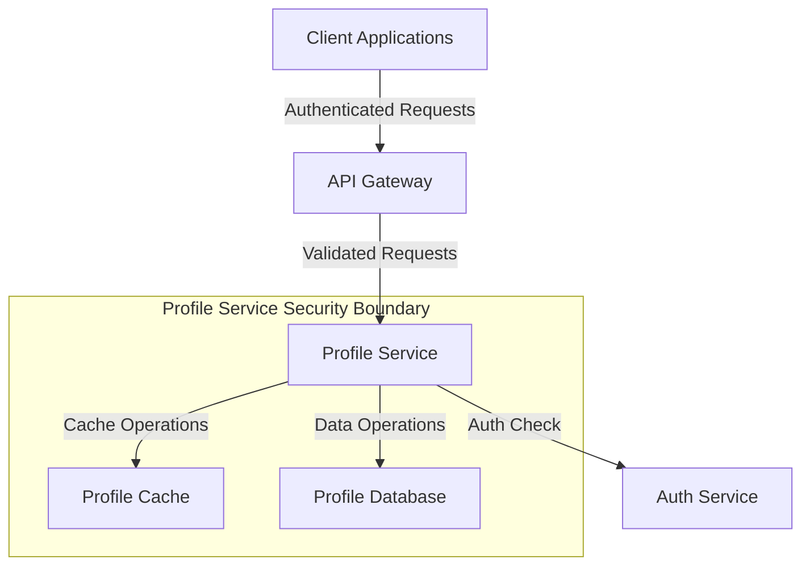

# Profile Service Security Documentation

## Service Overview

### Service Name

Profile Service

### Service Description

The Profile Service manages user profile data, including personal information, preferences, and settings. It provides CRUD operations for user profiles and handles profile data validation and storage.

## Security Context

### Security Boundaries



### Security Dependencies

- Auth Service for authentication and authorization
- Redis for profile caching
- PostgreSQL for profile data storage
- API Gateway for request routing and rate limiting

## Authentication

### Client Authentication

- JWT-based authentication
- Token validation through Auth Service
- Session management via refresh tokens
- Token rotation on refresh

### Service-to-Service Authentication

- mTLS for service-to-service communication
- Service mesh for automatic certificate management
- Service identity verification through service mesh

## Authorization

### Access Control

```yaml
permissions:
  - resource: "profile"
    actions:
      - "read"
      - "write"
      - "delete"
    roles:
      - "user"
      - "admin"
  - resource: "profile:preferences"
    actions:
      - "read"
      - "write"
    roles:
      - "user"
      - "admin"
```

### Role Requirements

- User role: Can read and write own profile
- Admin role: Can read and write any profile
- System role: Can perform background operations

## Data Security

### Data Classification

```yaml
data_types:
  - name: "personal_info"
    classification: "PII"
    encryption: "required"
    retention: "90d"
  - name: "preferences"
    classification: "internal"
    encryption: "required"
    retention: "365d"
  - name: "system_data"
    classification: "system"
    encryption: "required"
    retention: "30d"
```

### Data Protection

- AES-256 encryption for sensitive data
- Data masking for PII in logs
- Input sanitization for all fields
- Output encoding for all responses

## Network Security

### Network Policies

```yaml
network_policies:
  ingress:
    - from:
        - podSelector:
            matchLabels:
              app: "api-gateway"
      ports:
        - protocol: TCP
          port: 8080
  egress:
    - to:
        - podSelector:
            matchLabels:
              app: "auth-service"
      ports:
        - protocol: TCP
          port: 8080
    - to:
        - podSelector:
            matchLabels:
              app: "redis"
      ports:
        - protocol: TCP
          port: 6379
```

### API Security

- Rate limiting: 1000 requests/minute per user
- Request validation for all fields
- Response sanitization
- CORS policies

## Monitoring and Logging

### Security Events

```yaml
security_events:
  - name: "profile_access"
    severity: "info"
    metrics:
      - name: "profile_access_total"
        type: "counter"
    alerts:
      - condition: "rate(profile_access_total[5m]) > 1000"
        action: "notify_security_team"
  - name: "profile_modification"
    severity: "warning"
    metrics:
      - name: "profile_modification_total"
        type: "counter"
    alerts:
      - condition: "rate(profile_modification_total[5m]) > 100"
        action: "notify_security_team"
```

### Audit Logging

- Log all profile access attempts
- Log all profile modifications
- Log all permission changes
- 90-day retention period

## Security Controls

### Input Validation

- Validate all input fields
- Sanitize HTML content
- Validate email formats
- Validate phone numbers
- Maximum field lengths

### Output Encoding

- JSON encoding for API responses
- HTML encoding for web responses
- URL encoding for parameters
- Base64 encoding for binary data

## Security Testing

### Security Test Cases

```yaml
security_tests:
  - name: "profile_access_authorization"
    type: "integration"
    scenario: "User attempts to access another user's profile"
    expected_result: "403 Forbidden"
  - name: "profile_modification_validation"
    type: "unit"
    scenario: "User attempts to modify profile with invalid data"
    expected_result: "400 Bad Request"
  - name: "rate_limit_enforcement"
    type: "integration"
    scenario: "User exceeds rate limit"
    expected_result: "429 Too Many Requests"
```

### Vulnerability Scanning

- Weekly dependency scanning
- Monthly penetration testing
- Quarterly security assessment
- Automated security testing in CI/CD

## Incident Response

### Security Incidents

- Unauthorized profile access
- Data breach
- Service disruption
- Rate limit abuse

### Recovery Procedures

- Immediate service isolation
- Data backup verification
- Service restoration
- Post-incident analysis

## Compliance

### Compliance Requirements

- GDPR compliance
- CCPA compliance
- SOC 2 compliance
- ISO 27001 compliance

### Compliance Controls

- Data encryption at rest
- Data encryption in transit
- Access logging
- Audit trails

## Security Maintenance

### Updates and Patches

- Weekly dependency updates
- Monthly security patches
- Quarterly major updates
- Automated update testing

### Security Reviews

- Monthly security review
- Quarterly penetration testing
- Annual security assessment
- Continuous security monitoring

## Security Documentation

### Runbooks

- Security incident response
- Service recovery procedures
- Security monitoring procedures
- Access management procedures

### Security Policies

- Data handling policies
- Access control policies
- Security incident policies
- Compliance policies

## Next Steps

1. Implement mTLS for service-to-service communication
2. Set up automated security testing
3. Deploy security monitoring
4. Create security runbooks
5. Conduct security training
