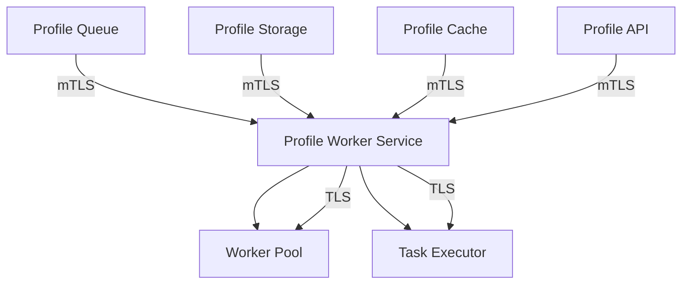

# Profile Worker Service Security Documentation

## Service Overview

### Description

The Profile Worker Service processes background jobs and requires robust security measures to ensure job integrity, access control, and compliance with security standards.

### Security Context



### Security Boundaries

- **Input**:
  - Authenticated job requests from Profile Queue
  - Task notifications from Profile API
  - Cache invalidation requests from Profile Cache
  - Data access requests from Profile Storage
- **Output**:
  - Processed job results
  - Task status updates
  - Event notifications
- **Dependencies**:
  - Secure Message Queue
  - TLS-enabled Storage Service
  - Secure Cache Service
  - Secure API Service

## Authentication

### Client Authentication

```yaml
authentication:
  methods:
    - type: mTLS
      description: Mutual TLS for service-to-service communication
      certificate_rotation: 90d
      validation:
        - verify_certificate
        - check_revocation
    - type: JWT
      description: For external API access
      validation:
        - verify_signature
        - check_expiration
        - validate_claims
```

### Service-to-Service Authentication

```yaml
service_auth:
  method: mTLS
  certificate_authority: internal-ca
  certificate_rotation: 90d
  validation:
    - verify_certificate
    - check_revocation
    - validate_service_identity
```

## Authorization

### Access Control

```yaml
authorization:
  roles:
    - name: system
      permissions:
        - read:jobs
        - write:jobs
        - manage:jobs
    - name: admin
      permissions:
        - read:jobs
        - write:jobs
    - name: service
      permissions:
        - read:jobs
        - write:jobs
  policies:
    - name: job_access
      rules:
        - allow: system
        - allow: admin
        - allow: service
        - deny: all
```

## Data Security

### Data Classification

```yaml
data_classification:
  - type: job_data
    sensitivity: high
    encryption: required
    retention: 7d
  - type: job_metadata
    sensitivity: medium
    encryption: required
    retention: 30d
  - type: audit_logs
    sensitivity: medium
    encryption: required
    retention: 1y
```

### Data Protection

```yaml
data_protection:
  encryption:
    at_rest:
      algorithm: AES-256
      key_rotation: 90d
    in_transit:
      protocol: TLS 1.3
      certificate_rotation: 90d
  masking:
    fields:
      - email
      - phone
      - address
  sanitization:
    input:
      - strip_html
      - validate_format
    output:
      - mask_sensitive
      - validate_schema
```

## Network Security

### Network Policies

```yaml
network_policies:
  ingress:
    - from:
        - namespace: profile-queue
        - namespace: profile-storage
        - namespace: profile-cache
        - namespace: profile-api
      ports:
        - 8080
      protocol: TCP
  egress:
    - to:
        - namespace: profile-queue
        - namespace: profile-storage
        - namespace: profile-cache
        - namespace: profile-api
      ports:
        - 8080
      protocol: TCP
```

### API Security

```yaml
api_security:
  rate_limiting:
    requests_per_second: 1000
    burst: 2000
  request_validation:
    max_size: 1MB
    allowed_content_types:
      - application/json
  response_sanitization:
    - remove_sensitive_headers
    - validate_content_type
```

## Monitoring and Logging

### Security Events

```yaml
security_events:
  - name: authentication_failure
    severity: high
    metrics:
      - auth_failures_total
    alerts:
      threshold: 10
      window: 5m
  - name: job_tampering
    severity: high
    metrics:
      - job_tampering_attempts
    alerts:
      threshold: 5
      window: 5m
```

### Audit Logging

```yaml
audit_logging:
  events:
    - name: job_access
      fields:
        - user_id
        - action
        - job_id
        - timestamp
    - name: job_modification
      fields:
        - user_id
        - action
        - job_id
        - old_value
        - new_value
        - timestamp
  retention: 1y
  encryption: required
```

## Security Controls

### Input Validation

```yaml
input_validation:
  - type: job
    rules:
      - max_size: 1MB
      - validate_json
      - required: true
  - type: job_id
    rules:
      - max_length: 256
      - pattern: ^[a-zA-Z0-9\-\_\.]+$
      - required: true
```

### Output Encoding

```yaml
output_encoding:
  - type: json
    rules:
      - escape_special_chars
      - validate_utf8
  - type: job_result
    rules:
      - validate_schema
      - sanitize_sensitive
```

## Security Testing

### Security Test Cases

```yaml
security_tests:
  - name: authentication_tests
    type: integration
    cases:
      - test_invalid_certificate
      - test_expired_certificate
      - test_invalid_jwt
  - name: job_security_tests
    type: integration
    cases:
      - test_job_injection
      - test_job_tampering
      - test_job_replay
```

### Vulnerability Scanning

```yaml
vulnerability_scanning:
  schedule: weekly
  tools:
    - name: trivy
      type: container
    - name: snyk
      type: dependency
  severity_threshold: high
  auto_fix: false
```

## Incident Response

### Security Incidents

```yaml
security_incidents:
  - type: job_tampering
    severity: critical
    response:
      - isolate_affected_jobs
      - notify_security_team
      - investigate_source
  - type: unauthorized_access
    severity: high
    response:
      - revoke_access
      - investigate_source
      - update_security_controls
```

### Recovery Procedures

```yaml
recovery_procedures:
  - name: job_recovery
    steps:
      - isolate_compromised_jobs
      - restore_from_backup
      - validate_job_integrity
  - name: service_recovery
    steps:
      - verify_security_controls
      - restore_service
      - validate_functionality
```

## Compliance

### Compliance Requirements

```yaml
compliance:
  standards:
    - name: GDPR
      requirements:
        - data_protection
        - data_retention
        - data_portability
    - name: SOC 2
      requirements:
        - security
        - availability
        - confidentiality
```

### Compliance Controls

```yaml
compliance_controls:
  - name: data_protection
    controls:
      - encryption_at_rest
      - encryption_in_transit
      - access_control
  - name: audit_trail
    controls:
      - logging
      - monitoring
      - alerting
```

## Security Maintenance

### Update Procedures

```yaml
security_updates:
  - type: certificate_rotation
    schedule: 90d
    procedure:
      - generate_new_certificates
      - update_configurations
      - verify_connections
  - type: security_patches
    schedule: weekly
    procedure:
      - review_patches
      - test_in_staging
      - deploy_to_production
```

### Review Process

```yaml
security_review:
  - type: access_review
    schedule: quarterly
    scope:
      - user_access
      - service_accounts
      - permissions
  - type: security_audit
    schedule: annually
    scope:
      - controls
      - policies
      - procedures
```

## Security Documentation

### Runbooks

```yaml
security_runbooks:
  - name: incident_response
    procedures:
      - detection
      - containment
      - eradication
      - recovery
  - name: certificate_rotation
    procedures:
      - preparation
      - execution
      - verification
```

### Policies

```yaml
security_policies:
  - name: data_protection
    scope:
      - data_classification
      - encryption
      - access_control
  - name: incident_response
    scope:
      - detection
      - response
      - recovery
```

## Next Steps

1. [ ] Implement additional encryption for job data
2. [ ] Enhance worker monitoring and alerting
3. [ ] Conduct security assessment
4. [ ] Create security runbooks
5. [ ] Train development team
