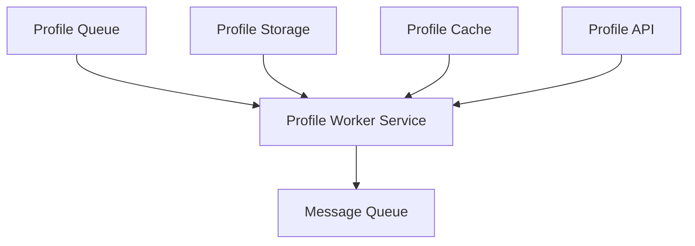
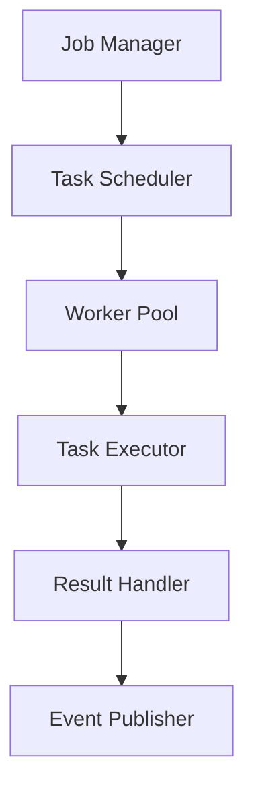
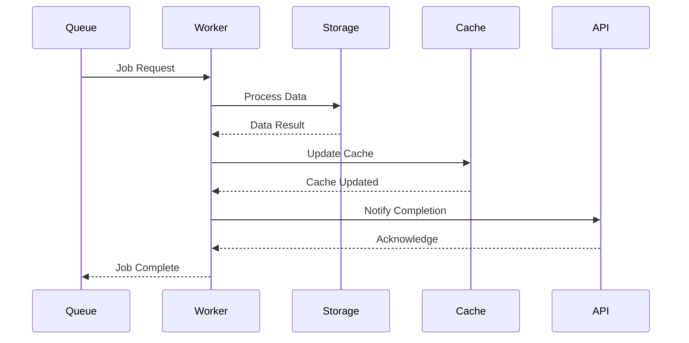

# Profile Worker Service Documentation

## Service Overview

### Description

The Profile Worker Service processes background jobs and asynchronous tasks for profile-related operations. It handles tasks such as profile updates, cache invalidation, and data synchronization across the system.

### Service Context



### Service Boundaries

- **Input**:
  - Job requests from Profile Queue
  - Task notifications from Profile API
  - Cache invalidation requests
- **Output**:
  - Processed job results
  - Task status updates
  - Event notifications
- **Dependencies**:
  - Message Queue
  - Profile Storage Service
  - Profile Cache Service
  - Profile API Service

## Architecture

### Component Diagram



### Data Flow



## API Documentation

### Endpoints

```yaml
endpoints:
  - path: /api/v1/worker/jobs
    method: POST
    description: Submit a new job
    requestBody:
      type: object
      required: true
      content:
        application/json:
          schema:
            $ref: "#/components/schemas/WorkerJob"
    responses:
      202:
        description: Job accepted
      400:
        description: Invalid job format
      500:
        description: Internal server error

  - path: /api/v1/worker/jobs/{jobId}
    method: GET
    description: Get job status
    parameters:
      - name: jobId
        type: string
        required: true
    responses:
      200:
        description: Job status
      404:
        description: Job not found
      500:
        description: Internal server error
```

### Data Models

```yaml
models:
  WorkerJob:
    type: object
    properties:
      id:
        type: string
      type:
        type: string
        enum: [profile_update, cache_invalidation, data_sync]
      payload:
        type: object
      priority:
        type: integer
        minimum: 1
        maximum: 10
      retry_count:
        type: integer
        minimum: 0
        maximum: 3
      timestamp:
        type: string
        format: date-time
```

## Implementation Details

### Technology Stack

- **Language**: Go 1.21+
- **Framework**: Gin
- **Message Queue**: RabbitMQ
- **Monitoring**: Prometheus + Grafana

### Configuration

```yaml
service:
  name: profile-worker
  version: 1.0.0
  port: 8080
  environment: development
  worker:
    pool_size: 10
    max_retries: 3
    retry_delay: 5s
  message_queue:
    host: rabbitmq
    port: 5672
    vhost: profiles
  logging:
    level: info
    format: json
  metrics:
    enabled: true
    port: 9090
```

### Dependencies

```yaml
dependencies:
  - name: github.com/gin-gonic/gin
    version: v1.9.1
    purpose: HTTP framework
  - name: github.com/streadway/amqp
    version: v1.0.0
    purpose: RabbitMQ client
  - name: github.com/prometheus/client_golang
    version: v1.17.0
    purpose: Metrics collection
```

## Operational Aspects

### Health Checks

```yaml
health_checks:
  - name: readiness
    path: /health/ready
    interval: 30s
    timeout: 5s
    checks:
      - worker_pool
      - message_queue
  - name: liveness
    path: /health/live
    interval: 30s
    timeout: 5s
```

### Metrics

```yaml
metrics:
  - name: worker_jobs_total
    type: counter
    labels:
      - job_type
      - status
  - name: worker_processing_duration_seconds
    type: histogram
    labels:
      - job_type
  - name: worker_queue_size
    type: gauge
    labels:
      - queue
```

### Logging

```yaml
logging:
  format: json
  fields:
    - service
    - trace_id
    - job_id
    - worker_id
  levels:
    - error
    - warn
    - info
    - debug
```

## Deployment

### Kubernetes Configuration

```yaml
deployment:
  replicas: 3
  resources:
    requests:
      cpu: 100m
      memory: 128Mi
    limits:
      cpu: 500m
      memory: 512Mi
  strategy:
    type: RollingUpdate
    rollingUpdate:
      maxSurge: 1
      maxUnavailable: 0
  volumes:
    - name: config
      configMap:
        name: profile-worker-config
```

### Environment Variables

```yaml
environment:
  - name: WORKER_POOL_SIZE
    value: "10"
  - name: MAX_RETRIES
    value: "3"
  - name: LOG_LEVEL
    value: info
```

## Development

### Local Development

```bash
# Start dependencies
docker-compose up -d rabbitmq

# Start service
go run cmd/main.go

# Run tests
go test ./...
```

### Testing

```yaml
testing:
  unit:
    command: go test ./...
    coverage: 80%
  integration:
    command: go test ./integration/...
    timeout: 5m
    requires:
      - rabbitmq
  e2e:
    command: go test ./e2e/...
    timeout: 10m
```

## Monitoring and Alerting

### Dashboards

```yaml
dashboards:
  - name: worker-overview
    metrics:
      - worker_jobs_total
      - worker_processing_duration_seconds
      - worker_queue_size
  - name: worker-resources
    metrics:
      - cpu_usage
      - memory_usage
      - worker_pool_size
```

### Alerts

```yaml
alerts:
  - name: high_job_failure_rate
    condition: rate(worker_jobs_total{status="failed"}[5m]) > 0.1
    duration: 5m
    severity: warning
  - name: slow_job_processing
    condition: histogram_quantile(0.95, rate(worker_processing_duration_seconds_bucket[5m])) > 30
    duration: 5m
    severity: warning
```

## Maintenance

### Backup and Recovery

```yaml
backup:
  schedule: "0 0 * * *"
  retention: 7d
  location: s3://worker-backups
recovery:
  rto: 30m
  rpo: 1h
  verification: automated-tests
```

### Update Procedures

```yaml
updates:
  - type: minor
    procedure: rolling-update
    max_unavailable: 1
    verification: health-checks
  - type: major
    procedure: blue-green
    verification:
      - health-checks
      - performance-tests
```

## Troubleshooting

### Common Issues

```yaml
issues:
  - name: job_processing_delay
    symptoms:
      - High queue size
      - Slow processing
    causes:
      - Worker overload
      - Resource constraints
    solutions:
      - Scale workers
      - Check resources
      - Review job logic

  - name: message_queue_connection
    symptoms:
      - Connection errors
      - Job loss
    causes:
      - Network issues
      - Queue overload
    solutions:
      - Check network
      - Monitor queue
      - Review connection pool
```

### Debug Procedures

```yaml
debug:
  - name: job_flow
    steps:
      - Check queue size
      - Analyze processing time
      - Review error logs
  - name: performance_issues
    steps:
      - Monitor metrics
      - Check resource usage
      - Review configuration
```

## Next Steps

1. [ ] Implement job prioritization
2. [ ] Add job scheduling
3. [ ] Enhance monitoring
4. [ ] Implement retry policies
5. [ ] Add job validation
