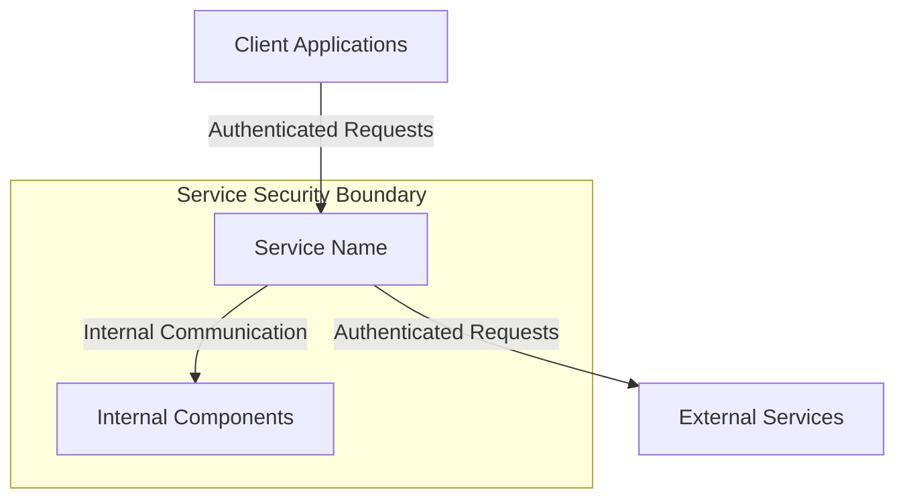

# Service Security Documentation Template

## Service Overview

### Service Name

[Service Name]

### Service Description

[Brief description of the service's purpose and main functionality]

## Security Context

### Security Boundaries



### Security Dependencies

- [List of security-related dependencies]
- [Authentication services]
- [Authorization services]
- [Monitoring services]

## Authentication

### Client Authentication

- [Authentication methods supported]
- [Token validation process]
- [Session management]

### Service-to-Service Authentication

- [Authentication method used]
- [Certificate management]
- [Identity verification]

## Authorization

### Access Control

```yaml
permissions:
  - resource: "[resource_name]"
    actions:
      - "[action]"
    roles:
      - "[role]"
```

### Role Requirements

- [List of required roles]
- [Permission matrix]
- [Role hierarchy]

## Data Security

### Data Classification

```yaml
data_types:
  - name: "[data_type]"
    classification: "[classification]"
    encryption: "[encryption_required]"
    retention: "[retention_period]"
```

### Data Protection

- [Encryption methods]
- [Data masking]
- [Data sanitization]

## Network Security

### Network Policies

```yaml
network_policies:
  ingress:
    - from:
        - podSelector:
            matchLabels:
              app: "[allowed_service]"
      ports:
        - protocol: TCP
          port: [port_number]
  egress:
    - to:
        - podSelector:
            matchLabels:
              app: "[target_service]"
      ports:
        - protocol: TCP
          port: [port_number]
```

### API Security

- [Rate limiting]
- [Request validation]
- [Response sanitization]

## Monitoring and Logging

### Security Events

```yaml
security_events:
  - name: "[event_name]"
    severity: "[severity]"
    metrics:
      - name: "[metric_name]"
        type: "[metric_type]"
    alerts:
      - condition: "[alert_condition]"
        action: "[alert_action]"
```

### Audit Logging

- [Audit log requirements]
- [Log retention]
- [Log analysis]

## Security Controls

### Input Validation

- [Validation rules]
- [Sanitization methods]
- [Error handling]

### Output Encoding

- [Encoding methods]
- [Content security]
- [Response headers]

## Security Testing

### Security Test Cases

```yaml
security_tests:
  - name: "[test_name]"
    type: "[test_type]"
    scenario: "[test_scenario]"
    expected_result: "[expected_result]"
```

### Vulnerability Scanning

- [Scanning tools]
- [Scanning frequency]
- [Remediation process]

## Incident Response

### Security Incidents

- [Incident types]
- [Response procedures]
- [Escalation paths]

### Recovery Procedures

- [Recovery steps]
- [Backup procedures]
- [Restore procedures]

## Compliance

### Compliance Requirements

- [Regulatory requirements]
- [Industry standards]
- [Internal policies]

### Compliance Controls

- [Control measures]
- [Audit requirements]
- [Reporting requirements]

## Security Maintenance

### Updates and Patches

- [Update process]
- [Patch management]
- [Version control]

### Security Reviews

- [Review frequency]
- [Review scope]
- [Review process]

## Security Documentation

### Runbooks

- [Security procedures]
- [Troubleshooting guides]
- [Recovery procedures]

### Security Policies

- [Service-specific policies]
- [Compliance policies]
- [Operational policies]

## Next Steps

1. [Immediate security tasks]
2. [Security improvements]
3. [Security assessments]
4. [Security training]
5. [Security documentation updates]
