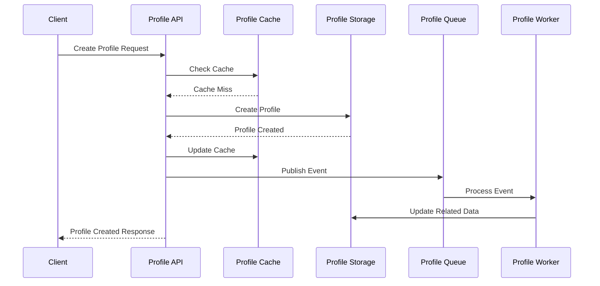
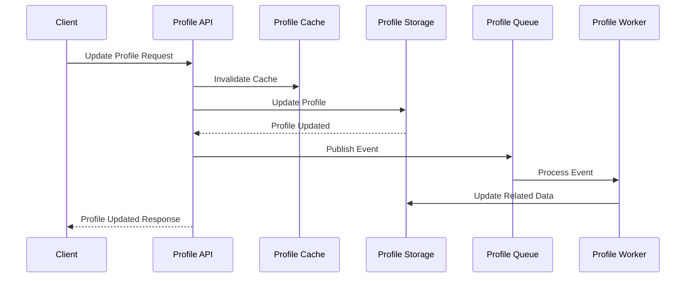
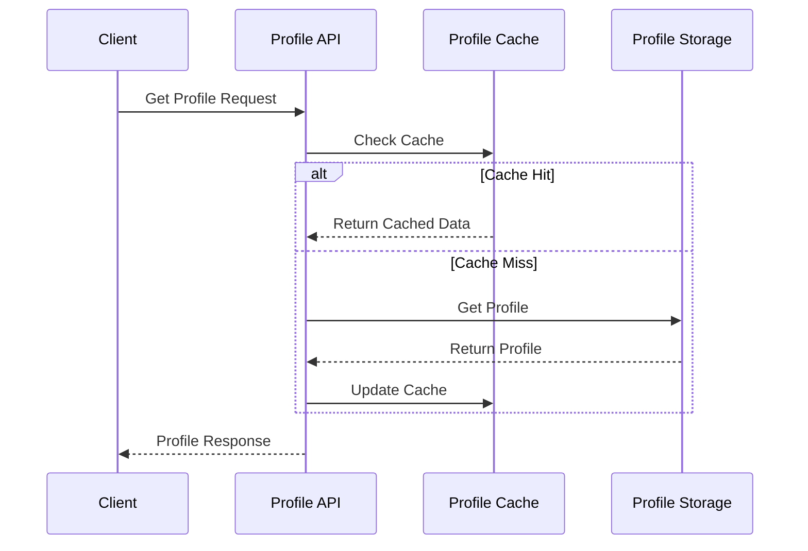

# Profile Microservices Interactions

-> IMPORTANT: Never add fictional dates, version numbers, or metrics. Only include real, verified information. If information is not available, mark it as "To be determined" or remove the section.

## Overview

This document describes how the different profile microservices interact with each other to provide a complete profile management system. Each service has a specific responsibility and communicates with other services through well-defined interfaces.

## Service Architecture

### Core Services

1. **Profile API Service**

   - Primary entry point for external clients
   - Handles HTTP requests and responses
   - Coordinates interactions between other services
   - Implements business logic and validation

2. **Profile Storage Service**

   - Manages persistent data storage
   - Handles database operations
   - Provides data consistency and reliability
   - Implements data access patterns

3. **Profile Cache Service**

   - Provides high-speed data access
   - Reduces database load
   - Improves response times
   - Manages cache invalidation

4. **Profile Queue Service**

   - Handles asynchronous communication
   - Manages message routing
   - Ensures reliable message delivery
   - Provides message persistence

5. **Profile Worker Service**

   - Processes background tasks
   - Handles long-running operations
   - Manages task scheduling
   - Implements retry mechanisms

6. **Profile Monitoring Service**
   - Collects metrics from all services
   - Provides system observability
   - Manages alerts and notifications
   - Tracks system health

## Service Interactions

### 1. Profile Creation Flow

### 2. Profile Update Flow

### 3. Profile Read Flow

## Service Dependencies

### 1. Profile API Service Dependencies

- Depends on:
  - Profile Storage Service (for data persistence)
  - Profile Cache Service (for performance)
  - Profile Queue Service (for async operations)
  - Profile Monitoring Service (for metrics)

### 2. Profile Storage Service Dependencies

- Depends on:
  - Profile Monitoring Service (for metrics)
  - Profile Queue Service (for event publishing)

### 3. Profile Cache Service Dependencies

- Depends on:
  - Profile Monitoring Service (for metrics)
  - Profile Queue Service (for cache invalidation events)

### 4. Profile Queue Service Dependencies

- Depends on:
  - Profile Monitoring Service (for metrics)
  - Profile Worker Service (for message processing)

### 5. Profile Worker Service Dependencies

- Depends on:
  - Profile Storage Service (for data updates)
  - Profile Cache Service (for cache updates)
  - Profile Monitoring Service (for metrics)
  - Profile Queue Service (for message consumption)

### 6. Profile Monitoring Service Dependencies

- No dependencies on other services
- All services depend on it for metrics collection

## Communication Patterns

### 1. Synchronous Communication

- HTTP/REST for API requests
- Direct service-to-service calls
- Used for:
  - Immediate data access
  - Real-time operations
  - Request-response patterns

### 2. Asynchronous Communication

- Message queues for events
- Event-driven patterns
- Used for:
  - Background processing
  - Event propagation
  - Decoupled operations

### 3. Caching Communication

- Redis for caching
- Cache invalidation patterns
- Used for:
  - Performance optimization
  - Data access patterns
  - State management

## Error Handling

### 1. Service-Level Errors

- Each service handles its own errors
- Implements retry mechanisms
- Provides error responses
- Logs error details

### 2. Cross-Service Errors

- Circuit breaker patterns
- Fallback mechanisms
- Error propagation
- Error recovery

### 3. Data Consistency

- Transaction management
- Eventual consistency
- Conflict resolution
- Data validation

## Monitoring and Observability

### 1. Metrics Collection

- Service-level metrics
- Cross-service metrics
- Performance metrics
- Business metrics

### 2. Logging

- Centralized logging
- Structured log format
- Log correlation
- Log levels

### 3. Tracing

- Request tracing
- Service tracing
- Performance tracing
- Error tracing

## Security

### 1. Authentication

- Service-to-service authentication
- API authentication
- Token management
- Identity verification

### 2. Authorization

- Role-based access
- Service permissions
- Resource access
- Operation permissions

### 3. Data Protection

- Data encryption
- Secure communication
- Data masking
- Access control

## Deployment Considerations

### 1. Service Deployment

- Independent deployment
- Version management
- Configuration management
- Environment setup

### 2. Infrastructure

- Resource allocation
- Scaling policies
- Network configuration
- Storage management

### 3. Monitoring

- Health checks
- Performance monitoring
- Resource monitoring
- Alert management

## Notes

- Track all decisions
- Update documentation
- Maintain accuracy
- Document changes
- Record lessons learned
- Track improvements

## Tasks History

- Initial documentation creation
- Added service interaction diagrams
- Documented communication patterns
- Added security considerations
