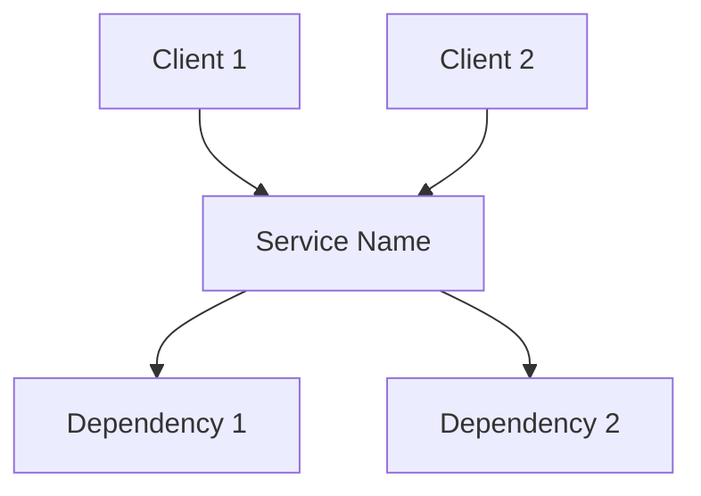
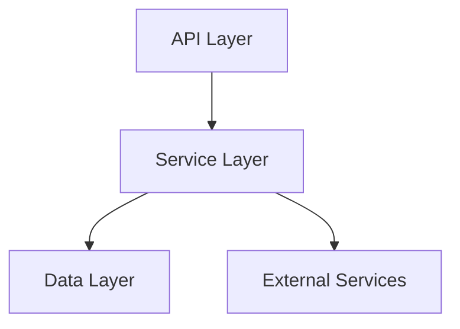
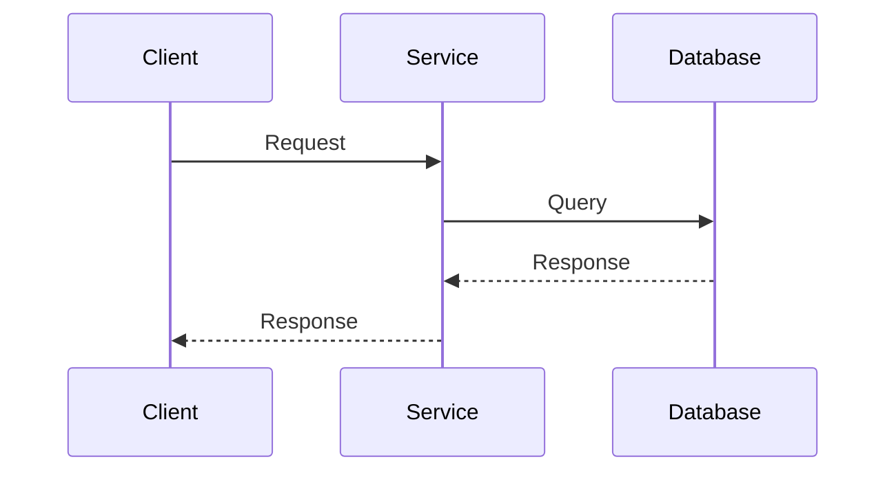

# [Service Name] Documentation

## Service Overview

### Description

[Brief description of the service's purpose and main responsibilities]

### Service Context



### Service Boundaries

- **Input**: [List of input sources and types]
- **Output**: [List of output destinations and types]
- **Dependencies**: [List of service dependencies]

## Architecture

### Component Diagram



### Data Flow



## API Documentation

### Endpoints

```yaml
endpoints:
  - path: /api/v1/resource
    method: GET
    description: Retrieve resource
    parameters:
      - name: id
        type: string
        required: true
    responses:
      200:
        description: Success
      404:
        description: Not Found
```

### Data Models

```yaml
models:
  Resource:
    type: object
    properties:
      id:
        type: string
      name:
        type: string
      created_at:
        type: string
        format: date-time
```

## Implementation Details

### Technology Stack

- **Language**: [Programming language]
- **Framework**: [Framework used]
- **Database**: [Database technology]
- **Message Queue**: [Message queue technology]
- **Cache**: [Caching technology]

### Configuration

```yaml
service:
  name: service-name
  version: 1.0.0
  port: 8080
  environment: development
  logging:
    level: info
    format: json
  metrics:
    enabled: true
    port: 9090
```

### Dependencies

```yaml
dependencies:
  - name: dependency-1
    version: 1.0.0
    purpose: [Purpose of dependency]
  - name: dependency-2
    version: 2.0.0
    purpose: [Purpose of dependency]
```

## Operational Aspects

### Health Checks

```yaml
health_checks:
  - name: readiness
    path: /health/ready
    interval: 30s
    timeout: 5s
  - name: liveness
    path: /health/live
    interval: 30s
    timeout: 5s
```

### Metrics

```yaml
metrics:
  - name: request_count
    type: counter
    labels:
      - method
      - path
      - status
  - name: request_duration
    type: histogram
    labels:
      - method
      - path
```

### Logging

```yaml
logging:
  format: json
  fields:
    - service
    - trace_id
    - user_id
  levels:
    - error
    - warn
    - info
    - debug
```

## Deployment

### Kubernetes Configuration

```yaml
deployment:
  replicas: 3
  resources:
    requests:
      cpu: 100m
      memory: 128Mi
    limits:
      cpu: 500m
      memory: 512Mi
  strategy:
    type: RollingUpdate
    rollingUpdate:
      maxSurge: 1
      maxUnavailable: 0
```

### Environment Variables

```yaml
environment:
  - name: DB_HOST
    value: postgres
  - name: DB_PORT
    value: "5432"
  - name: LOG_LEVEL
    value: info
```

## Development

### Local Development

```bash
# Start service locally
go run cmd/main.go

# Run tests
go test ./...

# Build container
docker build -t service-name .
```

### Testing

```yaml
testing:
  unit:
    command: go test ./...
    coverage: 80%
  integration:
    command: go test ./integration/...
    timeout: 5m
  e2e:
    command: go test ./e2e/...
    timeout: 10m
```

## Monitoring and Alerting

### Dashboards

```yaml
dashboards:
  - name: service-overview
    metrics:
      - request_count
      - request_duration
      - error_rate
  - name: resource-usage
    metrics:
      - cpu_usage
      - memory_usage
      - disk_usage
```

### Alerts

```yaml
alerts:
  - name: high_error_rate
    condition: error_rate > 0.05
    duration: 5m
    severity: critical
  - name: high_latency
    condition: request_duration_p95 > 1s
    duration: 5m
    severity: warning
```

## Maintenance

### Backup and Recovery

```yaml
backup:
  schedule: "0 0 * * *"
  retention: 7d
  location: s3://backups
recovery:
  rto: 1h
  rpo: 24h
```

### Update Procedures

```yaml
updates:
  - type: minor
    procedure: rolling-update
    max_unavailable: 1
  - type: major
    procedure: blue-green
    verification: automated-tests
```

## Troubleshooting

### Common Issues

```yaml
issues:
  - name: high_latency
    symptoms:
      - Slow response times
      - Increased error rates
    causes:
      - Database connection issues
      - Resource constraints
    solutions:
      - Check database connectivity
      - Monitor resource usage
```

### Debug Procedures

```yaml
debug:
  - name: request_tracing
    steps:
      - Enable debug logging
      - Check trace IDs
      - Review request flow
  - name: performance_analysis
    steps:
      - Collect metrics
      - Analyze resource usage
      - Check for bottlenecks
```

## Next Steps

1. [ ] Implement additional endpoints
2. [ ] Add more test coverage
3. [ ] Enhance monitoring
4. [ ] Optimize performance
5. [ ] Update documentation
