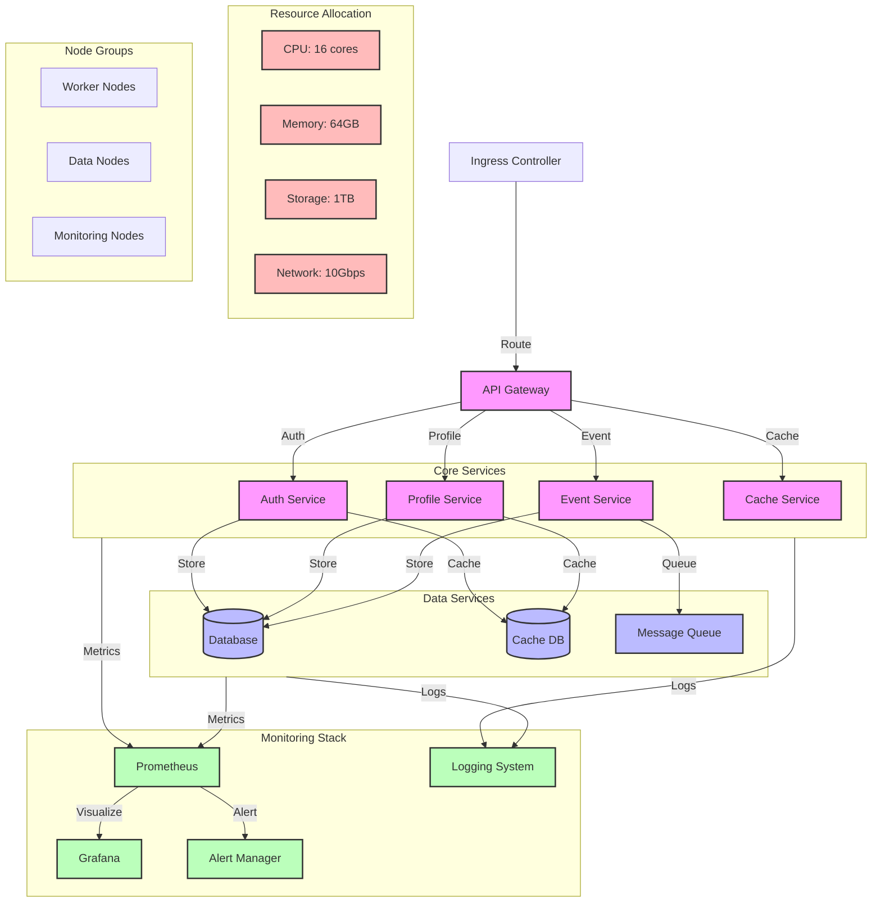

# Production Cluster Layout Diagram

## Overview

This diagram illustrates the production Kubernetes cluster layout, showing the organization of nodes, namespaces, and resource allocation for our microservices system.

## Flow Diagram

## Components

### Main Components

1. **Core Services**

   - Auth Service: Authentication and authorization
   - Profile Service: User profile management
   - Event Service: Event processing
   - Cache Service: Caching layer

2. **Data Services**

   - Database: Primary data storage
   - Cache DB: Caching storage
   - Message Queue: Event queue

3. **Monitoring Stack**
   - Prometheus: Metrics collection
   - Grafana: Visualization
   - Alert Manager: Alert handling
   - Logging System: Log management

### Resource Allocation

1. **Compute Resources**

   - CPU: 16 cores total
   - Memory: 64GB total
   - Storage: 1TB total
   - Network: 10Gbps

2. **Node Groups**
   - Worker Nodes: Service deployment
   - Data Nodes: Database and storage
   - Monitoring Nodes: Monitoring stack

## Deployment Details

### Service Configuration

1. **Core Services**

   - Replicas: 3-5 per service
   - Resource limits: 2 CPU, 4GB RAM
   - Auto-scaling: Enabled
   - Health checks: Enabled

2. **Data Services**

   - Database: Primary + 2 replicas
   - Cache: 3 nodes cluster
   - Message Queue: 3 nodes cluster

3. **Monitoring**
   - Prometheus: 2 replicas
   - Grafana: 2 replicas
   - Alert Manager: 2 replicas
   - Logging: 3 nodes

### Network Configuration

1. **Ingress**

   - Load balancer: Enabled
   - SSL termination: Enabled
   - Rate limiting: Enabled
   - WAF: Enabled

2. **Internal Network**
   - Service mesh: Enabled
   - mTLS: Enabled
   - Network policies: Enabled
   - DNS: CoreDNS

## Security Considerations

### Authentication

- Service mesh authentication
- Database authentication
- Monitoring authentication
- API authentication

### Authorization

- RBAC: Enabled
- Network policies
- Pod security policies
- Resource quotas

### Data Protection

- Encryption at rest
- Encryption in transit
- Secret management
- Backup encryption

## Monitoring

### Metrics

- Service metrics
- Resource metrics
- Network metrics
- Security metrics

### Alerts

- Resource alerts
- Service alerts
- Security alerts
- Performance alerts

### Logging

- Application logs
- System logs
- Security logs
- Audit logs

## Notes

- High availability setup
- Resource optimization
- Security hardening
- Monitoring coverage
- Backup strategy

## Related Documentation

- [Staging Cluster](./staging.md)
- [Development Cluster](./development.md)
- [Service Layout](../services/service-layout.md)
- [Network Security](../security/network-security.md)
