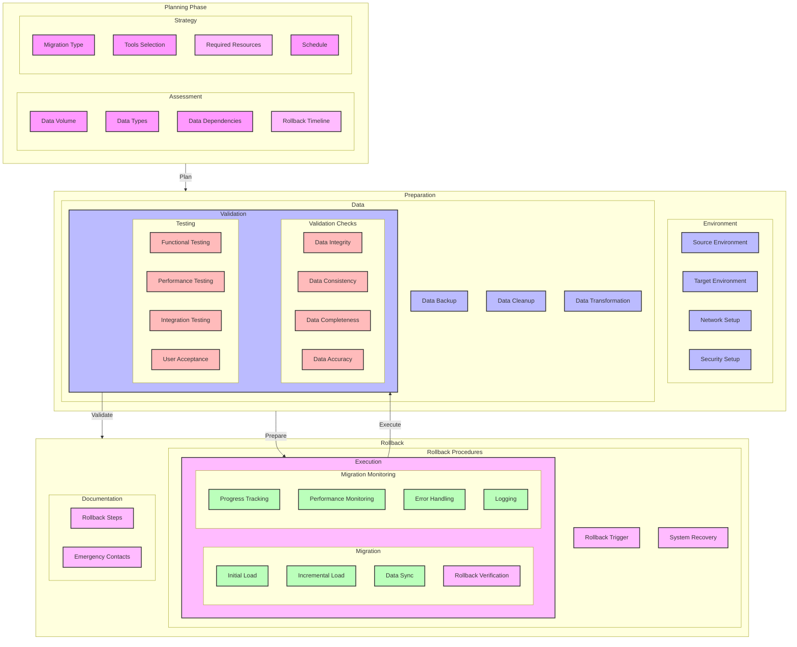

# Data Migration Strategy Diagram

## Overview

This diagram illustrates the data migration strategy for the microservices system, including migration planning, execution, validation, and rollback procedures.

## Flow Diagram

## Components

### Planning Phase

1. **Assessment**

   - Data volume: Size and growth
   - Data types: Structure and format
   - Dependencies: Data relationships
   - Timeline: Migration schedule

2. **Strategy**
   - Migration type: Big bang or phased
   - Tools selection: Migration tools
   - Resource planning: Team and infrastructure
   - Schedule: Timeline and milestones

### Preparation

1. **Environment**

   - Source environment: Current setup
   - Target environment: New setup
   - Network setup: Connectivity
   - Security setup: Access control

2. **Data**
   - Data backup: Pre-migration
   - Data validation: Quality check
   - Data cleanup: Remove duplicates
   - Data transformation: Format conversion

### Execution

1. **Migration**

   - Initial load: Bulk data transfer
   - Incremental load: Delta changes
   - Data sync: Real-time updates
   - Data verification: Integrity check

2. **Monitoring**
   - Progress tracking: Migration status
   - Performance monitoring: System health
   - Error handling: Issue resolution
   - Logging: Activity tracking

### Validation

1. **Validation Checks**

   - Data integrity: Consistency
   - Data consistency: Relationships
   - Data completeness: Coverage
   - Data accuracy: Quality

2. **Testing**
   - Functional testing: Features
   - Performance testing: Speed
   - Integration testing: Systems
   - User acceptance: Approval

### Rollback

1. **Rollback Procedures**

   - Rollback trigger: Conditions
   - Rollback execution: Steps
   - Rollback verification: Validation
   - System recovery: Restoration

2. **Documentation**
   - Rollback steps: Procedures
   - Emergency contacts: Support
   - Rollback timeline: Schedule
   - Required resources: Dependencies

## Implementation Notes

### Best Practices

- Comprehensive planning
- Thorough testing
- Regular validation
- Clear documentation

### Considerations

- Data volume
- Downtime impact
- Resource availability
- Risk management

### Performance Impact

- System performance
- Network bandwidth
- Storage requirements
- Processing time

## Migration Configuration

### Data Types

1. **Structured Data**

   - Databases: SQL, NoSQL
   - Files: CSV, JSON
   - Records: Business data
   - Metadata: System data

2. **Unstructured Data**
   - Documents: PDF, DOC
   - Media: Images, Videos
   - Logs: System logs
   - Archives: Historical data

### Migration Methods

1. **Big Bang**

   - One-time migration
   - Complete system switch
   - Minimal downtime
   - High risk

2. **Phased**
   - Incremental migration
   - Gradual system switch
   - Extended timeline
   - Lower risk

## Monitoring

### Metrics

- Migration progress
- Data transfer rate
- Error rate
- System performance

### Alerts

- Migration failures
- Data inconsistencies
- Performance issues
- System errors

### Logging

- Migration logs
- Error logs
- Performance logs
- System logs

## Notes

- Regular testing required
- Validation at each stage
- Clear communication
- Documentation updated
- Rollback plan ready

## Related Documentation

- [Disaster Recovery](../recovery/disaster-recovery.md)
- [Backup Strategy](../recovery/backup-restore.md)
- [Monitoring Setup](../monitoring/architecture.md)
- [CI/CD Pipeline](../pipeline/ci-cd.md)
