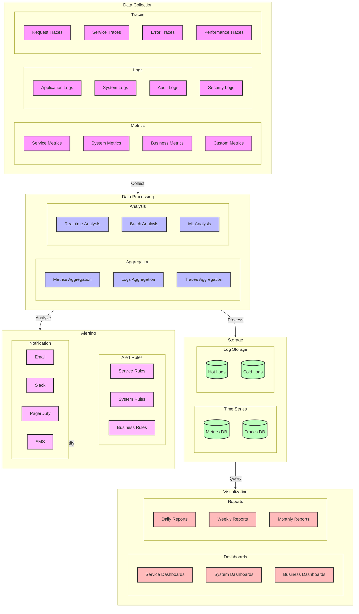

# Monitoring and Alerting Architecture Diagram

## Overview

This diagram illustrates the monitoring and alerting architecture for the microservices system, including metrics collection, log aggregation, tracing, and alerting mechanisms.

## Flow Diagram

## Components

### Data Collection

1. **Metrics**

   - Service metrics: Response time, error rate
   - System metrics: CPU, memory, disk
   - Business metrics: User activity, revenue
   - Custom metrics: Application-specific

2. **Logs**

   - Application logs: Service logs
   - System logs: Infrastructure logs
   - Audit logs: Security events
   - Security logs: Access attempts

3. **Traces**
   - Request traces: End-to-end
   - Service traces: Internal calls
   - Error traces: Failure paths
   - Performance traces: Bottlenecks

### Data Processing

1. **Aggregation**

   - Metrics aggregation: Time-based
   - Logs aggregation: Pattern-based
   - Traces aggregation: Request-based

2. **Analysis**
   - Real-time analysis: Immediate
   - Batch analysis: Scheduled
   - ML analysis: Predictive

### Storage

1. **Time Series**

   - Metrics DB: Prometheus
   - Traces DB: Jaeger
   - Retention: 30 days

2. **Log Storage**
   - Hot logs: 7 days
   - Cold logs: 90 days
   - Archive: 1 year

### Visualization

1. **Dashboards**

   - Service dashboards: Performance
   - System dashboards: Health
   - Business dashboards: KPIs

2. **Reports**
   - Daily reports: Summary
   - Weekly reports: Trends
   - Monthly reports: Analysis

### Alerting

1. **Alert Rules**

   - Service rules: SLOs
   - System rules: Thresholds
   - Business rules: KPIs

2. **Notification**
   - Email: Non-critical
   - Slack: Team alerts
   - PagerDuty: Critical
   - SMS: Emergency

## Implementation Notes

### Best Practices

- Centralized collection
- Real-time processing
- Efficient storage
- Clear visualization

### Considerations

- Data volume
- Processing speed
- Storage costs
- Alert fatigue

### Performance Impact

- Collection overhead
- Processing latency
- Storage requirements
- Query performance

## Monitoring

### Metrics

- Collection rate
- Processing time
- Storage usage
- Query latency

### Alerts

- Collection failures
- Processing errors
- Storage capacity
- Query timeouts

### Logging

- Collection logs
- Processing logs
- Storage logs
- Query logs

## Notes

- Regular review required
- Alert tuning needed
- Storage optimization
- Performance monitoring
- Documentation updated

## Related Documentation

- [Service Monitoring](../services/monitoring.md)
- [Logging Strategy](./logging.md)
- [Alerting Rules](./alerts.md)
- [Dashboard Templates](./dashboards.md)
