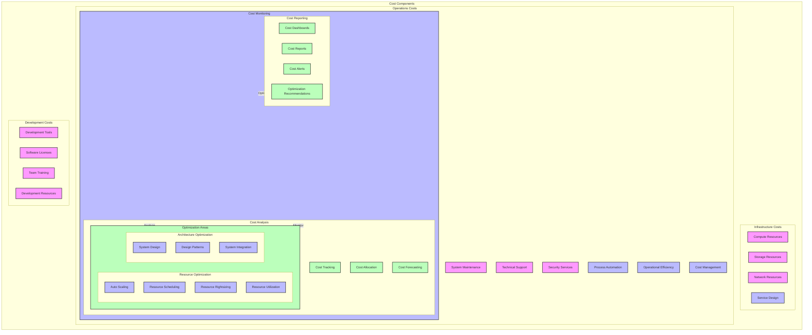

 # Cost Optimization Strategy Diagram

## Overview

This diagram illustrates the cost optimization strategy for the microservices system, including cost components, optimization areas, and monitoring mechanisms.

## Flow Diagram

## Components

### Cost Components

1. **Infrastructure Costs**
   - Compute Resources
   - Storage Resources
   - Network Resources
   - Managed Services

2. **Operations Costs**
   - System Maintenance
   - Technical Support
   - Monitoring Tools
   - Security Services

3. **Development Costs**
   - Development Tools
   - Software Licenses
   - Team Training
   - Development Resources

### Optimization Areas

1. **Resource Optimization**
   - Auto Scaling
   - Resource Scheduling
   - Resource Rightsizing
   - Resource Utilization

2. **Architecture Optimization**
   - System Design
   - Design Patterns
   - Service Design
   - System Integration

3. **Operations Optimization**
   - Process Automation
   - Operational Efficiency
   - Cost Monitoring
   - Cost Management

### Cost Monitoring

1. **Cost Analysis**
   - Cost Tracking
   - Cost Allocation
   - Cost Forecasting
   - Optimization Analysis

2. **Cost Reporting**
   - Cost Dashboards
   - Cost Reports
   - Cost Alerts
   - Optimization Recommendations

## Implementation Notes

### Best Practices
- Regular cost reviews
- Resource optimization
- Process automation
- Clear reporting

### Considerations
- Business requirements
- Performance impact
- Scalability needs
- Budget constraints

### Optimization Measures
- Resource management
- Process efficiency
- Cost monitoring
- Performance optimization

## Cost Configuration

### Resource Management

1. **Compute Resources**
   - Instance types
   - Auto scaling
   - Resource scheduling
   - Utilization monitoring

2. **Storage Resources**
   - Storage types
   - Data lifecycle
   - Backup strategy
   - Archival policy

### Operations Management

1. **Process Automation**
   - Deployment automation
   - Monitoring automation
   - Maintenance automation
   - Cost optimization

2. **Efficiency Measures**
   - Resource utilization
   - Process efficiency
   - Cost efficiency
   - Performance optimization

## Monitoring

### Cost Metrics
- Resource costs
- Operational costs
- Development costs
- Total cost of ownership

### Alerts
- Cost thresholds
- Budget alerts
- Optimization alerts
- Resource alerts

### Reporting
- Cost analysis
- Budget reports
- Optimization reports
- Performance reports

## Notes

- Regular cost reviews
- Continuous optimization
- Clear documentation
- Team training
- Budget management

## Related Documentation

- [Performance Testing](../testing/performance.md)
- [Monitoring Setup](../monitoring/architecture.md)
- [Security Architecture](../security/architecture.md)
- [CI/CD Pipeline](../pipeline/ci-cd.md)