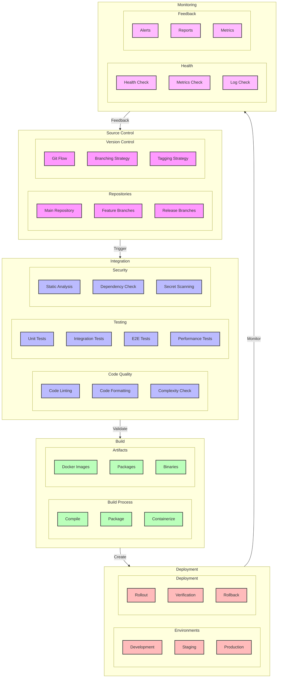

# CI/CD Pipeline Flow Diagram

## Overview

This diagram illustrates the continuous integration and deployment pipeline for the microservices system, including code integration, testing, building, and deployment stages.

## Flow Diagram

## Components

### Source Control

1. **Repositories**

   - Main repository: Production code
   - Feature branches: Development
   - Release branches: Staging

2. **Version Control**
   - Git Flow: Branching model
   - Branching strategy: Feature/Release
   - Tagging strategy: Semantic versioning

### Integration

1. **Code Quality**

   - Code linting: Style check
   - Code formatting: Consistency
   - Complexity check: Maintainability

2. **Testing**

   - Unit tests: Component testing
   - Integration tests: Service testing
   - E2E tests: System testing
   - Performance tests: Load testing

3. **Security**
   - Static analysis: Code security
   - Dependency check: Vulnerabilities
   - Secret scanning: Credentials

### Build

1. **Build Process**

   - Compile: Source to binary
   - Package: Application bundle
   - Containerize: Docker image

2. **Artifacts**
   - Docker images: Containerized apps
   - Packages: Application packages
   - Binaries: Executable files

### Deployment

1. **Environments**

   - Development: Local testing
   - Staging: Pre-production
   - Production: Live system

2. **Deployment**
   - Rollout: Gradual deployment
   - Verification: Health checks
   - Rollback: Failure recovery

### Monitoring

1. **Health**

   - Health check: Service status
   - Metrics check: Performance
   - Log check: Error detection

2. **Feedback**
   - Alerts: Issue notification
   - Reports: Deployment status
   - Metrics: Performance data

## Implementation Notes

### Best Practices

- Automated testing
- Continuous integration
- Automated deployment
- Monitoring feedback

### Considerations

- Build time
- Test coverage
- Deployment strategy
- Rollback plan

### Performance Impact

- Build performance
- Test execution
- Deployment speed
- Monitoring overhead

## Pipeline Configuration

### Build Pipeline

1. **Trigger**

   - Push to main: Production
   - Push to release: Staging
   - Pull request: Development

2. **Stages**
   - Quality check: 5 minutes
   - Testing: 15 minutes
   - Build: 10 minutes
   - Deploy: 5 minutes

### Test Pipeline

1. **Unit Tests**

   - Coverage: > 80%
   - Timeout: 5 minutes
   - Parallel: Yes

2. **Integration Tests**

   - Coverage: > 70%
   - Timeout: 10 minutes
   - Parallel: Yes

3. **E2E Tests**
   - Coverage: > 50%
   - Timeout: 15 minutes
   - Parallel: No

### Deployment Pipeline

1. **Development**

   - Auto-deploy: Yes
   - Approval: None
   - Rollback: Auto

2. **Staging**

   - Auto-deploy: Yes
   - Approval: Team lead
   - Rollback: Manual

3. **Production**
   - Auto-deploy: No
   - Approval: Manager
   - Rollback: Manual

## Monitoring

### Metrics

- Build success rate
- Test coverage
- Deployment time
- Rollback rate

### Alerts

- Build failures
- Test failures
- Deployment failures
- Health check failures

### Logging

- Build logs
- Test logs
- Deployment logs
- Health check logs

## Notes

- Regular review required
- Pipeline optimization
- Test coverage improvement
- Documentation updated
- Security scanning enabled

## Related Documentation

- [Build Configuration](./build.md)
- [Test Strategy](./testing.md)
- [Deployment Strategy](./deployment.md)
- [Monitoring Setup](./monitoring.md)
