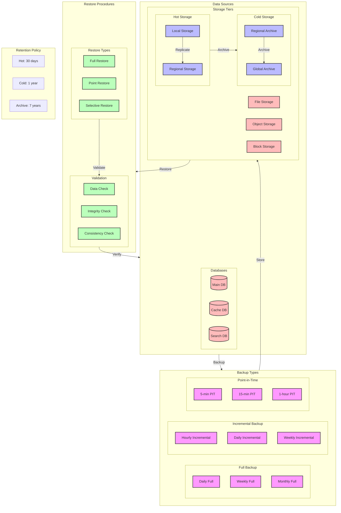

# Backup and Restore Strategy Diagram

## Overview

This diagram illustrates the backup and restore strategy for the microservices system, including backup types, schedules, retention policies, and restore procedures.

## Flow Diagram

## Components

### Backup Types

1. **Full Backup**

   - Daily full backup: 00:00 UTC
   - Weekly full backup: Sunday 00:00 UTC
   - Monthly full backup: 1st 00:00 UTC

2. **Incremental Backup**

   - Hourly incremental: Every hour
   - Daily incremental: Every 6 hours
   - Weekly incremental: Every 12 hours

3. **Point-in-Time**
   - 5-minute intervals: Critical data
   - 15-minute intervals: Important data
   - 1-hour intervals: Regular data

### Storage Tiers

1. **Hot Storage**

   - Local storage: Immediate access
   - Regional storage: Fast access
   - Replication: Real-time

2. **Cold Storage**
   - Regional archive: Infrequent access
   - Global archive: Long-term storage
   - Compression: Enabled

### Restore Procedures

1. **Restore Types**

   - Full restore: Complete system
   - Point restore: Specific time
   - Selective restore: Specific data

2. **Validation**
   - Data check: Integrity
   - Consistency check: Relations
   - Performance check: Speed

## Backup Configuration

### Database Backup

1. **Main Database**

   - Full backup: Daily
   - Incremental: Hourly
   - Point-in-time: 5 minutes
   - Retention: 30 days hot, 1 year cold

2. **Cache Database**

   - Full backup: Weekly
   - Incremental: Daily
   - Point-in-time: 15 minutes
   - Retention: 7 days hot, 30 days cold

3. **Search Database**
   - Full backup: Weekly
   - Incremental: Daily
   - Point-in-time: 1 hour
   - Retention: 7 days hot, 30 days cold

### Storage Backup

1. **File Storage**

   - Full backup: Daily
   - Incremental: Hourly
   - Retention: 30 days hot, 1 year cold

2. **Object Storage**

   - Full backup: Weekly
   - Incremental: Daily
   - Retention: 90 days hot, 1 year cold

3. **Block Storage**
   - Full backup: Daily
   - Incremental: Hourly
   - Retention: 30 days hot, 1 year cold

## Implementation Notes

### Best Practices

- Regular testing
- Encryption
- Compression
- Validation

### Considerations

- Storage costs
- Network bandwidth
- Recovery time
- Data integrity

### Performance Impact

- Backup window
- Storage usage
- Network usage
- System load

## Monitoring

### Metrics

- Backup success rate
- Backup duration
- Storage usage
- Restore time

### Alerts

- Backup failures
- Storage capacity
- Restore failures
- Data corruption

### Logging

- Backup logs
- Restore logs
- Validation logs
- Error logs

## Notes

- Regular testing required
- Encryption enabled
- Compression enabled
- Validation required
- Documentation updated

## Related Documentation

- [Disaster Recovery](./disaster-recovery.md)
- [Data Recovery](../flow/recovery/data-recovery.md)
- [Service Recovery](../flow/recovery/service-recovery.md)
- [Storage Architecture](../services/storage.md)
