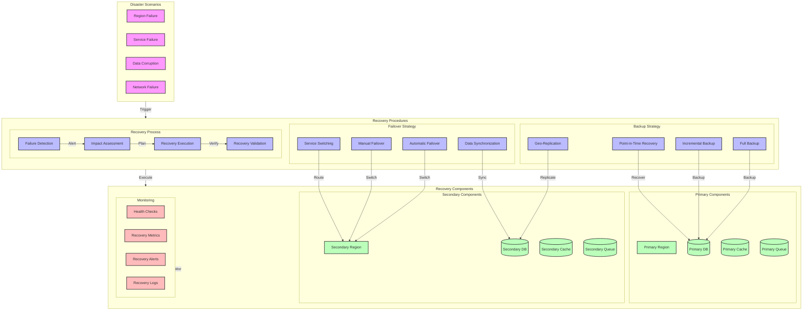

# Disaster Recovery Plan Diagram

## Overview

This diagram illustrates the disaster recovery procedures, including backup strategies, failover mechanisms, and recovery time objectives (RTO) and recovery point objectives (RPO) for different components of the system.

## Flow Diagram

## Components

### Disaster Scenarios

1. **Region Failure**

   - Complete region outage
   - Network isolation
   - Power failure
   - Natural disaster

2. **Service Failure**

   - Service crash
   - Resource exhaustion
   - Configuration error
   - Dependency failure

3. **Data Corruption**

   - Database corruption
   - Cache inconsistency
   - Queue message loss
   - Backup failure

4. **Network Failure**
   - Network partition
   - DNS failure
   - Load balancer failure
   - Security breach

### Recovery Procedures

1. **Backup Strategy**

   - Full backup: Daily
   - Incremental backup: Hourly
   - Point-in-time recovery: 5-minute intervals
   - Geo-replication: Real-time

2. **Failover Strategy**

   - Automatic failover: < 1 minute
   - Manual failover: < 15 minutes
   - Service switching: < 5 minutes
   - Data synchronization: Real-time

3. **Recovery Process**
   - Failure detection: Automated
   - Impact assessment: Automated + Manual
   - Recovery execution: Automated
   - Recovery validation: Automated + Manual

### Recovery Components

1. **Primary Components**

   - Primary region: Active
   - Primary database: Master
   - Primary cache: Write-through
   - Primary queue: Active

2. **Secondary Components**

   - Secondary region: Standby
   - Secondary database: Replica
   - Secondary cache: Read-through
   - Secondary queue: Standby

3. **Monitoring**
   - Health checks: Every 30 seconds
   - Recovery metrics: Real-time
   - Recovery alerts: Immediate
   - Recovery logs: Continuous

## Recovery Objectives

### RTO (Recovery Time Objective)

1. **Critical Services**

   - Auth Service: < 5 minutes
   - Profile Service: < 10 minutes
   - Event Service: < 15 minutes
   - Cache Service: < 5 minutes

2. **Data Services**
   - Database: < 30 minutes
   - Cache: < 10 minutes
   - Message Queue: < 15 minutes
   - Search Index: < 20 minutes

### RPO (Recovery Point Objective)

1. **User Data**

   - Profile data: < 5 minutes
   - Authentication data: < 1 minute
   - Session data: < 1 minute
   - Preferences: < 5 minutes

2. **System Data**
   - Configuration: < 1 minute
   - Logs: < 5 minutes
   - Metrics: < 1 minute
   - Events: < 5 minutes

## Implementation Notes

### Best Practices

- Regular testing
- Documentation
- Automation
- Monitoring

### Considerations

- Cost impact
- Performance impact
- Security impact
- Compliance requirements

### Performance Impact

- Recovery time
- Data loss
- Service availability
- User experience

## Monitoring

### Metrics

- Recovery time
- Data loss
- Service availability
- User impact

### Alerts

- Failure detection
- Recovery progress
- Service status
- Data consistency

### Logging

- Recovery events
- System state
- User impact
- Recovery actions

## Notes

- Regular testing required
- Documentation updates
- Team training
- Compliance checks
- Cost optimization

## Related Documentation

- [Service Recovery](../flow/recovery/service-recovery.md)
- [Data Recovery](../flow/recovery/data-recovery.md)
- [Failover Strategy](../flow/recovery/failover.md)
- [Backup Strategy](./backup-restore.md)
