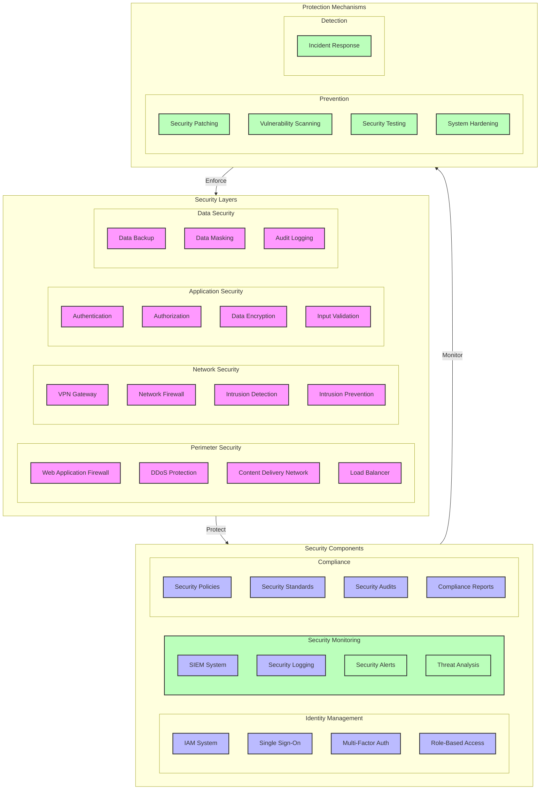

# Security Architecture Diagram

## Overview

This diagram illustrates the security architecture for the microservices system, including security layers, components, and protection mechanisms.

## Flow Diagram

## Components

### Security Layers

1. **Perimeter Security**

   - Web Application Firewall (WAF)
   - DDoS Protection
   - Content Delivery Network (CDN)
   - Load Balancer

2. **Network Security**

   - VPN Gateway
   - Network Firewall
   - Intrusion Detection System (IDS)
   - Intrusion Prevention System (IPS)

3. **Application Security**

   - Authentication
   - Authorization
   - Data Encryption
   - Input Validation

4. **Data Security**
   - Data Backup
   - Data Encryption
   - Data Masking
   - Audit Logging

### Security Components

1. **Identity Management**

   - IAM System
   - Single Sign-On (SSO)
   - Multi-Factor Authentication (MFA)
   - Role-Based Access Control (RBAC)

2. **Security Monitoring**

   - SIEM System
   - Security Logging
   - Security Alerts
   - Threat Analysis

3. **Compliance**
   - Security Policies
   - Security Standards
   - Security Audits
   - Compliance Reports

### Protection Mechanisms

1. **Prevention**

   - Security Patching
   - Vulnerability Scanning
   - Security Testing
   - System Hardening

2. **Detection**
   - Security Monitoring
   - Threat Analysis
   - Security Alerts
   - Incident Response

## Implementation Notes

### Best Practices

- Defense in depth
- Least privilege
- Regular updates
- Continuous monitoring

### Considerations

- Security requirements
- Compliance needs
- Performance impact
- Cost implications

### Security Measures

- Access control
- Data protection
- Network security
- Application security

## Security Configuration

### Access Control

1. **Authentication**

   - Multi-factor authentication
   - Password policies
   - Session management
   - Token handling

2. **Authorization**
   - Role-based access
   - Resource permissions
   - API access control
   - Service access

### Data Protection

1. **Encryption**

   - Data at rest
   - Data in transit
   - Key management
   - Certificate handling

2. **Data Handling**
   - Data classification
   - Data retention
   - Data disposal
   - Data backup

## Monitoring

### Security Metrics

- Access attempts
- Security incidents
- Compliance status
- System health

### Alerts

- Security breaches
- Access violations
- System anomalies
- Compliance issues

### Logging

- Security events
- Access logs
- System logs
- Audit trails

## Notes

- Regular security reviews
- Continuous monitoring
- Incident response plan
- Security training
- Documentation updated

## Related Documentation

- [Compliance Framework](./compliance.md)
- [Monitoring Setup](../monitoring/architecture.md)
- [Disaster Recovery](../recovery/disaster-recovery.md)
- [CI/CD Pipeline](../pipeline/ci-cd.md)
