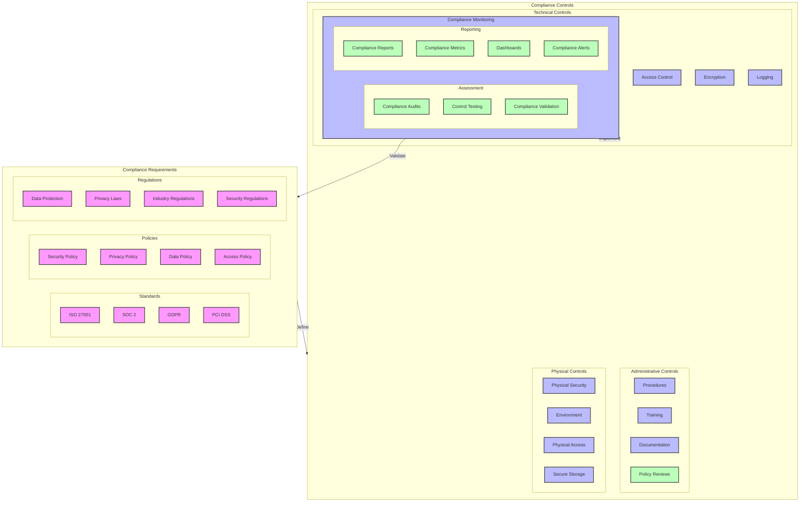

# Compliance Framework Diagram

## Overview

This diagram illustrates the compliance framework for the microservices system, including compliance requirements, controls, and monitoring mechanisms.

## Flow Diagram

## Components

### Compliance Requirements

1. **Standards**

   - ISO 27001: Information Security
   - SOC 2: Service Organization Control
   - GDPR: Data Protection
   - PCI DSS: Payment Card Industry

2. **Policies**

   - Security Policy
   - Privacy Policy
   - Data Policy
   - Access Policy

3. **Regulations**
   - Data Protection Laws
   - Privacy Regulations
   - Industry Standards
   - Security Requirements

### Compliance Controls

1. **Technical Controls**

   - Access Control Systems
   - Encryption Mechanisms
   - Monitoring Tools
   - Logging Systems

2. **Administrative Controls**

   - Standard Procedures
   - Training Programs
   - Documentation
   - Review Processes

3. **Physical Controls**
   - Physical Security
   - Environmental Controls
   - Access Management
   - Secure Storage

### Compliance Monitoring

1. **Assessment**

   - Compliance Audits
   - Policy Reviews
   - Control Testing
   - Compliance Validation

2. **Reporting**
   - Compliance Reports
   - Compliance Metrics
   - Compliance Dashboards
   - Compliance Alerts

## Implementation Notes

### Best Practices

- Regular assessments
- Continuous monitoring
- Clear documentation
- Staff training

### Considerations

- Regulatory requirements
- Industry standards
- Business needs
- Resource availability

### Compliance Measures

- Control implementation
- Policy enforcement
- Regular audits
- Documentation

## Compliance Configuration

### Technical Controls

1. **Access Control**

   - Authentication
   - Authorization
   - Session management
   - Access logging

2. **Data Protection**
   - Encryption
   - Data masking
   - Secure storage
   - Data backup

### Administrative Controls

1. **Procedures**

   - Standard operating procedures
   - Incident response
   - Change management
   - Risk management

2. **Training**
   - Security awareness
   - Compliance training
   - Technical training
   - Policy training

## Monitoring

### Compliance Metrics

- Control effectiveness
- Policy compliance
- Audit results
- Training completion

### Alerts

- Compliance violations
- Control failures
- Policy breaches
- Audit findings

### Reporting

- Compliance status
- Audit reports
- Training records
- Incident reports

## Notes

- Regular compliance reviews
- Continuous monitoring
- Staff training
- Documentation updated
- Audit preparation

## Related Documentation

- [Security Architecture](./architecture.md)
- [Monitoring Setup](../monitoring/architecture.md)
- [Disaster Recovery](../recovery/disaster-recovery.md)
- [CI/CD Pipeline](../pipeline/ci-cd.md)
