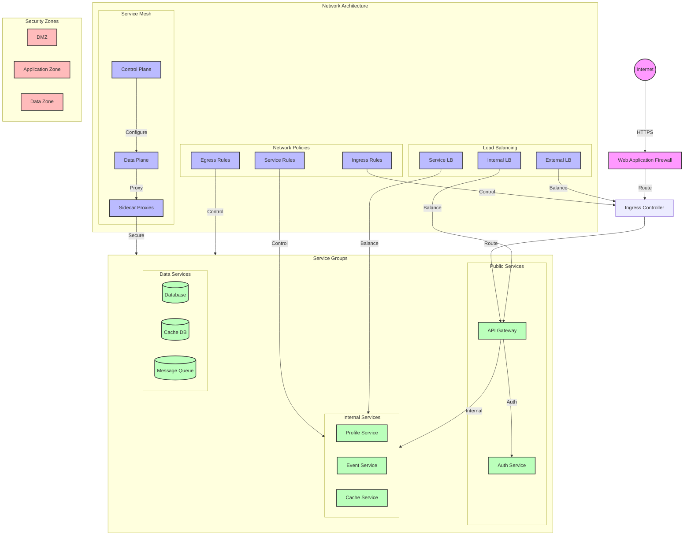

# Network Topology Diagram

## Overview

This diagram illustrates the network architecture of the microservices system, including service mesh, network policies, and communication patterns between different components.

## Flow Diagram

## Components

### Network Architecture

1. **Service Mesh**

   - Control Plane: Configuration
   - Data Plane: Traffic management
   - Sidecar Proxies: Service communication

2. **Network Policies**

   - Ingress Rules: External access
   - Egress Rules: Outbound traffic
   - Service Rules: Internal communication

3. **Load Balancing**
   - External LB: Internet traffic
   - Internal LB: Service traffic
   - Service LB: Pod traffic

### Service Groups

1. **Public Services**

   - API Gateway: External access
   - Auth Service: Authentication

2. **Internal Services**

   - Profile Service: User profiles
   - Event Service: Event processing
   - Cache Service: Caching

3. **Data Services**
   - Database: Primary storage
   - Cache DB: Caching storage
   - Message Queue: Event queue

## Network Configuration

### Service Mesh

1. **Control Plane**

   - Traffic management
   - Security policies
   - Service discovery
   - Load balancing

2. **Data Plane**
   - mTLS encryption
   - Traffic routing
   - Circuit breaking
   - Retry policies

### Network Policies

1. **Ingress Rules**

   - External access control
   - Rate limiting
   - SSL termination
   - WAF integration

2. **Egress Rules**

   - Outbound traffic control
   - DNS policies
   - External service access
   - Security groups

3. **Service Rules**
   - Service-to-service communication
   - Namespace isolation
   - Pod security
   - Network segmentation

## Security Zones

1. **DMZ**

   - Internet-facing services
   - WAF protection
   - DDoS protection
   - SSL termination

2. **Application Zone**

   - Internal services
   - Service mesh
   - Network policies
   - Load balancing

3. **Data Zone**
   - Database services
   - Cache services
   - Message queues
   - Backup systems

## Implementation Notes

### Best Practices

- Network segmentation
- Security policies
- Traffic management
- Monitoring

### Considerations

- Network latency
- Security impact
- Performance impact
- Cost impact

### Performance Impact

- Network overhead
- Service mesh impact
- Load balancer impact
- Security overhead

## Monitoring

### Metrics

- Network metrics
- Traffic metrics
- Security metrics
- Performance metrics

### Alerts

- Network alerts
- Security alerts
- Performance alerts
- Availability alerts

### Logging

- Network logs
- Security logs
- Access logs
- Audit logs

## Notes

- Network segmentation
- Security hardening
- Performance optimization
- Monitoring coverage
- Documentation

## Related Documentation

- [Service Layout](./service-layout.md)
- [Scaling Topology](./scaling.md)
- [Production Cluster](../cluster/production.md)
- [Security Boundaries](../security/network-security.md)
