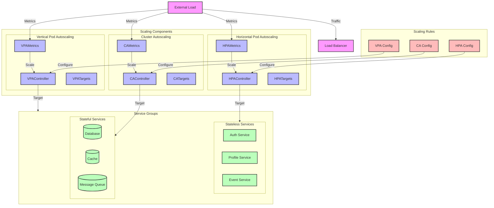

# Scaling Topology Diagram

## Overview

This diagram illustrates how services scale within the Kubernetes cluster, including horizontal pod autoscaling (HPA), vertical pod autoscaling (VPA), and cluster autoscaling.

## Flow Diagram

## Components

### Scaling Components

1. **Horizontal Pod Autoscaling (HPA)**

   - CPU/Memory based scaling
   - Custom metrics support
   - Min/Max pod limits
   - Scaling policies

2. **Vertical Pod Autoscaling (VPA)**

   - Resource recommendations
   - Pod resource limits
   - Memory optimization
   - CPU optimization

3. **Cluster Autoscaling**
   - Node group scaling
   - Resource thresholds
   - Scaling policies
   - Cost optimization

### Service Groups

1. **Stateless Services**

   - Auth Service: HPA enabled
   - Profile Service: HPA enabled
   - Event Service: HPA enabled

2. **Stateful Services**
   - Database: VPA enabled
   - Cache: VPA enabled
   - Message Queue: VPA enabled

## Scaling Configuration

### HPA Configuration

1. **Metrics**

   - CPU utilization: 70%
   - Memory utilization: 80%
   - Custom metrics: QPS, latency

2. **Limits**
   - Min replicas: 3
   - Max replicas: 10
   - Scale up/down delay

### VPA Configuration

1. **Resource Limits**

   - CPU: 0.5-2 cores
   - Memory: 1-4GB
   - Storage: 10-50GB

2. **Update Policy**
   - Auto mode
   - Initial mode
   - Off mode

### Cluster Configuration

1. **Node Groups**

   - Worker nodes: 3-10
   - Data nodes: 3-5
   - Monitoring nodes: 2-3

2. **Resource Thresholds**
   - CPU: 70%
   - Memory: 80%
   - Storage: 85%

## Implementation Notes

### Best Practices

- Gradual scaling
- Resource optimization
- Cost management
- Performance monitoring

### Considerations

- Scaling delays
- Resource limits
- Cost impact
- Performance impact

### Performance Impact

- Scaling latency
- Resource usage
- Cost efficiency
- Service availability

## Monitoring

### Metrics

- Scaling metrics
- Resource metrics
- Cost metrics
- Performance metrics

### Alerts

- Scaling alerts
- Resource alerts
- Cost alerts
- Performance alerts

### Logging

- Scaling logs
- Resource logs
- Cost logs
- Performance logs

## Notes

- Gradual scaling
- Resource optimization
- Cost management
- Performance monitoring
- Documentation

## Related Documentation

- [Service Layout](./service-layout.md)
- [Network Topology](./networking.md)
- [Production Cluster](../cluster/production.md)
- [Security Boundaries](../security/network-security.md)
