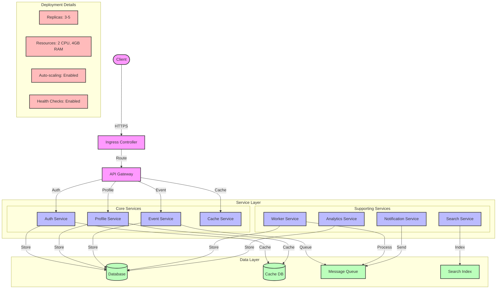

# Service Layout Diagram

## Overview

This diagram illustrates the service deployment topology, showing how different services are organized, their dependencies, and communication patterns within the Kubernetes cluster.

## Flow Diagram

## Components

### Main Components

1. **External Access**

   - Client: External requests
   - Ingress Controller: Request routing
   - API Gateway: Service routing

2. **Service Layer**

   - Core Services: Primary functionality
   - Supporting Services: Additional features
   - Service Dependencies: Inter-service communication

3. **Data Layer**
   - Database: Primary storage
   - Cache: Performance optimization
   - Message Queue: Async communication
   - Search Index: Search functionality

### Deployment Details

1. **Service Configuration**

   - Replicas: 3-5 per service
   - Resources: 2 CPU, 4GB RAM
   - Auto-scaling: Enabled
   - Health checks: Enabled

2. **Network Configuration**
   - Service mesh: Enabled
   - mTLS: Enabled
   - Network policies: Enabled
   - DNS: CoreDNS

## Service Dependencies

### Core Services

1. **Auth Service**

   - Depends on: Database, Cache
   - Provides: Authentication, Authorization
   - Used by: All services

2. **Profile Service**

   - Depends on: Database, Cache
   - Provides: User profiles
   - Used by: Auth, Event services

3. **Event Service**

   - Depends on: Message Queue, Database
   - Provides: Event processing
   - Used by: All services

4. **Cache Service**
   - Depends on: Cache DB
   - Provides: Caching
   - Used by: All services

### Supporting Services

1. **Worker Service**

   - Depends on: Message Queue, Database
   - Provides: Background processing
   - Used by: Event service

2. **Notification Service**

   - Depends on: Message Queue
   - Provides: Notifications
   - Used by: All services

3. **Search Service**

   - Depends on: Search Index
   - Provides: Search functionality
   - Used by: Profile service

4. **Analytics Service**
   - Depends on: Database
   - Provides: Analytics
   - Used by: All services

## Implementation Notes

### Best Practices

- Service isolation
- Resource limits
- Health monitoring
- Security policies
- Documentation

### Considerations

- Service dependencies
- Resource allocation
- Network policies
- Security measures
- Monitoring needs

### Performance Impact

- Service latency
- Resource usage
- Network traffic
- Cache efficiency
- Queue processing

## Security Considerations

### Authentication

- Service mesh auth
- API authentication
- Database auth
- Cache auth

### Authorization

- RBAC policies
- Network policies
- Resource quotas
- Access controls

### Data Protection

- Encryption at rest
- Encryption in transit
- Secret management
- Data isolation

## Monitoring

### Metrics

- Service metrics
- Resource metrics
- Network metrics
- Cache metrics
- Queue metrics

### Alerts

- Service alerts
- Resource alerts
- Security alerts
- Performance alerts

### Logging

- Service logs
- Access logs
- Error logs
- Audit logs

## Notes

- Service isolation
- Resource optimization
- Security hardening
- Monitoring coverage
- Documentation

## Related Documentation

- [Production Cluster](../cluster/production.md)
- [Scaling Topology](./scaling.md)
- [Network Topology](./networking.md)
- [Security Boundaries](../security/network-security.md)
