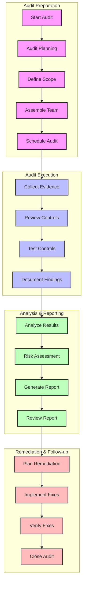

# Compliance Audit Workflow

## Overview

This diagram illustrates the workflow for conducting compliance audits in the Profile Service Microservices, including preparation, execution, and follow-up phases.

## Flow Diagram

## Workflow Description

### 1. Audit Preparation

- **Start Audit**: Initiate audit process
- **Audit Planning**: Define objectives and approach
- **Define Scope**: Determine audit boundaries
- **Assemble Team**: Select audit team members
- **Schedule Audit**: Plan audit timeline

### 2. Audit Execution

- **Collect Evidence**: Gather compliance documentation
- **Review Controls**: Evaluate control effectiveness
- **Test Controls**: Verify control implementation
- **Document Findings**: Record audit observations

### 3. Analysis & Reporting

- **Analyze Results**: Evaluate audit findings
- **Risk Assessment**: Identify compliance risks
- **Generate Report**: Create audit report
- **Review Report**: Validate report accuracy

### 4. Remediation & Follow-up

- **Plan Remediation**: Develop action plans
- **Implement Fixes**: Execute remediation
- **Verify Fixes**: Confirm implementation
- **Close Audit**: Complete audit process

## Implementation Guidelines

### Best Practices

1. **Preparation**

   - Clear objectives
   - Defined scope
   - Resource allocation
   - Timeline planning

2. **Execution**

   - Systematic approach
   - Evidence collection
   - Control testing
   - Documentation

3. **Analysis**

   - Risk assessment
   - Impact analysis
   - Root cause analysis
   - Trend analysis

4. **Remediation**
   - Action planning
   - Implementation
   - Verification
   - Documentation

### Considerations

1. **Compliance Requirements**

   - Regulatory standards
   - Industry requirements
   - Internal policies
   - Best practices

2. **Resource Management**

   - Team availability
   - Tool requirements
   - Budget constraints
   - Timeline management

3. **Risk Management**
   - Risk identification
   - Impact assessment
   - Mitigation strategies
   - Monitoring

## Monitoring & Metrics

### Key Metrics

- Audit completion rate
- Finding resolution time
- Compliance score
- Risk reduction rate
- Remediation effectiveness

### Reporting

- Audit status reports
- Compliance dashboards
- Risk assessment reports
- Remediation tracking
- Trend analysis

### Documentation

- Audit procedures
- Control documentation
- Evidence collection
- Finding reports
- Remediation plans

## Related Documentation

- [Compliance Framework](../deployment/security/compliance.md)
- [Security Architecture](../deployment/security/architecture.md)
- [Monitoring Strategy](../deployment/monitoring/strategy.md)
- [Risk Management](../deployment/security/risk-management.md)
