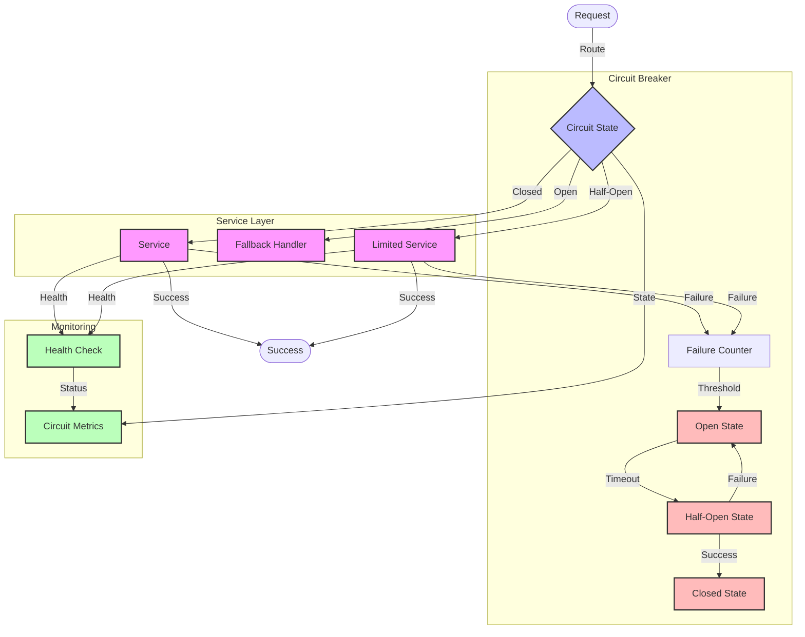

# Circuit Breaker Flow Diagram

## Overview

This diagram illustrates the circuit breaker pattern implementation, showing how it protects our microservices system from cascading failures by monitoring service health and managing request flow.

## Flow Diagram

## Components

### Main Components

1. **Circuit Breaker**

   - Circuit State: Current state of the circuit
   - Failure Counter: Tracks consecutive failures
   - State Transitions: Manages state changes

2. **Service Layer**

   - Service: Normal service operation
   - Limited Service: Restricted operation
   - Fallback Handler: Alternative behavior

3. **Monitoring**
   - Circuit Metrics: Tracks circuit state
   - Health Check: Monitors service health
   - State Transitions: Records state changes

### Error Handling

1. **Failure Detection**

   - Error counting
   - Threshold monitoring
   - Health checking

2. **State Management**
   - State transitions
   - Timeout handling
   - Recovery logic

## Flow Description

### Main Flow

1. **Request Processing**

   - Request arrives at circuit breaker
   - Circuit state is checked
   - Request is routed accordingly

2. **State Management**
   - Closed: Normal operation
   - Open: Failures exceed threshold
   - Half-Open: Testing recovery

### Error Scenarios

1. **Circuit Opening**

   - Failure threshold reached
   - Service health degraded
   - Manual intervention

2. **Circuit Recovery**
   - Timeout period elapsed
   - Limited requests allowed
   - Success leads to closing

## Implementation Notes

### Best Practices

- Use appropriate thresholds
- Implement timeouts
- Monitor health metrics
- Use fallback strategies
- Track state changes

### Considerations

- Threshold values
- Timeout periods
- Health check criteria
- Fallback behavior
- Monitoring needs

### Performance Impact

- Circuit overhead
- State transitions
- Monitoring impact
- Fallback latency

## Security Considerations

### Authentication

- Service authentication
- Health check security
- Metrics protection

### Authorization

- State management
- Configuration access
- Monitoring access

### Data Protection

- State persistence
- Metrics storage
- Health data

## Monitoring

### Metrics

- Circuit state
- Failure counts
- Success rates
- Response times
- Health status

### Alerts

- Circuit trips
- State changes
- Health degradation
- Performance issues

### Logging

- State transitions
- Failure details
- Health check results
- Performance metrics

## Notes

- Configurable thresholds
- Automatic recovery
- Health monitoring
- Fallback strategies
- State persistence

## Related Documentation

- [Retry Mechanism](./retry-mechanism.md)
- [Fallback Strategy](./fallback-strategy.md)
- [Service Health](../architecture/patterns/health.md)
- [Monitoring](../architecture/patterns/monitoring.md)
