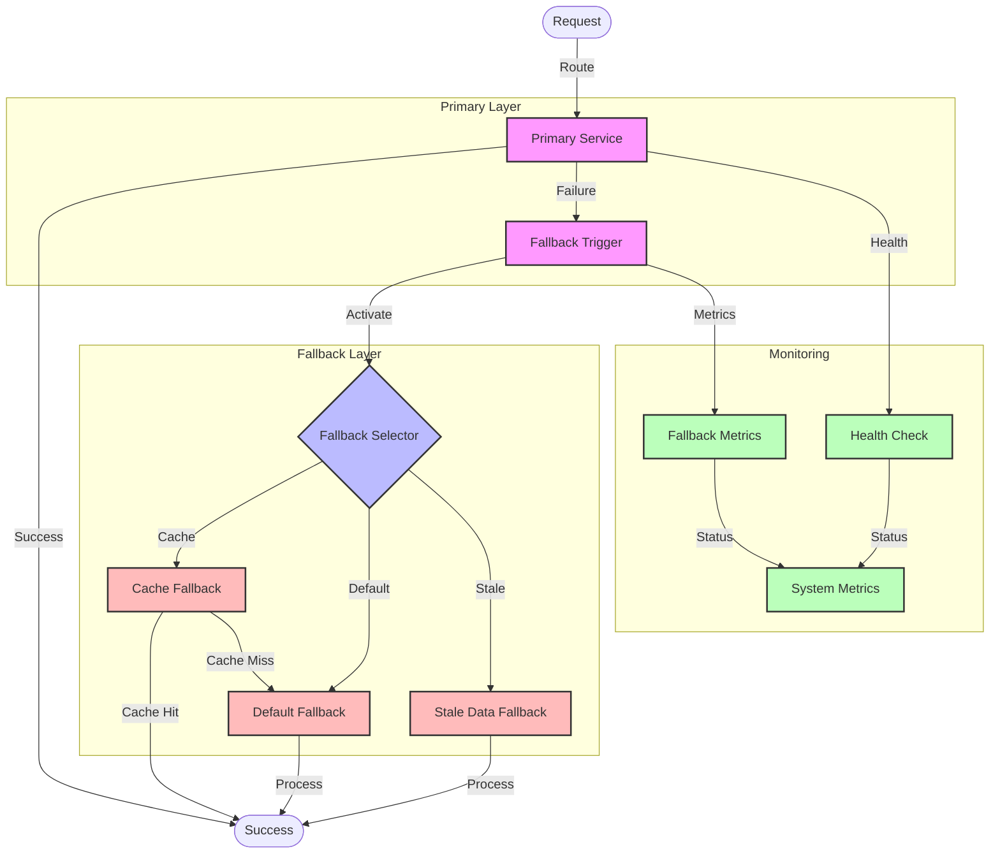

# Fallback Strategy Flow Diagram

## Overview

This diagram illustrates the fallback strategy implementation, showing how the system gracefully degrades functionality when primary services fail, ensuring continued operation with reduced capabilities.

## Flow Diagram

## Components

### Main Components

1. **Primary Layer**

   - Primary Service: Main service implementation
   - Fallback Trigger: Detects service failures

2. **Fallback Layer**

   - Fallback Selector: Chooses appropriate fallback
   - Cache Fallback: Uses cached data
   - Default Fallback: Provides basic functionality
   - Stale Data Fallback: Uses older data

3. **Monitoring**
   - Health Check: Monitors service health
   - Fallback Metrics: Tracks fallback usage
   - System Metrics: Overall system status

### Error Handling

1. **Failure Detection**

   - Service health monitoring
   - Error rate tracking
   - Response time monitoring

2. **Fallback Selection**
   - Context-aware selection
   - Priority-based routing
   - Data freshness checks

## Flow Description

### Main Flow

1. **Primary Service**

   - Request processing
   - Success handling
   - Failure detection

2. **Fallback Processing**
   - Fallback selection
   - Alternative processing
   - Result delivery

### Error Scenarios

1. **Service Failure**

   - Primary service unavailable
   - Performance degradation
   - Data inconsistency

2. **Fallback Failure**
   - Cache miss
   - Default fallback failure
   - Stale data unavailability

## Implementation Notes

### Best Practices

- Implement graceful degradation
- Use appropriate fallbacks
- Monitor fallback usage
- Maintain data consistency
- Document fallback behavior

### Considerations

- Fallback priorities
- Data freshness
- Cache management
- Default behaviors
- Monitoring needs

### Performance Impact

- Fallback latency
- Cache overhead
- Monitoring impact
- Data consistency

## Security Considerations

### Authentication

- Service authentication
- Cache security
- Metrics protection

### Authorization

- Fallback access
- Cache access
- Monitoring access

### Data Protection

- Cache encryption
- Stale data handling
- Metrics storage

## Monitoring

### Metrics

- Fallback usage
- Cache hit rates
- Response times
- Error rates
- Health status

### Alerts

- Fallback activation
- Cache issues
- Performance degradation
- Data inconsistency

### Logging

- Fallback triggers
- Cache operations
- Error details
- Performance metrics

## Notes

- Graceful degradation
- Cache management
- Data consistency
- Performance monitoring
- Security measures

## Related Documentation

- [Circuit Breaker](./circuit-breaker.md)
- [Retry Mechanism](./retry-mechanism.md)
- [Caching Strategy](../architecture/patterns/caching.md)
- [Monitoring](../architecture/patterns/monitoring.md)
