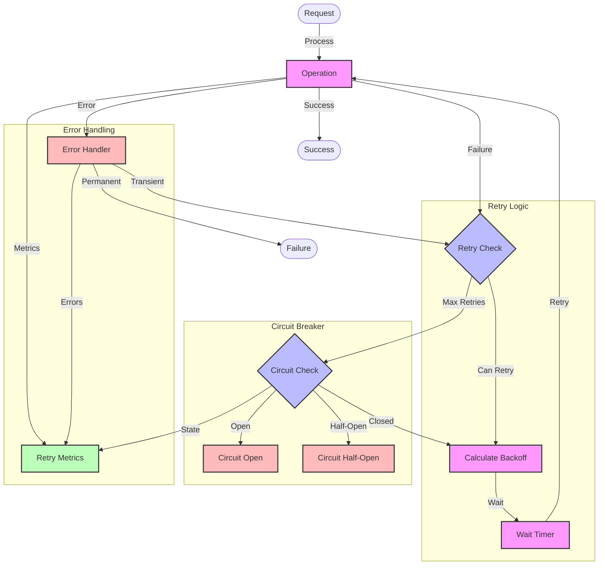

# Retry Mechanism Flow Diagram

## Overview

This diagram illustrates the retry mechanism implementation across our microservices system, showing how failed operations are retried with exponential backoff, circuit breaking, and proper error handling.

## Flow Diagram

## Components

### Main Components

1. **Operation Layer**

   - Operation: The main operation being retried
   - Success: Successful operation completion
   - Failure: Permanent failure state

2. **Retry Logic**

   - Retry Check: Determines if retry is possible
   - Backoff Calculator: Computes wait time
   - Wait Timer: Implements the delay

3. **Circuit Breaker**

   - Circuit Check: Monitors circuit state
   - Circuit Open: Prevents further retries
   - Circuit Half-Open: Allows limited retries

4. **Error Handling**
   - Error Handler: Classifies errors
   - Metrics: Tracks retry statistics
   - Monitoring: Observes system state

### Error Handling

1. **Transient Errors**

   - Network timeouts
   - Temporary unavailability
   - Rate limiting

2. **Permanent Errors**
   - Invalid requests
   - Authentication failures
   - Resource not found

## Flow Description

### Main Flow

1. **Operation Execution**

   - Operation is attempted
   - Success leads to completion
   - Failure triggers retry check

2. **Retry Process**
   - Check if retry is possible
   - Calculate exponential backoff
   - Wait for specified time
   - Retry operation

### Error Scenarios

1. **Retry Exhaustion**

   - Maximum retries reached
   - Circuit breaker trips
   - Permanent failure

2. **Circuit States**
   - Open: No retries allowed
   - Half-Open: Limited retries
   - Closed: Normal operation

## Implementation Notes

### Best Practices

- Use exponential backoff
- Implement jitter
- Set maximum retries
- Use circuit breakers
- Monitor retry metrics

### Considerations

- Backoff calculation
- Retry limits
- Circuit thresholds
- Error classification
- Monitoring needs

### Performance Impact

- Retry overhead
- Circuit breaker impact
- Monitoring overhead
- Resource consumption

## Security Considerations

### Authentication

- Retry on auth failures
- Token refresh handling
- Rate limiting

### Authorization

- Permission checks
- Access control
- Resource limits

### Data Protection

- Data consistency
- State management
- Error logging

## Monitoring

### Metrics

- Retry counts
- Success rates
- Circuit states
- Error types
- Latency impact

### Alerts

- High retry rates
- Circuit trips
- Error spikes
- Performance degradation

### Logging

- Retry attempts
- Error details
- Circuit state changes
- Performance metrics

## Notes

- Exponential backoff with jitter
- Circuit breaker integration
- Comprehensive monitoring
- Error classification
- State management

## Related Documentation

- [Circuit Breaker Pattern](../architecture/patterns/circuit-breaker.md)
- [Error Handling](../architecture/patterns/error-handling.md)
- [Monitoring](../architecture/patterns/monitoring.md)
- [Service Resilience](../architecture/patterns/resilience.md)
