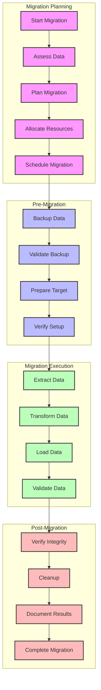

# Data Migration Workflow

## Overview

This diagram illustrates the workflow for data migration operations in the Profile Service Microservices, including preparation, execution, and validation phases.

## Flow Diagram

## Workflow Description

### 1. Migration Planning

- **Start Migration**: Initiate migration process
- **Assess Data**: Evaluate data volume and complexity
- **Plan Migration**: Develop migration strategy
- **Allocate Resources**: Assign necessary resources
- **Schedule Migration**: Plan execution timeline

### 2. Pre-Migration

- **Backup Data**: Create data backup
- **Validate Backup**: Verify backup integrity
- **Prepare Target**: Set up target environment
- **Verify Setup**: Confirm system readiness

### 3. Migration Execution

- **Extract Data**: Extract from source
- **Transform Data**: Convert data format
- **Load Data**: Load into target
- **Validate Data**: Verify data accuracy

### 4. Post-Migration

- **Verify Integrity**: Check data consistency
- **Cleanup**: Remove temporary data
- **Document Results**: Record migration details
- **Complete Migration**: Finalize process

## Implementation Guidelines

### Best Practices

1. **Planning**

   - Data assessment
   - Resource planning
   - Timeline management
   - Risk assessment

2. **Execution**

   - Batch processing
   - Progress monitoring
   - Error handling
   - Performance optimization

3. **Validation**

   - Data integrity checks
   - Format verification
   - Relationship validation
   - Performance testing

4. **Documentation**
   - Process documentation
   - Results recording
   - Issue tracking
   - Performance metrics

### Considerations

1. **Data Integrity**

   - Data consistency
   - Format conversion
   - Relationship preservation
   - Validation rules

2. **Performance**

   - Batch size optimization
   - Resource utilization
   - Network bandwidth
   - Processing speed

3. **Recovery**
   - Rollback procedures
   - Error recovery
   - State restoration
   - Data consistency

## Monitoring & Metrics

### Key Metrics

- Migration progress
- Data transfer rate
- Validation success
- Error rate
- System performance

### Reporting

- Progress reports
- Validation results
- Error reports
- Performance metrics
- Completion status

### Documentation

- Migration procedures
- Validation rules
- Error handling
- Recovery procedures
- Performance benchmarks

## Related Documentation

- [Migration Strategy](../deployment/migration/strategy.md)
- [Data Architecture](../deployment/architecture.md)
- [Validation Procedures](../validation/procedures.md)
- [Recovery Strategy](../recovery/strategy.md)
