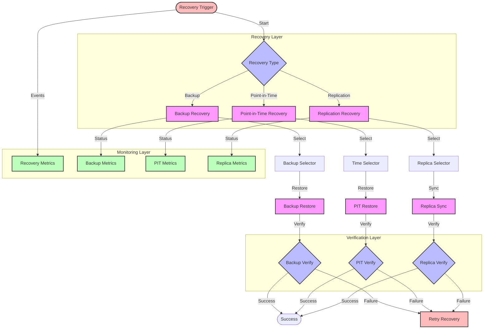

# Data Recovery Flow Diagram

## Overview

This diagram illustrates the data recovery implementation, showing how the system handles data restoration from backups, point-in-time recovery, and data consistency verification.

## Flow Diagram

## Components

### Main Components

1. **Recovery Layer**

   - Recovery Type: Determines recovery method
   - Backup Recovery: Restores from backups
   - Point-in-Time Recovery: Restores to specific time
   - Replication Recovery: Syncs from replicas

2. **Verification Layer**

   - Backup Verification: Validates backup restore
   - PIT Verification: Validates point-in-time restore
   - Replica Verification: Validates replica sync

3. **Monitoring Layer**
   - Recovery Metrics: Tracks recovery progress
   - Backup Metrics: Monitors backup status
   - PIT Metrics: Tracks point-in-time recovery
   - Replica Metrics: Monitors replication

### Error Handling

1. **Recovery Failures**

   - Backup corruption
   - Time point unavailability
   - Replica inconsistency
   - Verification failures

2. **Retry Logic**
   - Automatic retries
   - Manual intervention
   - Alternative methods
   - Escalation paths

## Flow Description

### Main Flow

1. **Recovery Initiation**

   - Trigger detection
   - Type selection
   - Method execution
   - Progress monitoring

2. **Verification Process**
   - Data validation
   - Consistency checks
   - Integrity verification
   - Success confirmation

### Error Scenarios

1. **Recovery Issues**

   - Backup failures
   - Time point issues
   - Replica problems
   - Verification errors

2. **Data Inconsistency**
   - Partial recovery
   - Corrupted data
   - Missing data
   - Inconsistent state

## Implementation Notes

### Best Practices

- Regular backups
- Point-in-time snapshots
- Replica maintenance
- Verification procedures
- Recovery testing

### Considerations

- Recovery time
- Data volume
- Storage requirements
- Network bandwidth
- Performance impact

### Performance Impact

- Recovery duration
- System load
- Resource usage
- Network traffic
- Storage I/O

## Security Considerations

### Authentication

- Recovery access
- Backup access
- Replica access
- Metrics protection

### Authorization

- Recovery permissions
- Backup permissions
- Replica permissions
- Monitoring access

### Data Protection

- Backup encryption
- Transfer security
- Storage security
- Access logging

## Monitoring

### Metrics

- Recovery progress
- Backup status
- PIT availability
- Replica health
- Error rates

### Alerts

- Recovery failures
- Backup issues
- PIT problems
- Replica errors
- Verification failures

### Logging

- Recovery events
- Backup operations
- PIT operations
- Replica syncs
- Verification results

## Notes

- Regular testing
- Documentation
- Monitoring
- Security measures
- Performance optimization

## Related Documentation

- [Service Recovery](./service-recovery.md)
- [Failover](./failover.md)
- [Backup Strategy](../architecture/patterns/backup.md)
- [Monitoring](../architecture/patterns/monitoring.md)
