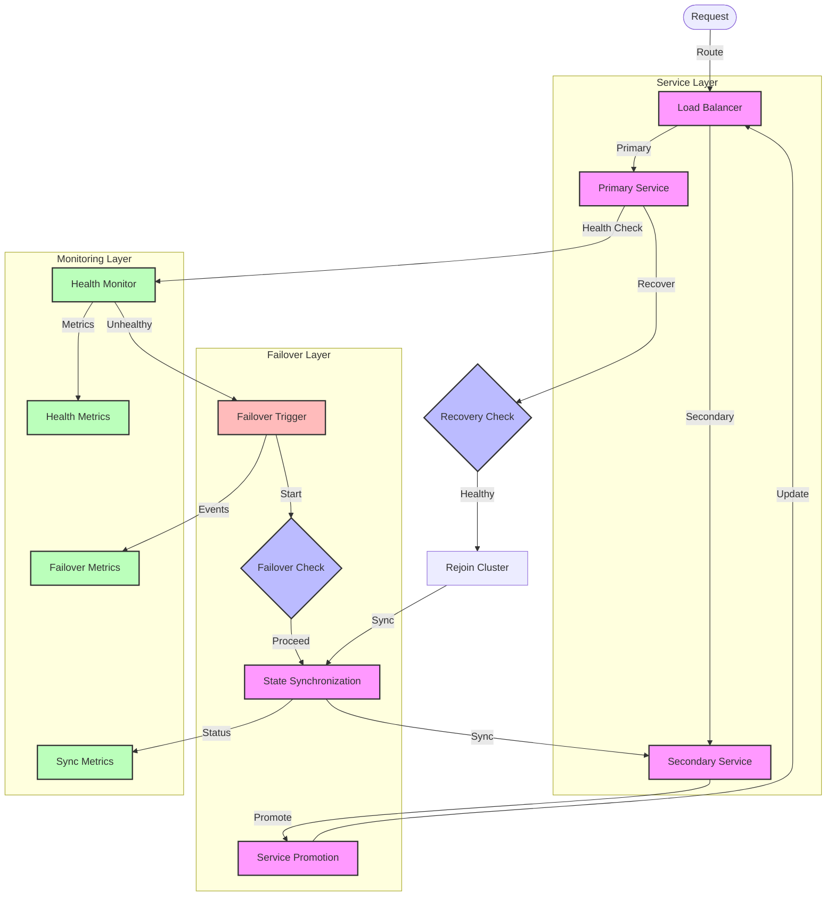

# Failover Flow Diagram

## Overview

This diagram illustrates the failover implementation, showing how the system automatically switches between primary and secondary services when failures occur, ensuring high availability and minimal downtime.

## Flow Diagram

## Components

### Main Components

1. **Service Layer**

   - Primary Service: Main service instance
   - Secondary Service: Backup service instance
   - Load Balancer: Request routing

2. **Failover Layer**

   - Failover Trigger: Initiates failover
   - Failover Check: Validates failover
   - State Sync: Synchronizes state
   - Service Promotion: Promotes secondary

3. **Monitoring Layer**
   - Health Monitor: Service health checks
   - Health Metrics: Health tracking
   - Failover Metrics: Failover statistics
   - Sync Metrics: State sync tracking

### Error Handling

1. **Failure Detection**

   - Health check failures
   - Performance degradation
   - Network issues
   - Service unavailability

2. **Failover Process**
   - State synchronization
   - Service promotion
   - Load balancer updates
   - Recovery handling

## Flow Description

### Main Flow

1. **Normal Operation**

   - Request routing
   - Health monitoring
   - State synchronization
   - Performance tracking

2. **Failover Process**
   - Failure detection
   - State sync
   - Service promotion
   - Load balancer update

### Error Scenarios

1. **Service Failure**

   - Primary service down
   - Network partition
   - Performance issues
   - State inconsistency

2. **Failover Issues**
   - Sync failures
   - Promotion problems
   - Load balancer issues
   - Recovery delays

## Implementation Notes

### Best Practices

- Automatic failover
- State synchronization
- Health monitoring
- Load balancing
- Recovery procedures

### Considerations

- Failover time
- State consistency
- Network latency
- Resource requirements
- Monitoring needs

### Performance Impact

- Failover duration
- Sync overhead
- Load balancer impact
- Recovery time
- Resource usage

## Security Considerations

### Authentication

- Service authentication
- Sync security
- Metrics protection
- Load balancer security

### Authorization

- Failover permissions
- Sync permissions
- Monitoring access
- Recovery access

### Data Protection

- State encryption
- Sync security
- Metrics storage
- Access logging

## Monitoring

### Metrics

- Health status
- Failover events
- Sync status
- Performance metrics
- Error rates

### Alerts

- Health degradation
- Failover triggers
- Sync issues
- Performance problems
- Recovery delays

### Logging

- Health checks
- Failover events
- Sync operations
- Performance data
- Error details

## Notes

- Automatic failover
- State management
- Performance monitoring
- Security measures
- Recovery procedures

## Related Documentation

- [Service Recovery](./service-recovery.md)
- [Data Recovery](./data-recovery.md)
- [Load Balancing](../architecture/patterns/load-balancing.md)
- [Monitoring](../architecture/patterns/monitoring.md)
