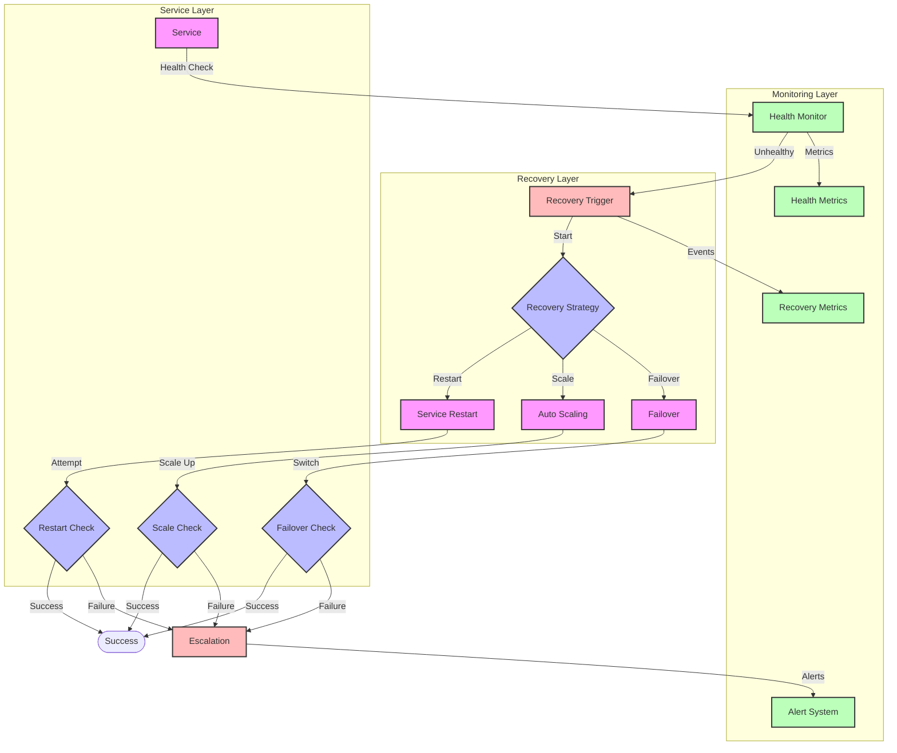

# Service Recovery Flow Diagram

## Overview

This diagram illustrates the service recovery implementation, showing how the system detects, handles, and recovers from service failures through health checks, auto-scaling, and service restart procedures.

## Flow Diagram

## Components

### Main Components

1. **Monitoring Layer**

   - Health Monitor: Continuous health checks
   - Health Metrics: Service health tracking
   - Recovery Metrics: Recovery statistics
   - Alert System: Failure notifications

2. **Recovery Layer**

   - Recovery Trigger: Initiates recovery
   - Recovery Selector: Chooses strategy
   - Service Restart: Restart procedure
   - Auto Scaling: Scaling operations
   - Failover: Service switching

3. **Service Layer**
   - Service: Main service instance
   - Recovery Checks: Success verification
   - State Management: Service state

### Error Handling

1. **Failure Detection**

   - Health check failures
   - Performance degradation
   - Resource exhaustion
   - Network issues

2. **Recovery Strategies**
   - Service restart
   - Auto scaling
   - Failover switching
   - Manual intervention

## Flow Description

### Main Flow

1. **Health Monitoring**

   - Continuous health checks
   - Performance monitoring
   - Resource tracking
   - State verification

2. **Recovery Process**
   - Failure detection
   - Strategy selection
   - Recovery execution
   - Success verification

### Error Scenarios

1. **Service Failure**

   - Process crashes
   - Resource exhaustion
   - Network issues
   - Configuration problems

2. **Recovery Failure**
   - Restart failures
   - Scaling issues
   - Failover problems
   - Resource constraints

## Implementation Notes

### Best Practices

- Implement health checks
- Use appropriate timeouts
- Monitor recovery metrics
- Document procedures
- Test recovery scenarios

### Considerations

- Recovery timeouts
- Resource limits
- State management
- Data consistency
- Monitoring needs

### Performance Impact

- Recovery overhead
- Scaling impact
- Monitoring cost
- Resource usage

## Security Considerations

### Authentication

- Service authentication
- Recovery access
- Metrics protection

### Authorization

- Recovery permissions
- Scaling controls
- Monitoring access

### Data Protection

- State persistence
- Metrics storage
- Recovery logs

## Monitoring

### Metrics

- Health status
- Recovery times
- Success rates
- Resource usage
- Error rates

### Alerts

- Health degradation
- Recovery failures
- Resource exhaustion
- Performance issues

### Logging

- Health checks
- Recovery attempts
- Error details
- Performance metrics

## Notes

- Automated recovery
- Manual intervention
- State management
- Performance monitoring
- Security measures

## Related Documentation

- [Data Recovery](./data-recovery.md)
- [Failover](./failover.md)
- [Health Checks](../architecture/patterns/health.md)
- [Monitoring](../architecture/patterns/monitoring.md)
