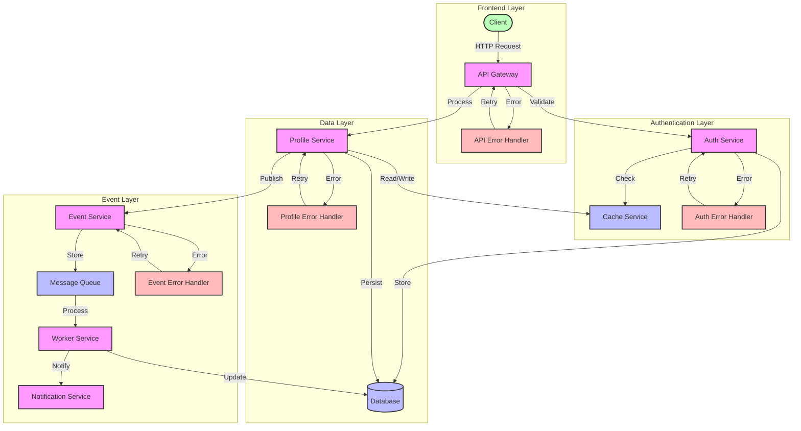

# Data Flow Diagram

## Overview

This diagram illustrates the data flow within our microservices system, showing how data moves between different services, storage systems, and external interfaces. It covers the main data paths for profile management, authentication, and event processing.

## Flow Diagram

## Components

### Main Components

1. **Frontend Layer**

   - Client: External applications and users
   - API Gateway: Entry point for all requests
   - Error Handler: Manages API-level errors

2. **Authentication Layer**

   - Auth Service: Handles authentication and authorization
   - Cache Service: Stores session data and tokens
   - Error Handler: Manages auth-related errors

3. **Data Layer**

   - Profile Service: Manages user profile data
   - Database: Persistent storage
   - Error Handler: Manages data-related errors

4. **Event Layer**
   - Event Service: Handles event publishing
   - Message Queue: Stores events
   - Worker Service: Processes events
   - Notification Service: Handles notifications
   - Error Handler: Manages event-related errors

### Error Handling

1. **API Error Handler**

   - Handles invalid requests
   - Manages rate limiting
   - Implements circuit breaking

2. **Auth Error Handler**

   - Manages authentication failures
   - Handles token expiration
   - Implements retry logic

3. **Profile Error Handler**

   - Manages data validation errors
   - Handles storage failures
   - Implements rollback mechanisms

4. **Event Error Handler**
   - Manages event publishing failures
   - Handles queue processing errors
   - Implements dead letter queues

## Flow Description

### Main Flow

1. **Request Processing**

   - Client sends request to API Gateway
   - API Gateway validates request
   - Auth Service authenticates request
   - Profile Service processes request
   - Event Service publishes events
   - Worker Service processes events

2. **Data Persistence**
   - Data is cached for quick access
   - Data is persisted to database
   - Events are stored in message queue
   - Notifications are sent to relevant services

### Error Scenarios

1. **Authentication Failures**

   - Invalid credentials
   - Token expiration
   - Rate limiting

2. **Data Processing Failures**
   - Validation errors
   - Storage failures
   - Event publishing failures

## Implementation Notes

### Best Practices

- Use circuit breakers for service calls
- Implement retry mechanisms with backoff
- Use dead letter queues for failed events
- Implement proper error logging

### Considerations

- Data consistency across services
- Event ordering and processing
- Cache invalidation strategies
- Error recovery mechanisms

### Performance Impact

- Cache hit rates
- Database load
- Queue processing times
- Service response times

## Security Considerations

### Authentication

- Token-based authentication
- Rate limiting
- IP whitelisting

### Authorization

- Role-based access control
- Service-to-service authentication
- API key management

### Data Protection

- Data encryption at rest
- Data encryption in transit
- PII data handling

## Monitoring

### Metrics

- Request latency
- Error rates
- Cache hit rates
- Queue lengths

### Alerts

- High error rates
- Service unavailability
- Queue backlogs
- Cache misses

### Logging

- Request logs
- Error logs
- Audit logs
- Performance logs

## Notes

- All services implement health checks
- Circuit breakers are configured per service
- Retry mechanisms use exponential backoff
- Events are processed in order when required

## Related Documentation

- [API Documentation](../api/README.md)
- [Authentication Flow](../sequence/authentication/login.md)
- [Event Processing Flow](../sequence/events/event-processing.md)
- [Service Communication Flow](../sequence/service-communication/profile-creation.md)
