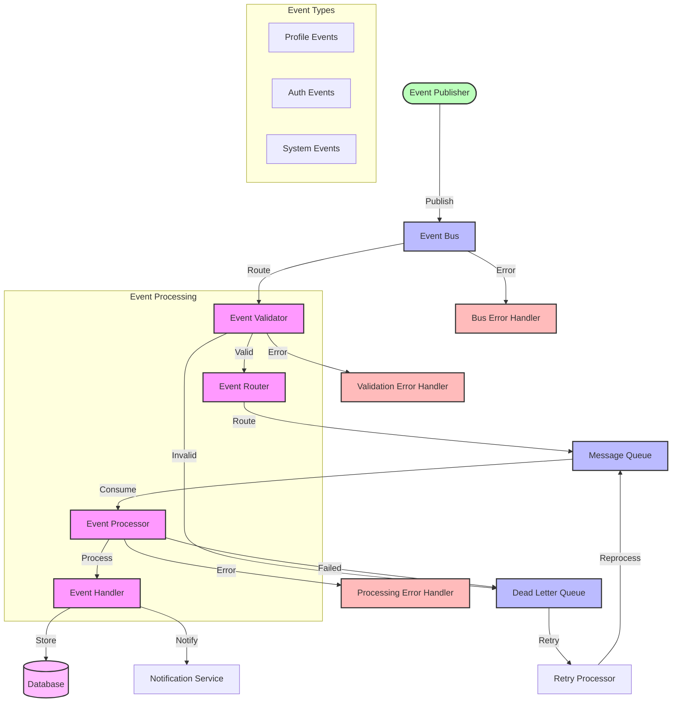

# Event System Flow Diagram

## Overview

This diagram illustrates the event processing system, showing how events are published, processed, and handled across different services, including event validation, routing, processing, and error handling.

## Flow Diagram

## Components

### Main Components

1. **Event Publishing Layer**

   - Event Publisher: Services that publish events
   - Event Bus: Central event distribution system
   - Event Types: Different categories of events

2. **Event Processing Layer**

   - Event Validator: Validates event structure
   - Event Router: Routes events to appropriate queues
   - Event Processor: Processes events from queue
   - Event Handler: Handles specific event types

3. **Storage Layer**
   - Message Queue: Stores events for processing
   - Dead Letter Queue: Stores failed events
   - Database: Persists event data
   - Notification Service: Handles event notifications

### Error Handling

1. **Validation Errors**

   - Invalid event structure
   - Missing required fields
   - Schema validation failures

2. **Processing Errors**
   - Processing failures
   - Handler errors
   - Storage errors

## Flow Description

### Main Flow

1. **Event Publishing**

   - Service publishes event to Event Bus
   - Event is validated for structure
   - Valid event is routed to appropriate queue
   - Event is stored in message queue

2. **Event Processing**
   - Event is consumed from queue
   - Event is processed by handler
   - Results are stored in database
   - Notifications are sent if needed

### Error Scenarios

1. **Validation Failures**

   - Invalid event format
   - Missing required data
   - Schema violations

2. **Processing Failures**
   - Handler errors
   - Database errors
   - Notification failures

## Implementation Notes

### Best Practices

- Use event versioning
- Implement idempotency
- Use dead letter queues
- Implement retry mechanisms
- Use event schemas

### Considerations

- Event ordering
- Processing guarantees
- Error handling
- Retry policies
- Monitoring

### Performance Impact

- Queue processing speed
- Database load
- Notification latency
- Retry overhead

## Security Considerations

### Authentication

- Publisher authentication
- Event validation
- Access control

### Authorization

- Event permissions
- Processing permissions
- Storage permissions

### Data Protection

- Event encryption
- Data privacy
- Audit logging

## Monitoring

### Metrics

- Event publishing rate
- Processing latency
- Error rates
- Queue lengths
- Retry counts

### Alerts

- High error rates
- Queue backlogs
- Processing delays
- Validation failures

### Logging

- Event logs
- Processing logs
- Error logs
- Audit logs

## Notes

- Events are versioned
- Processing is idempotent
- Dead letter queues are used
- Retry mechanisms are implemented
- Events are validated

## Related Documentation

- [Event Processing](../sequence/events/event-processing.md)
- [Dead Letter Queue](../sequence/events/dead-letter-queue.md)
- [Event Replay](../sequence/events/event-replay.md)
- [Message Queue](../architecture/patterns/queuing.md)
