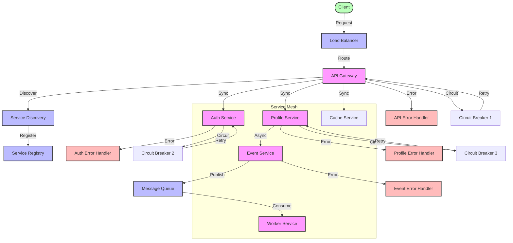

# Service Interaction Flow Diagram

## Overview

This diagram illustrates how different services in our microservices architecture interact with each other, including synchronous and asynchronous communication patterns, service discovery, and load balancing.

## Flow Diagram

## Components

### Main Components

1. **Infrastructure Layer**

   - Load Balancer: Distributes incoming traffic
   - Service Discovery: Manages service registration
   - Service Registry: Stores service information
   - Message Queue: Handles async communication

2. **Service Layer**

   - API Gateway: Entry point for all requests
   - Auth Service: Handles authentication
   - Profile Service: Manages user profiles
   - Cache Service: Provides caching
   - Event Service: Manages events
   - Worker Service: Processes background tasks

3. **Resilience Layer**
   - Circuit Breakers: Prevents cascading failures
   - Error Handlers: Manages service errors
   - Retry Logic: Handles transient failures

### Error Handling

1. **Service Errors**

   - Timeout handling
   - Circuit breaking
   - Retry mechanisms
   - Fallback strategies

2. **Infrastructure Errors**
   - Service discovery failures
   - Load balancer issues
   - Queue processing errors

## Flow Description

### Main Flow

1. **Request Processing**

   - Client request reaches load balancer
   - Load balancer routes to API Gateway
   - API Gateway discovers required services
   - Services process request synchronously
   - Events are published asynchronously

2. **Service Communication**
   - Synchronous: Direct service-to-service calls
   - Asynchronous: Event-based communication
   - Service discovery: Dynamic service location
   - Load balancing: Request distribution

### Error Scenarios

1. **Service Failures**

   - Service unavailability
   - Timeout scenarios
   - Circuit breaker trips
   - Retry exhaustion

2. **Infrastructure Failures**
   - Service discovery issues
   - Load balancer problems
   - Queue processing failures

## Implementation Notes

### Best Practices

- Use service mesh for communication
- Implement circuit breakers
- Use retry with exponential backoff
- Implement proper timeouts
- Use health checks

### Considerations

- Service discovery overhead
- Load balancing strategies
- Circuit breaker thresholds
- Retry policies
- Timeout values

### Performance Impact

- Service mesh overhead
- Load balancer latency
- Circuit breaker impact
- Retry mechanism overhead

## Security Considerations

### Authentication

- Service-to-service authentication
- API Gateway authentication
- Token validation

### Authorization

- Service permissions
- API Gateway policies
- Resource access control

### Data Protection

- Service communication encryption
- Data in transit security
- Message queue security

## Monitoring

### Metrics

- Service response times
- Circuit breaker states
- Retry counts
- Error rates
- Queue lengths

### Alerts

- Service unavailability
- High error rates
- Circuit breaker trips
- Queue backlogs

### Logging

- Service communication logs
- Error logs
- Circuit breaker logs
- Retry logs

## Notes

- All services use service mesh
- Circuit breakers are configured per service
- Retry policies are service-specific
- Health checks are mandatory
- Service discovery is dynamic

## Related Documentation

- [Service Mesh Configuration](../architecture/patterns/service-mesh.md)
- [Circuit Breaker Pattern](../architecture/patterns/circuit-breaker.md)
- [Service Discovery](../architecture/patterns/service-discovery.md)
- [Load Balancing](../architecture/patterns/load-balancing.md)
