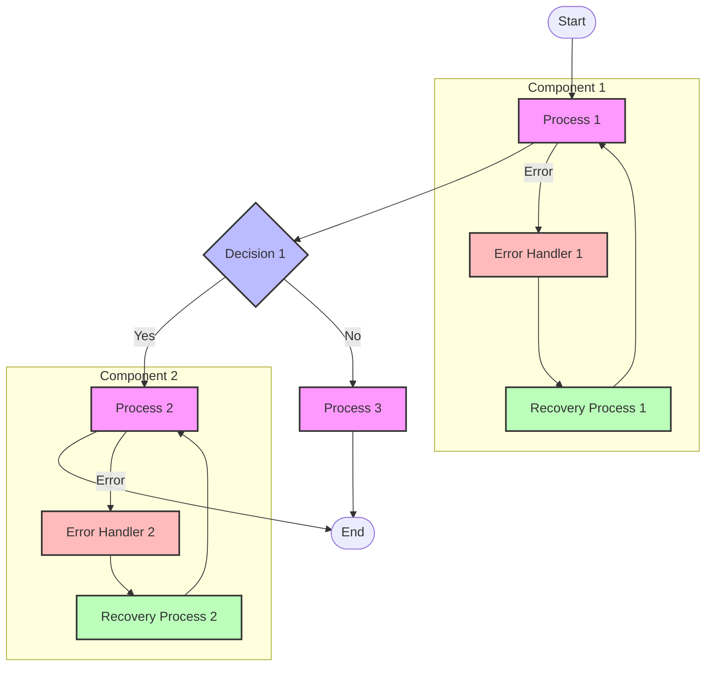

# [Flow Name] Flow Diagram

## Overview

[Brief description of what this flow represents and its purpose in the system]

## Flow Diagram

## Components

### Main Components

1. **Component 1**

   - Description of component 1
   - Its role in the flow
   - Key responsibilities

2. **Component 2**
   - Description of component 2
   - Its role in the flow
   - Key responsibilities

### Error Handling

1. **Error Handler 1**

   - Description of error scenarios
   - Recovery process
   - Retry mechanisms

2. **Error Handler 2**
   - Description of error scenarios
   - Recovery process
   - Retry mechanisms

## Flow Description

### Main Flow

1. **Step 1**

   - Detailed description
   - Input/Output
   - Dependencies

2. **Step 2**
   - Detailed description
   - Input/Output
   - Dependencies

### Error Scenarios

1. **Scenario 1**

   - Error conditions
   - Impact
   - Recovery steps

2. **Scenario 2**
   - Error conditions
   - Impact
   - Recovery steps

## Implementation Notes

### Best Practices

- Practice 1
- Practice 2
- Practice 3

### Considerations

- Consideration 1
- Consideration 2
- Consideration 3

### Performance Impact

- Impact 1
- Impact 2
- Impact 3

## Security Considerations

### Authentication

- Auth requirement 1
- Auth requirement 2

### Authorization

- Authz requirement 1
- Authz requirement 2

### Data Protection

- Protection measure 1
- Protection measure 2

## Monitoring

### Metrics

- Metric 1
- Metric 2
- Metric 3

### Alerts

- Alert 1
- Alert 2
- Alert 3

### Logging

- Log 1
- Log 2
- Log 3

## Notes

- Note 1
- Note 2
- Note 3

## Related Documentation

- [Link to related doc 1]
- [Link to related doc 2]
- [Link to related doc 3]
