# Performance Testing Workflow

## Overview

This diagram illustrates the workflow for performance testing operations in the Profile Service Microservices, including setup, execution, and analysis phases.

## Flow Diagram

```mermaid
graph TB
    subgraph "Test Planning"
        START[Start Testing] --> REQUIRE[Gather Requirements]
        REQUIRE --> SCENARIOS[Define Scenarios]
        SCENARIOS --> METRICS[Define Metrics]
        METRICS --> PLAN[Create Test Plan]
    end

    subgraph "Test Setup"
        PLAN --> ENV[Setup Environment]
        ENV --> DATA[Prepare Test Data]
        DATA --> TOOLS[Configure Tools]
        TOOLS --> VERIFY[Verify Setup]
    end

    subgraph "Test Execution"
        VERIFY --> BASELINE[Run Baseline]
        BASELINE --> LOAD[Load Testing]
        LOAD --> STRESS[Stress Testing]
        STRESS --> SCALE[Scalability Testing]
    end

    subgraph "Analysis & Reporting"
        SCALE --> COLLECT[Collect Results]
        COLLECT --> ANALYZE[Analyze Data]
        ANALYZE --> REPORT[Generate Report]
        REPORT --> REVIEW[Review Results]
    end

    subgraph "Optimization"
        REVIEW --> IDENTIFY[Identify Issues]
        IDENTIFY --> OPTIMIZE[Optimize System]
        OPTIMIZE --> VERIFY_OPT[Verify Optimization]
        VERIFY_OPT --> COMPLETE[Complete Testing]
    end

    %% Styling
    classDef planning fill:#f9f,stroke:#333,stroke-width:2px
    classDef setup fill:#bbf,stroke:#333,stroke-width:2px
    classDef execution fill:#bfb,stroke:#333,stroke-width:2px
    classDef analysis fill:#fbb,stroke:#333,stroke-width:2px
    classDef optimization fill:#fbf,stroke:#333,stroke-width:2px

    class START,REQUIRE,SCENARIOS,METRICS,PLAN planning
    class ENV,DATA,TOOLS,VERIFY setup
    class BASELINE,LOAD,STRESS,SCALE execution
    class COLLECT,ANALYZE,REPORT,REVIEW analysis
    class IDENTIFY,OPTIMIZE,VERIFY_OPT,COMPLETE optimization
```

## Workflow Description

### 1. Test Planning

- **Start Testing**: Initiate testing process
- **Gather Requirements**: Collect performance needs
- **Define Scenarios**: Create test scenarios
- **Define Metrics**: Establish performance metrics
- **Create Test Plan**: Develop testing strategy

### 2. Test Setup

- **Setup Environment**: Prepare test environment
- **Prepare Test Data**: Generate test data
- **Configure Tools**: Set up testing tools
- **Verify Setup**: Confirm readiness

### 3. Test Execution

- **Run Baseline**: Establish baseline performance
- **Load Testing**: Test under normal load
- **Stress Testing**: Test under extreme conditions
- **Scalability Testing**: Test system scaling

### 4. Analysis & Reporting

- **Collect Results**: Gather test data
- **Analyze Data**: Process test results
- **Generate Report**: Create test report
- **Review Results**: Evaluate findings

### 5. Optimization

- **Identify Issues**: Find performance problems
- **Optimize System**: Implement improvements
- **Verify Optimization**: Test improvements
- **Complete Testing**: Finalize process

## Implementation Guidelines

### Best Practices

1. **Planning**

   - Clear objectives
   - Realistic scenarios
   - Defined metrics
   - Resource planning

2. **Execution**

   - Controlled environment
   - Consistent conditions
   - Proper monitoring
   - Data collection

3. **Analysis**

   - Comprehensive metrics
   - Root cause analysis
   - Trend analysis
   - Performance patterns

4. **Optimization**
   - Systematic approach
   - Measurable improvements
   - Validation testing
   - Documentation

### Considerations

1. **Test Environment**

   - Environment isolation
   - Resource allocation
   - Network conditions
   - Data management

2. **Performance Metrics**

   - Response times
   - Throughput
   - Resource usage
   - Error rates

3. **System Impact**
   - Resource consumption
   - System stability
   - Data integrity
   - Service availability

## Monitoring & Metrics

### Key Metrics

- Response times
- Throughput rates
- Error rates
- Resource usage
- System health

### Reporting

- Test results
- Performance trends
- Bottleneck analysis
- Optimization results
- Recommendations

### Documentation

- Test procedures
- Performance baselines
- Optimization steps
- Best practices
- Lessons learned

## Related Documentation

- [Testing Strategy](../deployment/testing/strategy.md)
- [Performance Architecture](../deployment/testing/performance.md)
- [Monitoring Strategy](../deployment/monitoring/strategy.md)
- [System Architecture](../deployment/architecture.md)
