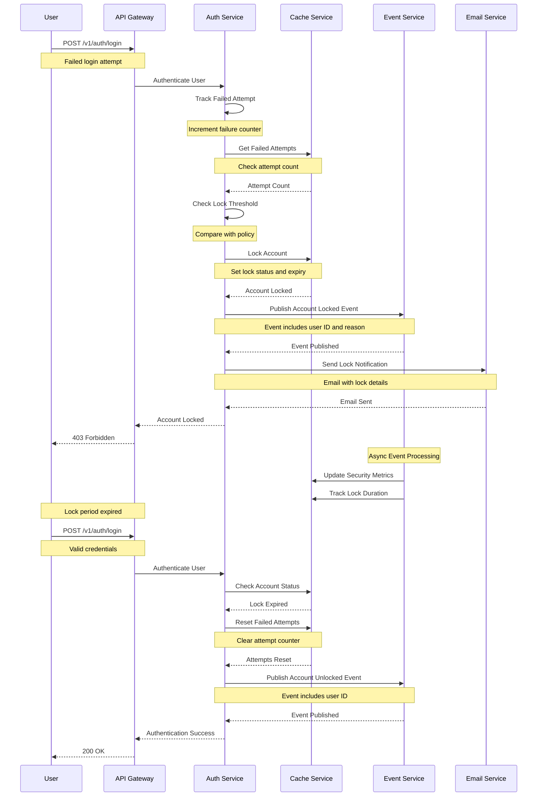
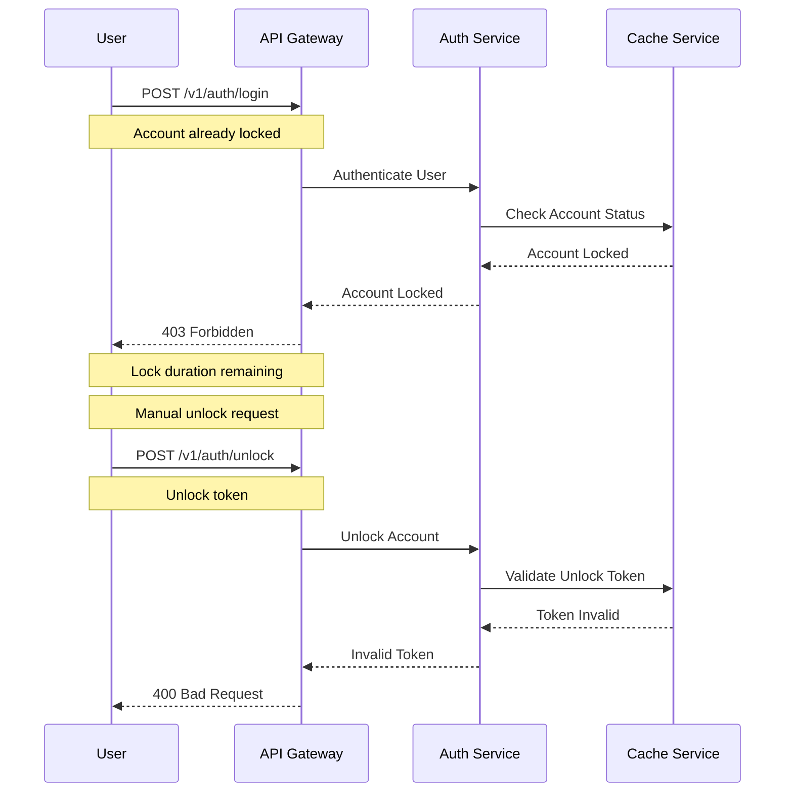

# Account Locking Flow

This diagram illustrates the sequence of interactions during account locking.

## Sequence Diagram

## Description

This sequence diagram shows the complete flow of account locking:

1. **Failed Login**

   - Track failed attempts
   - Check lock threshold
   - Lock account if needed

2. **Account Locking**

   - Set lock status
   - Publish lock event
   - Send notification

3. **Lock Management**

   - Track lock duration
   - Update security metrics
   - Monitor lock status

4. **Lock Release**
   - Check lock expiry
   - Reset failed attempts
   - Unlock account

## Error Handling

## Notes

- Progressive lock duration
- Multiple lock triggers
- Lock bypass for admins
- Manual unlock process
- Lock notification system
- Security metrics tracking
- Lock history maintained
- IP-based tracking
- Device fingerprinting
- Lock policy enforcement
- Unlock token system
- Lock duration limits
- Security audit logging
- Lock attempt tracking
- Recovery options available
