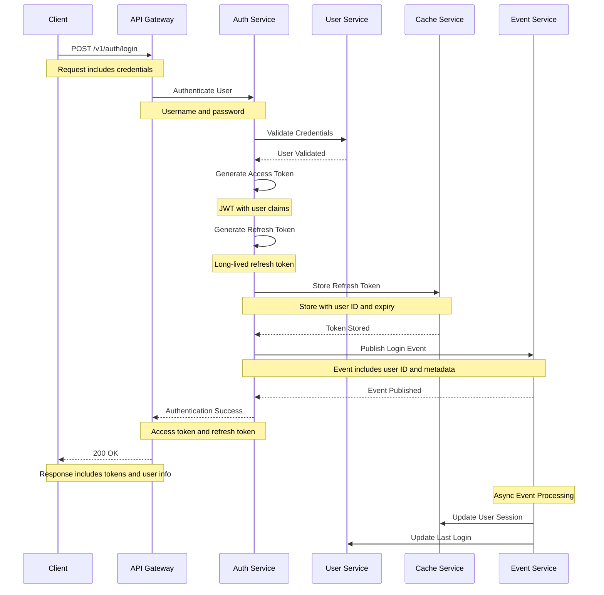
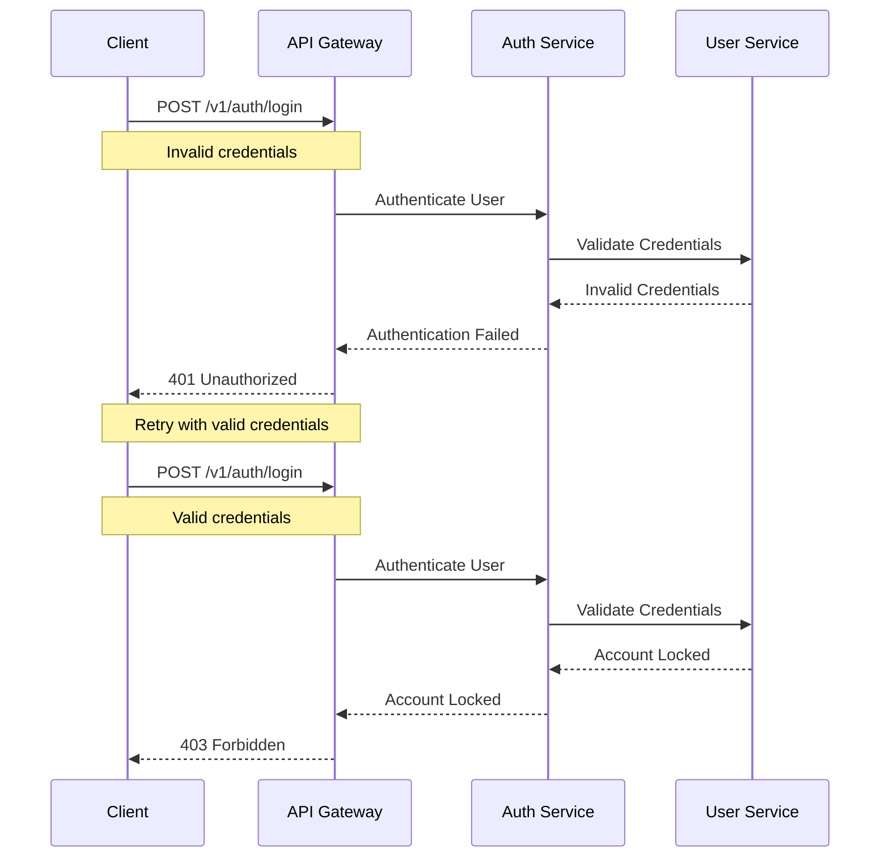

# Login Flow

This diagram illustrates the sequence of interactions during user login.

## Sequence Diagram

## Description

This sequence diagram shows the complete flow of user login:

1. **Initial Request**

   - Client sends login request with credentials
   - Request includes username and password

2. **Authentication**

   - Auth Service validates credentials with User Service
   - Generates access and refresh tokens

3. **Token Generation**

   - Access token (JWT) with user claims
   - Refresh token for token renewal
   - Tokens stored in cache

4. **Event Publishing**

   - Login event published for tracking
   - Other services can react to login

5. **Response**

   - Success response with tokens
   - Includes user information

6. **Async Processing**
   - Update user session in cache
   - Update last login timestamp

## Error Handling

## Notes

- Access tokens are short-lived (15-60 minutes)
- Refresh tokens are long-lived (days/weeks)
- All tokens are stored securely
- Failed login attempts are tracked
- Account locking after multiple failures
- Events are published with at-least-once delivery
- All sensitive data is encrypted in transit
- Rate limiting is applied to login attempts
- Session tracking for security monitoring
- Audit logging for security events
