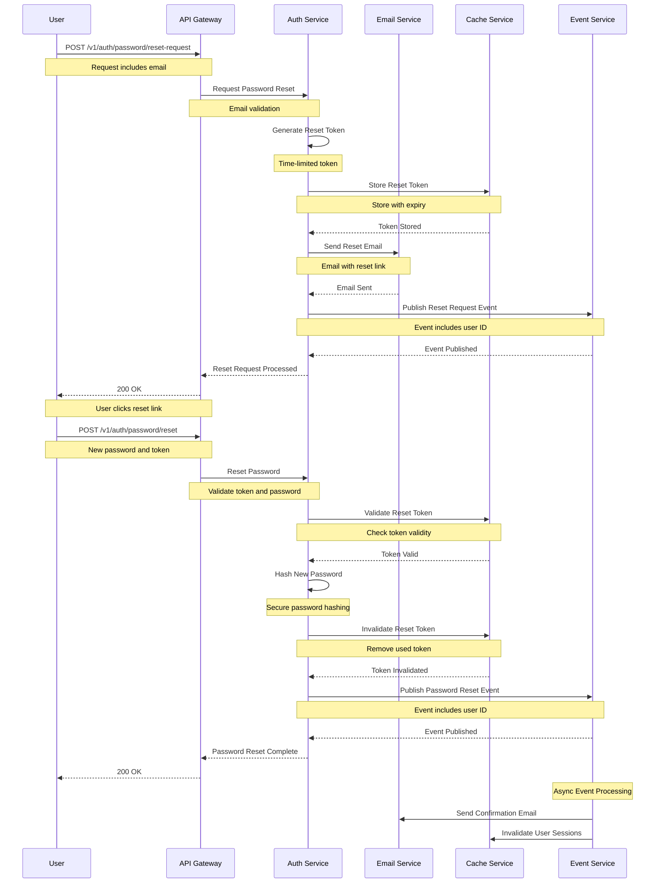
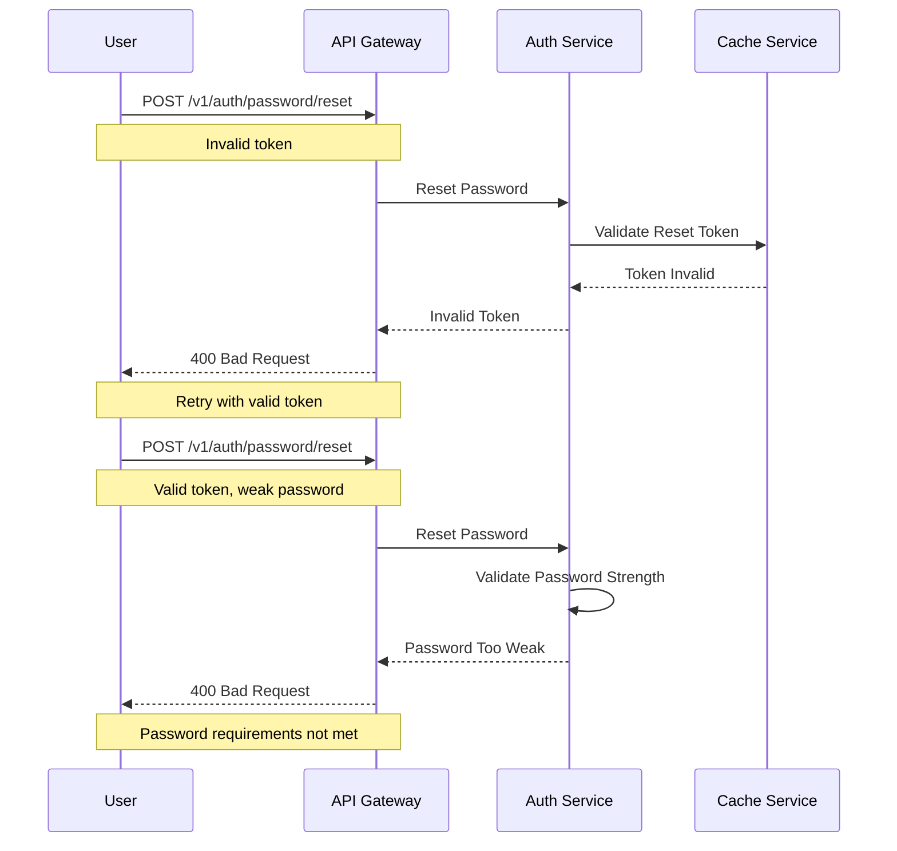

# Password Reset Flow

This diagram illustrates the sequence of interactions during password reset.

## Sequence Diagram

## Description

This sequence diagram shows the complete flow of password reset:

1. **Reset Request**

   - User requests password reset
   - Reset token generated
   - Reset email sent

2. **Token Storage**

   - Token stored in cache
   - Time-limited validity
   - Secure storage

3. **Password Reset**

   - Token validation
   - Password hashing
   - Token invalidation

4. **Event Processing**
   - Reset events published
   - Confirmation email sent
   - Sessions invalidated

## Error Handling

## Notes

- Reset tokens are time-limited
- Tokens are single-use only
- Password strength requirements enforced
- Rate limiting on reset requests
- Email verification required
- Session invalidation on reset
- Audit logging of reset attempts
- Secure password hashing
- Reset link expiration
- Multiple reset prevention
- Email delivery tracking
- Reset attempt tracking
- Security notifications
- Account recovery options
- Password history check
