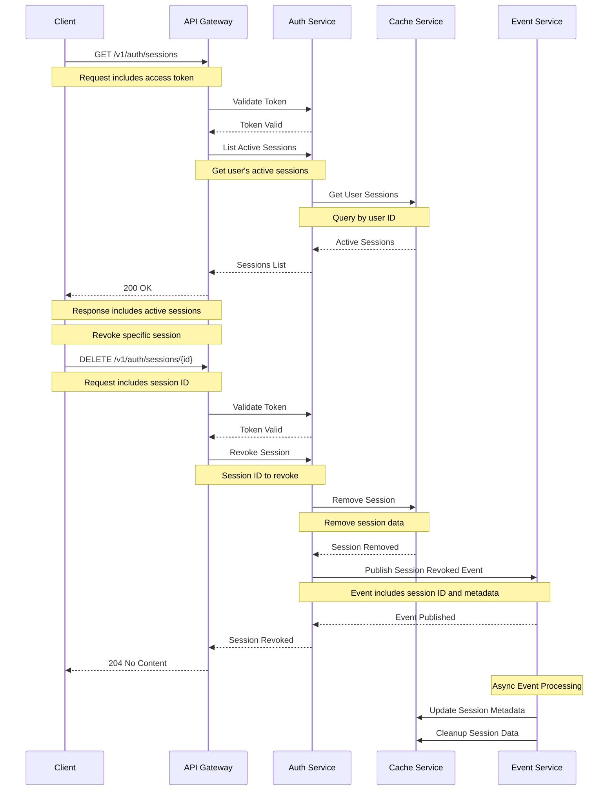
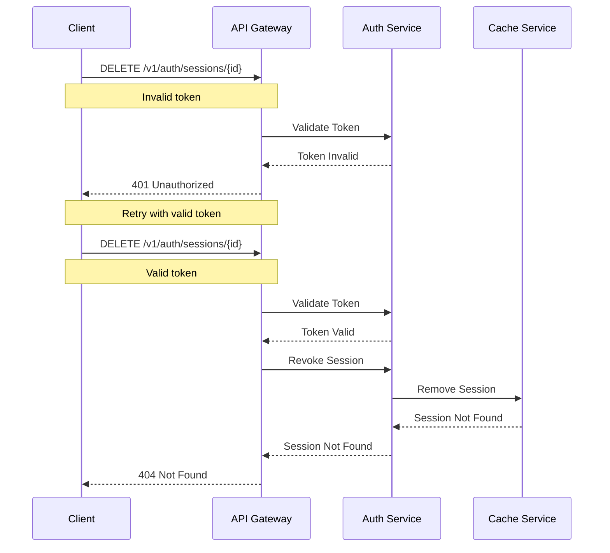

# Session Management Flow

This diagram illustrates the sequence of interactions during session management.

## Sequence Diagram

## Description

This sequence diagram shows the complete flow of session management:

1. **List Sessions**

   - Client requests active sessions
   - Auth Service validates token
   - Returns list of active sessions

2. **Revoke Session**

   - Client requests session revocation
   - Auth Service validates token
   - Removes session from cache

3. **Event Publishing**

   - Session revocation event published
   - Other services can react to revocation

4. **Async Processing**
   - Update session metadata
   - Cleanup session data

## Error Handling

## Notes

- Sessions are tracked per user
- Session metadata includes device info
- Failed revocation attempts are logged
- Events are published with at-least-once delivery
- All sensitive data is encrypted in transit
- Rate limiting is applied to session operations
- Session metadata is tracked for security
- Audit logging for session events
- Automatic cleanup of expired sessions
- Session revocation is immediate
- Multiple sessions per user supported
- Session activity is monitored
