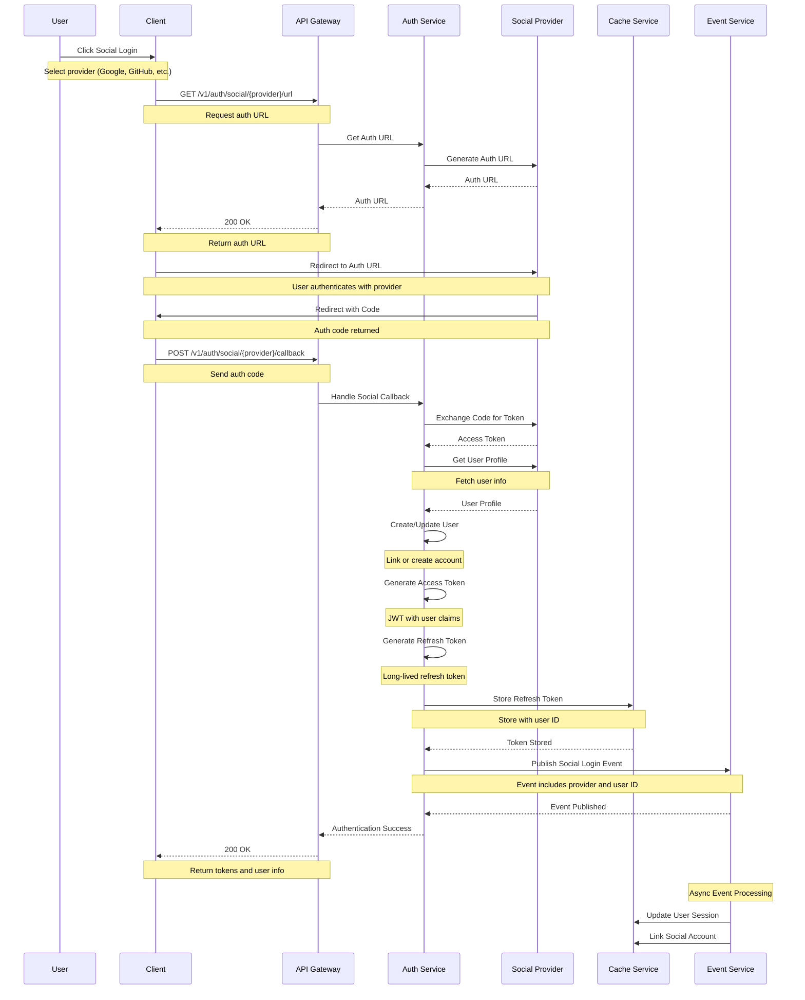
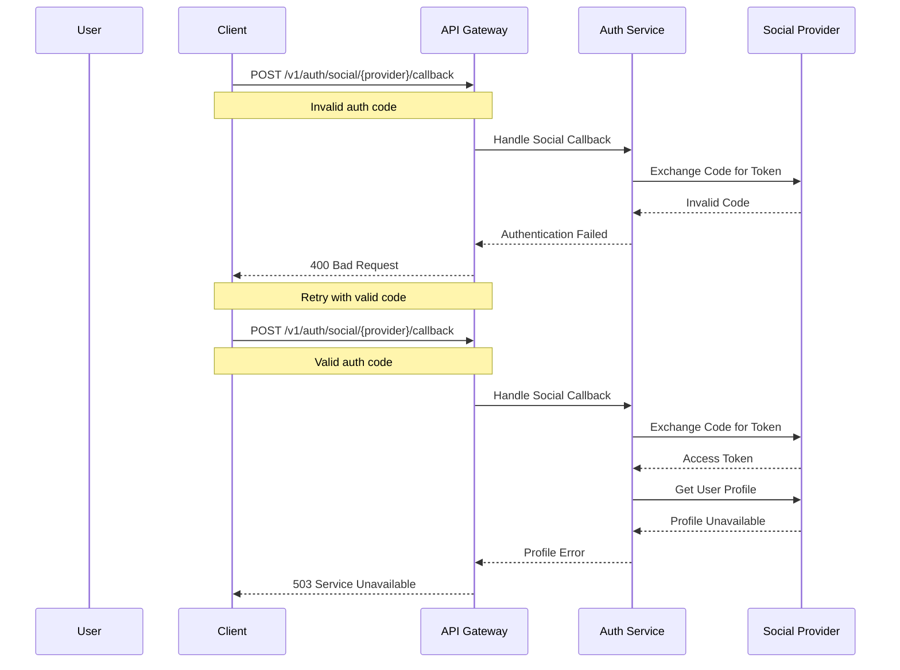

# Social Login Flow

This diagram illustrates the sequence of interactions during social login.

## Sequence Diagram

## Description

This sequence diagram shows the complete flow of social login:

1. **Initial Request**

   - User initiates social login
   - Get authentication URL
   - Redirect to provider

2. **Provider Authentication**

   - User authenticates with provider
   - Provider returns auth code
   - Exchange code for token

3. **User Management**

   - Get user profile from provider
   - Create or link user account
   - Generate system tokens

4. **Session Management**
   - Store refresh token
   - Publish login event
   - Update user session

## Error Handling

## Notes

- Multiple provider support
- Account linking capability
- Profile synchronization
- Token management
- Session tracking
- Event publishing
- Error handling
- Rate limiting
- Security measures
- Audit logging
- User data mapping
- Provider metadata
- Account merging
- Profile updates
- Session management
