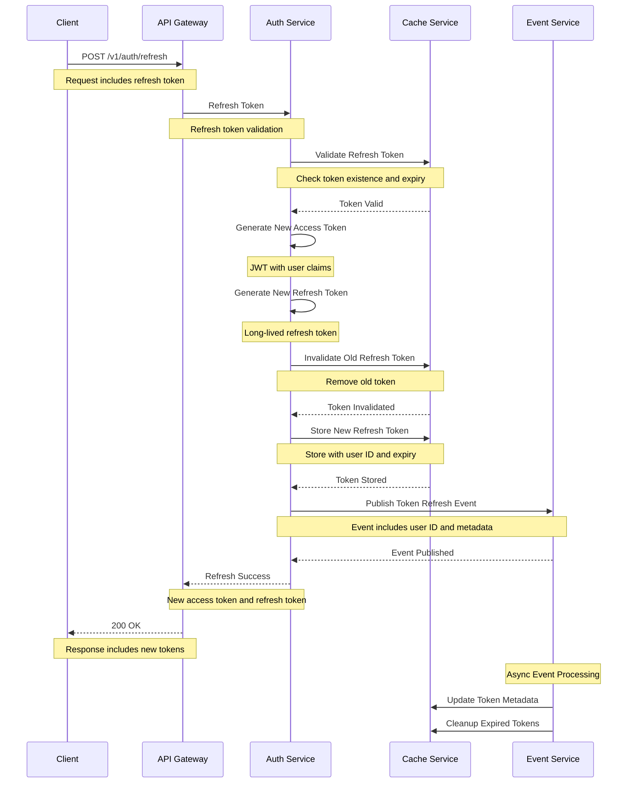
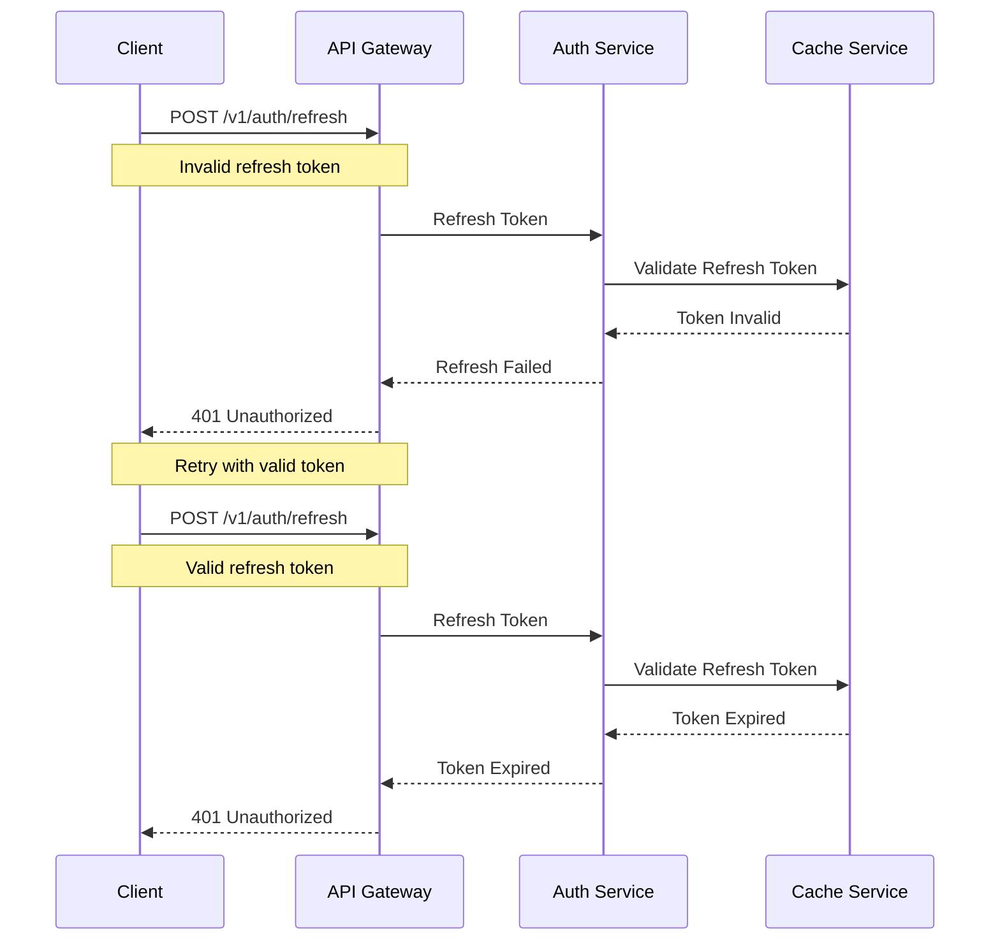

# Token Refresh Flow

This diagram illustrates the sequence of interactions during token refresh.

## Sequence Diagram

## Description

This sequence diagram shows the complete flow of token refresh:

1. **Initial Request**

   - Client sends refresh request with refresh token
   - Request includes current refresh token

2. **Token Validation**

   - Auth Service validates refresh token
   - Checks token existence and expiry

3. **Token Generation**

   - New access token generated
   - New refresh token generated
   - Old refresh token invalidated

4. **Token Storage**

   - New refresh token stored in cache
   - Old refresh token removed
   - Token metadata updated

5. **Event Publishing**

   - Token refresh event published
   - Other services can react to refresh

6. **Response**

   - Success response with new tokens
   - Includes new access and refresh tokens

7. **Async Processing**
   - Update token metadata
   - Cleanup expired tokens

## Error Handling

## Notes

- Refresh tokens are rotated on each refresh
- Old refresh tokens are immediately invalidated
- Token validation includes expiry check
- Failed refresh attempts are logged
- Events are published with at-least-once delivery
- All sensitive data is encrypted in transit
- Rate limiting is applied to refresh attempts
- Token metadata is tracked for security
- Audit logging for refresh events
- Automatic cleanup of expired tokens
