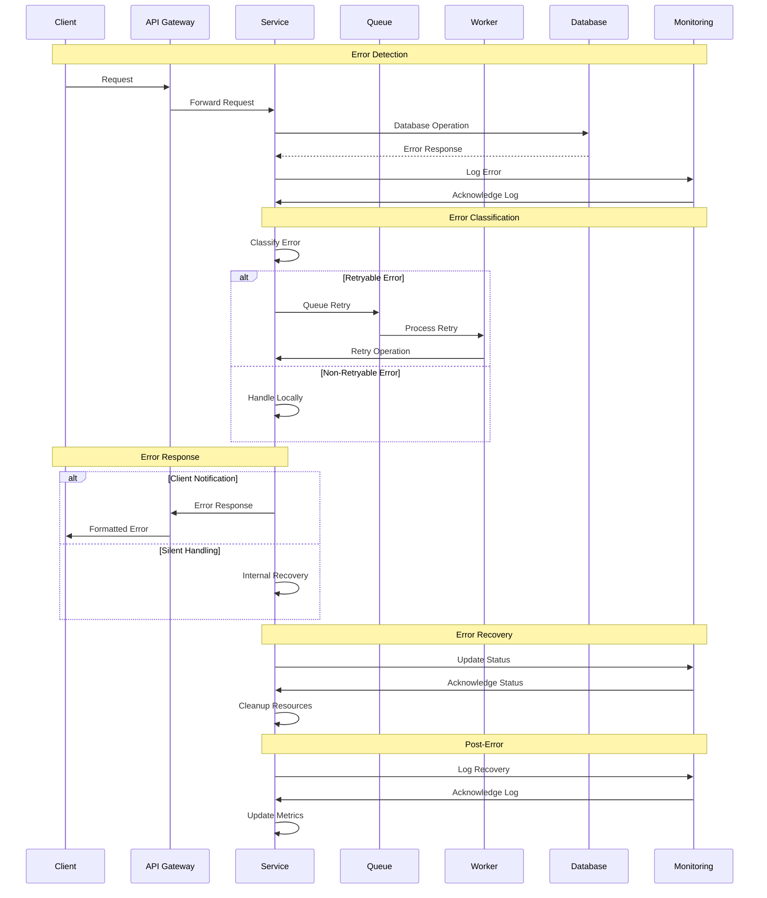

# Error Handling Flow

## Overview

This diagram illustrates the sequence of actions and interactions between different components during error handling in the Profile Service Microservices.

## Sequence Diagram

## Components Description

### 1. Error Detection

- **Client**: Initiates requests
- **API Gateway**: Routes requests and handles initial errors
- **Service**: Processes requests and detects errors
- **Database**: Source of potential errors
- **Monitoring**: Tracks error occurrences

### 2. Error Classification

- **Service**: Analyzes error type
- **Queue**: Manages retry operations
- **Worker**: Handles retry processing
- **Monitoring**: Tracks error patterns

### 3. Error Response

- **Client Notification**:
  - Formatted error messages
  - Appropriate status codes
  - Error details
- **Silent Handling**:
  - Internal recovery
  - Background processing
  - Resource cleanup

### 4. Error Recovery

- **Status Updates**: Track recovery progress
- **Resource Cleanup**: Release resources
- **Metrics Update**: Record recovery metrics

### 5. Post-Error

- **Logging**: Record recovery actions
- **Metrics**: Update system metrics
- **Monitoring**: Track system health

## Implementation Notes

### Best Practices

1. **Error Detection**

   - Comprehensive logging
   - Error categorization
   - Pattern recognition
   - Real-time monitoring

2. **Error Handling**

   - Clear error messages
   - Appropriate retry logic
   - Resource management
   - State recovery

3. **Recovery**
   - Systematic approach
   - Resource cleanup
   - State verification
   - Performance monitoring

### Considerations

1. **Error Types**

   - Transient errors
   - Permanent errors
   - System errors
   - Business errors

2. **Recovery Strategies**

   - Automatic recovery
   - Manual intervention
   - Fallback mechanisms
   - State restoration

3. **Monitoring**
   - Error rates
   - Recovery times
   - System impact
   - Resource usage

## Monitoring

### Metrics

- Error frequency
- Recovery time
- Success rate
- Resource impact
- System performance

### Alerts

- Error thresholds
- Recovery failures
- System degradation
- Resource exhaustion
- Pattern detection

### Logging

- Error details
- Recovery steps
- System state
- Resource usage
- Performance metrics

## Related Documentation

- [Error Handling Strategy](../flow/error-handling/strategy.md)
- [Monitoring Strategy](../deployment/monitoring/strategy.md)
- [Recovery Procedures](../flow/recovery/procedures.md)
- [System Architecture](../deployment/architecture.md)
