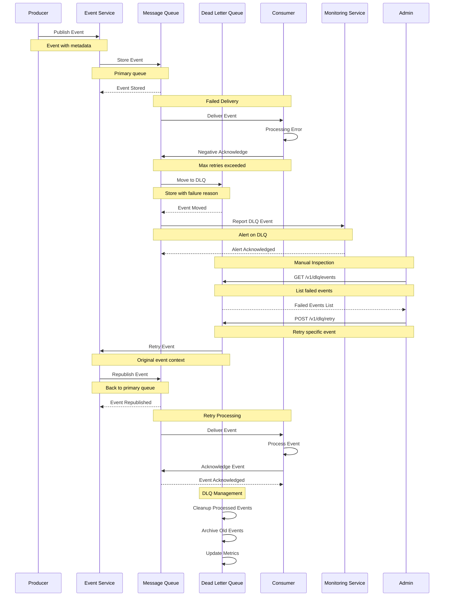
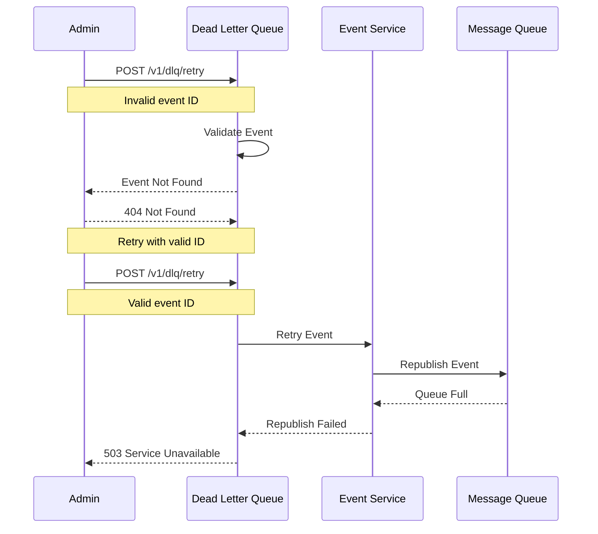

# Dead Letter Queue Flow

This diagram illustrates the sequence of interactions during dead letter queue processing.

## Sequence Diagram

## Description

This sequence diagram shows the complete flow of dead letter queue handling:

1. **Event Failure**

   - Event processing fails
   - Max retries exceeded
   - Move to DLQ

2. **DLQ Management**

   - Store failed events
   - Track failure reasons
   - Monitor DLQ size

3. **Manual Intervention**

   - Admin inspects events
   - Retry failed events
   - Monitor retry success

4. **Cleanup**
   - Process successful retries
   - Archive old events
   - Update metrics

## Error Handling

## Notes

- DLQ monitoring
- Retry policies
- Failure tracking
- Event archiving
- Manual intervention
- Metrics collection
- Alert thresholds
- Cleanup policies
- Event inspection
- Retry limits
- Error categorization
- Recovery procedures
- Performance impact
- Resource management
- Audit logging
