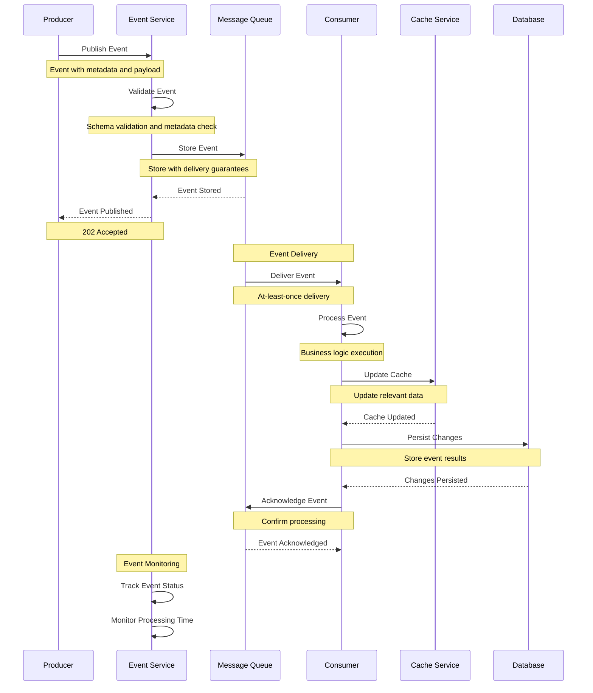
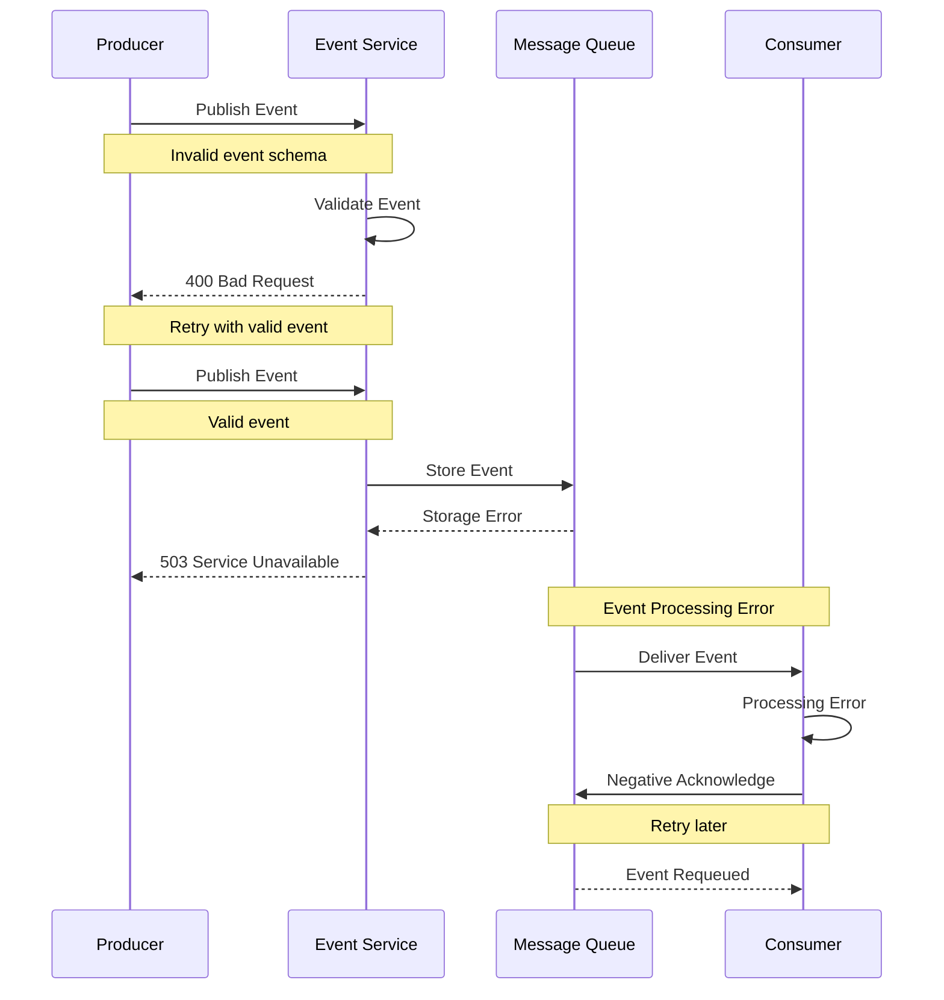

# Event Processing Flow

This diagram illustrates the sequence of interactions during event processing in the system.

## Sequence Diagram

## Description

This sequence diagram shows the complete flow of event processing:

1. **Event Publishing**

   - Producer publishes event
   - Event Service validates event
   - Event stored in queue

2. **Event Delivery**

   - Queue delivers to consumer
   - At-least-once delivery guarantee
   - Consumer processes event

3. **Data Updates**

   - Cache is updated
   - Database changes persisted
   - Event acknowledged

4. **Monitoring**
   - Event status tracked
   - Processing time monitored
   - System health checked

## Error Handling

## Notes

- Events are validated against schemas
- At-least-once delivery guarantee
- Dead letter queues for failed events
- Event replay capability
- Event versioning support
- Event correlation tracking
- Processing time monitoring
- Error rate tracking
- Retry policies configured
- Circuit breakers implemented
- Event ordering maintained
- Event deduplication handled
- Event persistence configured
- Event TTL management
- Event priority support
