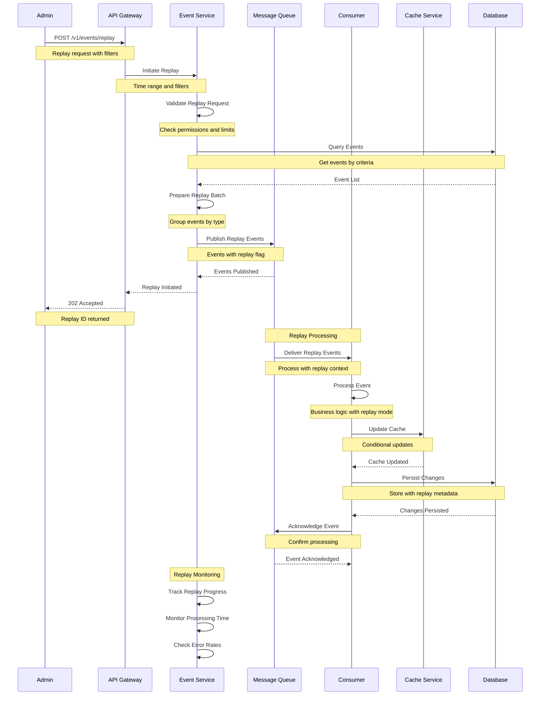
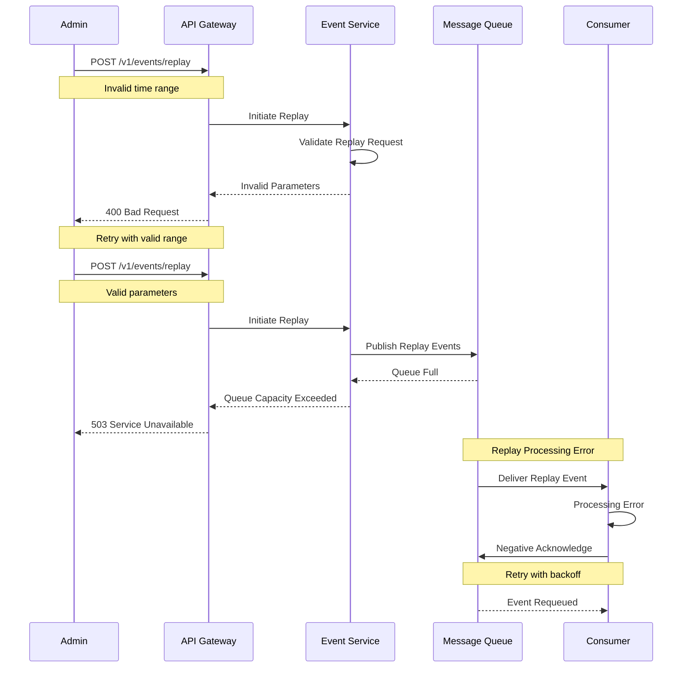

# Event Replay Flow

This diagram illustrates the sequence of interactions during event replay processing.

## Sequence Diagram

## Description

This sequence diagram shows the complete flow of event replay:

1. **Replay Initiation**

   - Admin requests replay
   - Validate replay parameters
   - Query relevant events

2. **Event Publishing**

   - Prepare events for replay
   - Publish with replay context
   - Track replay progress

3. **Replay Processing**

   - Process events in replay mode
   - Handle conditional updates
   - Track processing status

4. **Monitoring**
   - Track replay progress
   - Monitor processing time
   - Check error rates

## Error Handling

## Notes

- Replay with filters
- Time range selection
- Batch processing
- Progress tracking
- Error handling
- Rate limiting
- Resource management
- Audit logging
- Replay metadata
- Conditional updates
- Conflict resolution
- State management
- Performance monitoring
- Recovery options
- Replay validation
