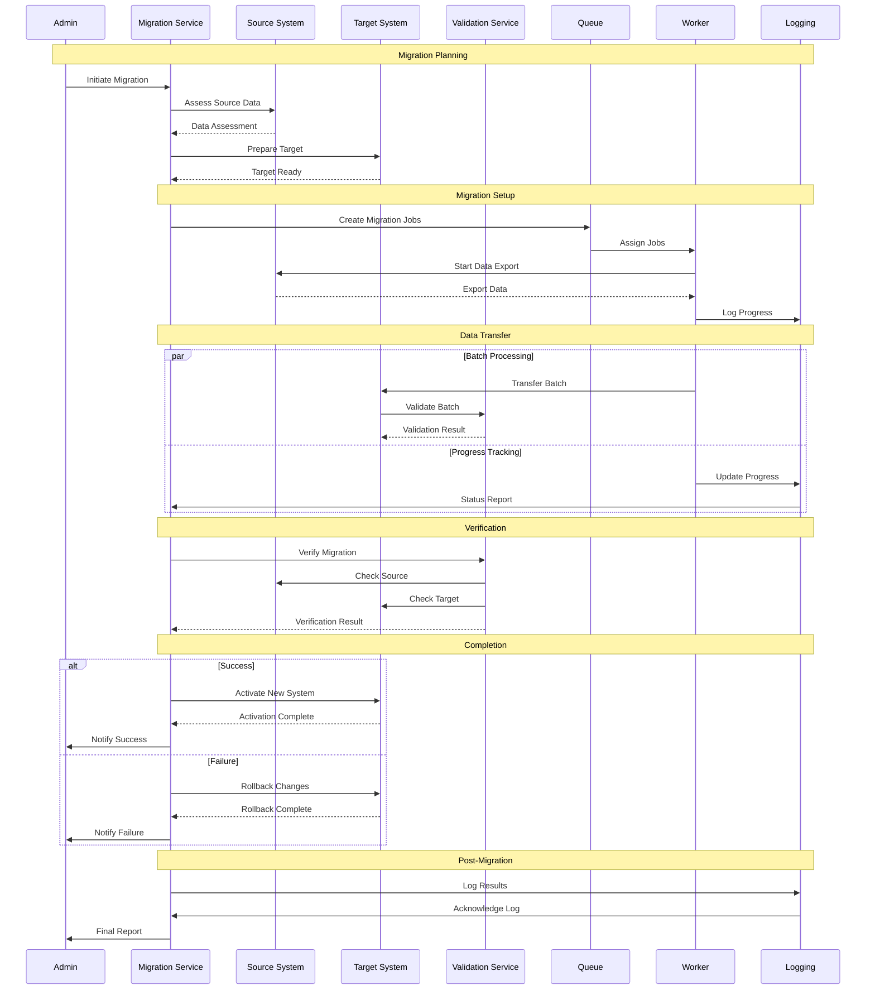

# Data Migration Flow

## Overview

This diagram illustrates the sequence of actions and interactions between different components during data migration in the Profile Service Microservices.

## Sequence Diagram

## Components Description

### 1. Migration Planning

- **Admin**: Initiates and oversees migration
- **Migration Service**: Coordinates migration process
- **Source System**: Original data location
- **Target System**: New data destination

### 2. Migration Setup

- **Queue**: Manages migration jobs
- **Worker**: Processes migration tasks
- **Logging**: Tracks migration progress

### 3. Data Transfer

- **Batch Processing**:
  - Data transfer
  - Validation
  - Progress tracking
- **Progress Tracking**:
  - Status updates
  - Performance monitoring
  - Error detection

### 4. Verification

- **Validation Service**: Ensures data integrity
- **Source Check**: Verifies source data
- **Target Check**: Validates migrated data

### 5. Completion

- **Success Path**:
  - System activation
  - Success notification
  - Final verification
- **Failure Path**:
  - Rollback process
  - Failure notification
  - Error reporting

### 6. Post-Migration

- **Logging**: Records migration results
- **Reporting**: Generates final report
- **Cleanup**: System maintenance

## Implementation Notes

### Best Practices

1. **Planning**

   - Data assessment
   - Resource allocation
   - Timeline planning
   - Risk assessment

2. **Execution**

   - Batch processing
   - Progress monitoring
   - Error handling
   - Performance optimization

3. **Verification**
   - Data validation
   - Integrity checks
   - Performance verification
   - System testing

### Considerations

1. **Data Integrity**

   - Data consistency
   - Format conversion
   - Relationship preservation
   - Data validation

2. **Performance**

   - Batch size optimization
   - Resource utilization
   - Network bandwidth
   - Processing speed

3. **Recovery**
   - Rollback procedures
   - Error recovery
   - State restoration
   - Data consistency

## Monitoring

### Metrics

- Migration progress
- Data transfer rate
- Validation success
- Error rate
- System performance

### Alerts

- Migration failures
- Validation errors
- Performance issues
- Resource constraints
- System errors

### Logging

- Migration progress
- Validation results
- Error details
- System state
- Performance metrics

## Related Documentation

- [Migration Strategy](../deployment/migration/strategy.md)
- [Data Architecture](../deployment/architecture.md)
- [Validation Procedures](../flow/validation/procedures.md)
- [Recovery Strategy](../flow/recovery/strategy.md)
